# 配台特別ルール ノードプログラミング UI／ロジック 実装プラン

## 全体像（Before → After）

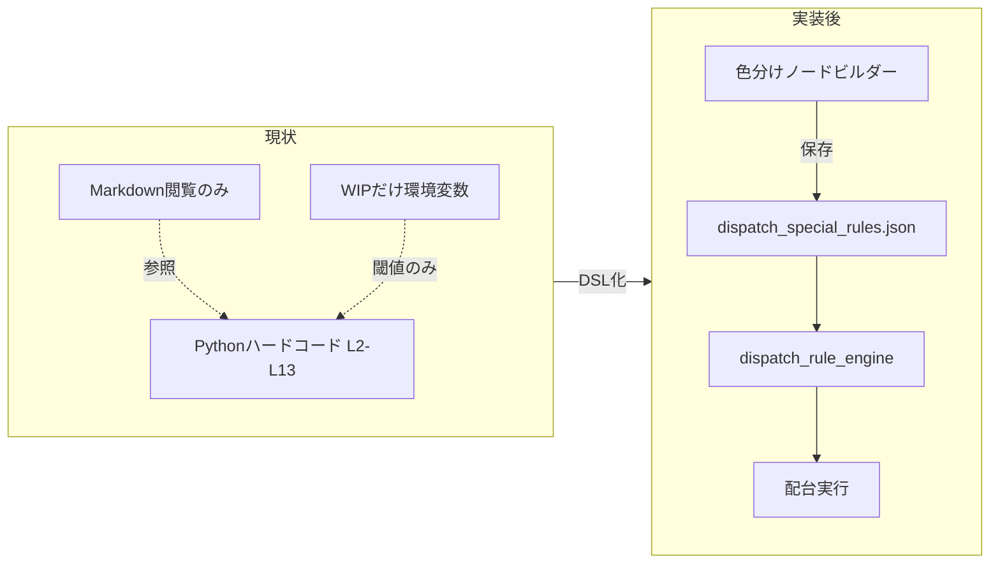

---

## 2026-06 ロジック再検討（製品変更との整合）

**関連プラン**: [`段階1-3.2配台計画_e8b94f80.plan.md`](.cursor/plans/段階1-3.2配台計画_e8b94f80.plan.md)

### 製品側で確定した変更（ビルダー前提の更新）

| 項目 | 旧前提（本プラン初版） | 現状（2026-06） |
|------|------------------------|-----------------|
| 配台表 JSON 正本 | 段階2 と段階2.5 で切替（`PM_AI_DISPATCH_TABLE_ACTIVE_SOURCE`） | **常に** [`結果_配台表.json`](code_java/src/main/java/jp/co/pm/ai/desktop/config/AppPaths.java)（段階2 出力）。段階2.5(AI) **削除済み** |
| 段階2.5 | アラジン整列 + 学習アーカイブ自動 enqueue | **未実装（再設計待ち）**。学習アーカイブ基盤（`dispatch-learning-archive/`）は残置・手動更新可 |
| パイプライン段階 | 段階1／2／3／**3.5** | 段階1／**2.0**／**2.1**／**3.0**／**3.1**／**3.2**（[`PipelineExecutionTimingKind`](code_java/src/main/java/jp/co/pm/ai/desktop/PipelineExecutionTimingKind.java)） |
| 段階3 | 手動修正タブの単体「配台試行」 | **入力3表生成 → 枝番分解 → 配台A → 枝番統合**のパイプライン（手動修正は前処理） |
| 特別ルールの task キー | `task_id` = 依頼NO | 枝番行では **`rule_task_id`（親依頼）** で L10/L11/L13・§A を集計（段階1-3.2 計画 `rule-task-id-refactor`） |

### 実装済みだが **ロジックが古い** 箇所（次フェーズで直す）

| 箇所 | 現状 | あるべき姿 |
|------|------|------------|
| [`DispatchRuleStageRunOverlay.captureForStage`](code_java/src/main/java/jp/co/pm/ai/desktop/dispatch/rules/stage/DispatchRuleStageRunOverlay.java) | `stage1` / `stage2` / 汎用 `stage` の3値 | `stage1`, `stage2_0`, `stage2_1`, `stage3_0`, `stage3_1`, `stage3_2`（`PipelineExecutionTimingKind.name()` 小文字化でも可） |
| [`MainShellController.overlayDispatchSpecialRulesForStageRun`](code_java/src/main/java/jp/co/pm/ai/desktop/MainShellController.java) | `STAGE1`/`STAGE2` script のみ capture | **2.1 子プロセス**・**3.0/3.1/3.2 パイプライン**開始前にも capture |
| [`overlayDispatchSpecialRulesForStageTrial`](code_java/src/main/java/jp/co/pm/ai/desktop/MainShellController.java) | 常に `"stage3"` | `STAGE3_0`/`STAGE3_1`/`STAGE3_2` を区別（trace の `run_snapshot_id` と一致） |
| [`DispatchRuleBuilderRunContext`](code_java/src/main/java/jp/co/pm/ai/desktop/dispatch/rules/stage/DispatchRuleBuilderRunContext.java) バナー | 「段階1～3.2」表記 | 「段階1～3.2」+ 実行中は **PipelineExecutionTimingKind.label()** を表示 |
| 試走ラボ | plan_input **入力1表**の行のみ | 入力3表・枝番行も選択可。`rule_task_id` を simulation へ渡す |
| 適用トレース sidecar | `task_id` のみ | 枝番実行時は `branch_task_id` + `rule_task_id` + `pipeline_stage`（3.0/3.1/3.2） |
| `tryBeginDispatchTrialGating` | `STAGE3` のみ gating | 現状維持でよい（2.5 削除済み）。段階3.x は **パイプライン busy** と runLock の両方でバナー連動を確認 |

### 再検討して **変えない** 方針

1. **legacy 併存 + executionMode** — 現場の保険。段階2.5 削除とは無関係に維持。
2. **run_snapshots 凍結モデル** — 「実行中は開始 snapshot のみ」「編集は次回開始から」は有効。段階キーの粒度だけ更新。
3. **特別ルールタブ gating 例外** — パイプライン実行中もビルダー編集可は維持。
4. **段階2.5 用 DSL ノード** — 再設計プランが出るまで **追加しない**（アラジン整列は手動修正「アラジン計画に合わせる」と段階3 前処理の責務）。

### 段階ごとのルール評価（更新版）

| 段階 | 特別ルール評価 | snapshot 必須 | 備考 |
|------|----------------|---------------|------|
| 段階1 | 通常 **しない** | 推奨（次段階2.0 用 id 連鎖） | タスク抽出のみ |
| 段階2.0 | **する** | **必須** | `plan_simulation_stage2.py` → `_core` フック |
| 段階2.1 | **する** | **必須**（現状未 capture → **要修正**） | 時間外 hybrid、成果物は正本へ promote |
| 段階3.0 | **する** | **必須** | 入力3表・枝番分解後の配台A |
| 段階3.1 | **する** | **必須** | 時間外 + 配台A（2.1 と同型） |
| 段階3.2 | **する** | **必須** | 数量厳守モード（env 分岐） |
| ~~段階2.5~~ | — | — | **削除済み** |
| ~~段階3.5~~ | — | — | **3.1/3.2 に分解**。旧表記はプランから排除 |

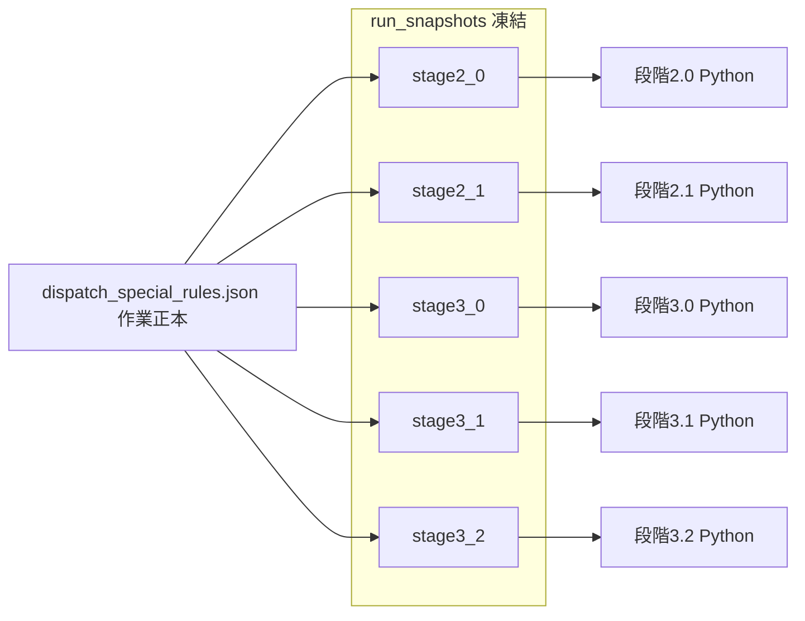

### 次フェーズ作業順（推奨）

1. **`rework-snapshot-overlay`** — overlay 配線 + stage キー + バナー文言（Java のみ、回帰小）
2. **`rework-rule-task-id`** — Python engine + hook_adapter + conflict/trace（段階1-3.2 と同一 PR 単位が望ましい）
3. **`rework-trace-stage3`** — sidecar スキーマ拡張 + 手動修正バッジ + 適用トレース UI フィルタ
4. **`rework-test-lab-input3`** — 試走 UX
5. **`rework-stage25-docs-gap`** — 2.5 再設計プラン確定後にのみ DSL ノード追加を検討

**ユーザーが触るもの**: コードや Markdown ではなく、**左から右に流れる色付きブロック**でルールを組み立てる。

---

## 画面レイアウト（ワイヤーフレーム）

「特別ルール」タブ内の **ルールビルダー** 子タブ:

```
┌─────────────────────────────────────────────────────────────────────────────┐
│ [要約] [列挙] [★ルールビルダー] [JSON]                                        │
├──────────┬──────────────────────────────────────────────┬───────────────────┤
│ ノード    │  キャンバス（左→右の流れ・ドット格子背景）      │  プロパティ        │
│ パレット  │                                              │  （選択ノード）    │
│          │   ┌────────┐    ┌────────┐    ┌────────┐     │                   │
│ ■ 対象    │   │🎯 対象   │───▶│📊 集計  │───▶│🚫 除外   │     │  工程名: 接続     │
│ ■ 条件    │   │ 工程×機械│    │ WIP合計 │    │ 候補から │     │  機械名: 熱融着…  │
│ ■ 集計    │   └────────┘    └────┬───┘    └────────┘     │  上限: [20]       │
│ ■ 比較    │                        │                       │                   │
│ ■ 効果    │                   ┌────▼───┐                   │  ── ライブ要約 ──  │
│ ■ 定数    │                   │⚖ 比較   │                   │  「WIP≥20で接続を   │
│          │                   │ ≥ 20   │                   │   配台しない」      │
│ テンプレ  │                   └────────┘                   │                   │
│ [L13]    │  ┌─ ミニマップ ─┐  ┌─ 凡例 ─────────────────┐  │                   │
│ [L10]    │  │ ■■■□□      │  │■対象 ■条件 ■集計 ■効果│  │                   │
├──────────┴──┴──────────────┴──┴──────────────────────────┴──┴───────────────────┤
│ ルール: [L13 接続→SEC WIP ▼]  schema v1  │ [履歴▼][検証][衝突][試走][保存]      │
│ 編集履歴: 2026-05-26 14:30 保存 …  [この版に戻す]                              │
│ ┌─ 実行中バナー（段階2.0 等 実行中）──────────────────────────────────────────┐ │
│ │ ⏳ 段階2.0 実行中 │ 適用中ルール: 14:30:01 スナップショット │ 編集は次回から │ │
│ │ 未保存の変更あり → 次回実行にも未反映。保存してください。                  │ │
│ └──────────────────────────────────────────────────────────────────────────┘ │
│ ⚠ 衝突 1 件: L4 ↔ L6（同一SEC・速度上書き競合） [詳細]                      │
│ ┌─ ルール一覧（適用順・有効/無効）──────────────────────────────────────┐ │
│ │順│ ON │ ID  │ 名称           │ 実行元  │ 適用 │                        │ │
│ │1 │ ☑ │ L2  │ スライス3名    │ [自動▼] │ ●DSL │  ≡ ドラッグで並べ替え   │ │
│ │2 │ ☑ │ L10 │ スリットSEC WIP│ [従来▼] │ ○Leg │  [すべてON][すべてOFF]  │ │
│ │3 │ ☐ │ L4  │ SEC速度935     │ [従来▼] │ OFF  │                        │ │
│ │4 │ ☑ │ L13 │ 接続SEC WIP    │ [自動▼] │ ●DSL │                        │ │
│ └──────────────────────────────────────────────────────────────────────┘ │
│ 適用順: 有効ルールのみ L2→L10→L13 の順で評価（同一フェーズ内）              │
│ 保存先: …/dispatch_special_rules/dispatch_special_rules.json                    │
└─────────────────────────────────────────────────────────────────────────────┘
```

---

## 視覚設計原則（必須）

| 原則 | 具体 |
|------|------|
| **左→右の因果** | グラフは常に **対象 → 条件 → 集計 → 比較 → 効果** の順。自動レイアウトボタンで整列 |
| **色でカテゴリ識別** | 6 色固定（下表）。ノード左端に色帯＋アイコン＋**日本語短ラベル**（内部 type 名は Inspector のみ） |
| **1 ノード 1 行要約** | キャンバス上に業務文言（例:「製品幅=935 → 20m/分」）。詳細は右ペイン |
| **接続は意味付き** | エッジにラベルなし。ポート名は `データ` / `真` / `偽` 等、Inspector でのみ表示 |
| **テンプレートから開始** | 空キャンバス禁止。初回は L13 等の **完成グラフを読込** → パラメータだけ変更 |
| **即時フィードバック** | 編集のたび右ペイン「ライブ要約」更新。検証 NG は該当ノードを赤枠 |
| **版の見える化** | ツールバーに `schema v1` バッジ。旧版時は黄色帯「v1→v2 変換可能 [変換して保存]」 |

### ノード色・アイコン（カタログ）

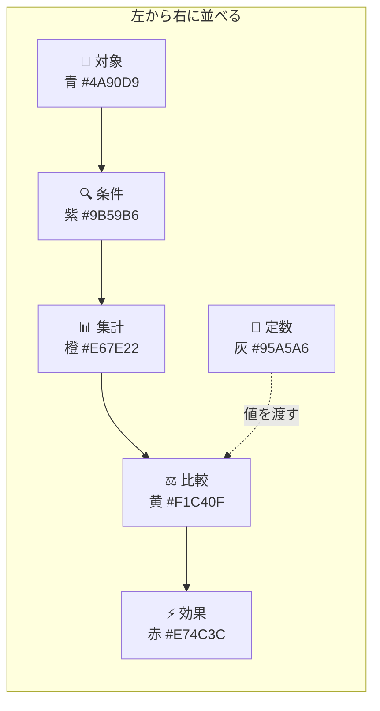

| 色 | カテゴリ | ユーザー向け名称 | 例 |
|----|----------|------------------|-----|
| 青 | スコープ | **対象** | 接続×熱融着機、加工内容 接続→SEC |
| 紫 | 条件 | **条件** | 製品幅=935、加工途中 |
| 橙 | 集計 | **集計** | WIP 合計、同一依頼ロール差 |
| 黄 | 比較 | **比較** | ≥ 20、＜ 5 |
| 赤 | アクション | **効果** | 候補除外、速度20、試行順隣接 |
| 灰 | 定数 | **数値** | 20、5、「接続」 |

---

## ルール例：B-6 / L13（視覚）

接続→SEC の WIP 制御を **1 本の流れ** として表示:

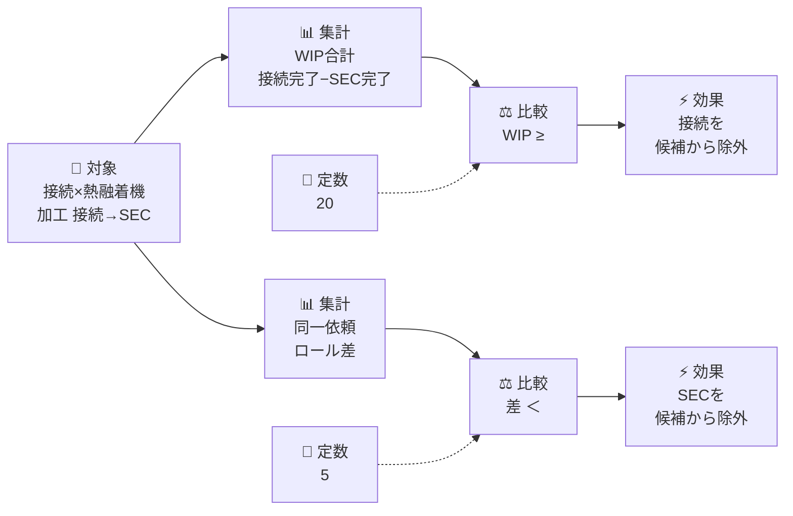

**ユーザー操作**: 定数ノード `20` / `5` をダブルクリック → スピナーで変更 → ライブ要約が「WIP上限20ロール」に更新。

---

## 背景と現状

| 層 | 現状 | ギャップ |
|----|------|----------|
| **仕様** | [`配台ルール.md`](code/要件定義/配台ルール.md) §B-1〜B-6、[`特別ルール列挙.md`](特別ルール列挙.md) L2〜L13 | 外部設定不可 |
| **実行** | [`planning_core/_core.py`](code/python/planning_core/_core.py) に L 番号ごとにハードコード（約 2.4 万行） | プラグイン化なし |
| **パラメータ** | WIP 系のみ環境変数（[`ui_ref_env_defaults.json`](code_java/src/main/resources/jp/co/pm/ai/desktop/ui_ref_env_defaults.json)） | 条件・工程ペアはコード固定 |
| **UI** | [`SpecialRulesTabController.java`](code_java/src/main/java/jp/co/pm/ai/desktop/SpecialRulesTabController.java) は Markdown **閲覧のみ** | 編集・検証・プレビューなし |

**再利用できる既存資産**

- 条件式スキーマ: 配台不要 [`ロジック式`](code/json/stage1_exclude_rules.json)（`version/mode/conditions/column/op/value`）— [`_evaluate_exclude_rule_one_condition`](code/python/planning_core/_core.py) と同等 API を特別ルール条件ノードで流用
- JSON 双方向編集: [`ExcludeRulesTabController`](code_java/src/main/java/jp/co/pm/ai/desktop/ExcludeRulesTabController.java)（表＋TextArea＋保存パス）
- Canvas／線／DnD: [`EquipmentGraphicGanttPane`](code_java/src/main/java/jp/co/pm/ai/desktop/ui/EquipmentGraphicGanttPane.java)、[`MainShellTabOrganizerTabController`](code_java/src/main/java/jp/co/pm/ai/desktop/MainShellTabOrganizerTabController.java)

**UI 方式**: **JavaFX ネイティブ Canvas グラフエディタ**（上記ワイヤーフレーム・色分け・左→右）。JSON タブは上級者／デバッグ用。MVP から **ミニマップ＋凡例＋ライブ要約** を含める（Undo は Phase 2）。

---

## データの流れ（保存〜配台）

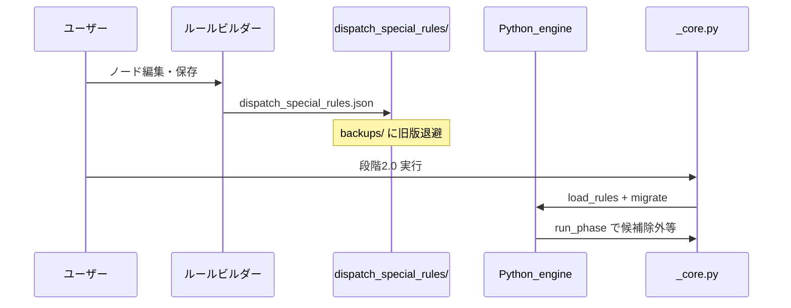

---

## 目標アーキテクチャ

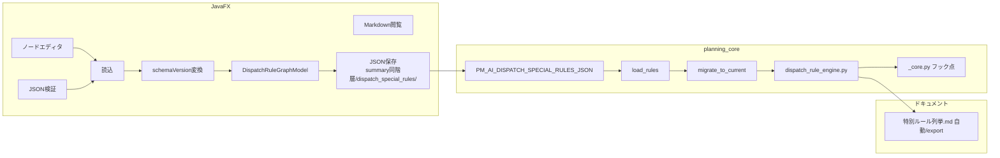

**設計原則**

1. **実行の正本は Python**（Java は編集・構造検証・ドライラン起動のみ）
2. **`_core.py` への追記は薄いフックのみ** — 評価本体は新パッケージ [`planning_core/dispatch_rules/`](code/python/planning_core/dispatch_rules/)（`_core.py` 外・独立）
3. **段階移行** — ルール単位で DSL／従来を切替。**従来 `_core.py` は当面残す**（global `PM_AI_DISPATCH_RULE_ENGINE` は補助）
4. **§B 全体を 1 DSL で表現** — L2〜L8（速度・人数）、L10/L11/L13（WIP）、B-1〜B-3（ソート帯・パイプライン・隣接）、L9/L12（未実装分もノード型として定義）
5. **スキーマ版は明示的に管理** — `schemaVersion` でファイル形式を版付けし、アプリ／engine 更新時は **段階マイグレーション** で旧 JSON を最新版へ変換可能にする（[`UserProfileStore`](code_java/src/main/java/jp/co/pm/ai/desktop/config/UserProfileStore.java) と同型）
6. **ルール単位の ON/OFF ＋ legacy 併存** — 各 L 番号を **有効/無効**切替可能。**Python 組込み（従来）ルールは当面残し**、DSL 不調時の保険として **ルールごとに実行元を選べる**（自動／新ルール／従来）
7. **ソースは独立モジュールで新規作成** — ロジック・UI・パス・マイグレーションは **専用パッケージに集約**。既存巨大ファイルへの変更は **配線（import + 数行）のみ**
8. **配台実行時の適用を可視化** — タスク割当・候補除外の瞬間に **どの L ルールが効いたか**を色付きバッジ・タイムライン・グラフハイライトで追える
9. **ルール間のロジック衝突を検出** — 有効ルール同士の矛盾を保存前／検証時にチェック
10. **適用順をユーザーが制御** — 有効ルールは **`applyOrder` 昇順**で評価。UI で **ドラッグ並べ替え**＋**一括 ON/OFF**
11. **編集履歴と復元** — 保存のたびに **スナップショット**を残し、一覧から **ワンクリックで過去状態に戻せる**
12. **段階1～3.2 実行中も編集可** — 実行中の子プロセスは **開始時点のルールスナップショット**で固定。UI の編集・保存は **次回実行から**反映（タイミングを常時表示）
13. **ルールは試走で検証** — **実タスク**を選び engine に流し込み、**グラフ上をアニメーション**で通過させて効果を確認。段階2 未実行・未保存ルールでも可（本番配台とは独立）
14. **実装完了＝テスト合格** — 各 Phase および全体完了時、**内部テストを十分実行**し、不具合があれば **修正→再テストを同一作業内で反復**してから完了報告する

---

## 1. ルールグラフ DSL（JSON スキーマ）

### 保存先（作業正本）

**サマリ Excel（`サマリ_AI配台.xlsx` / `PM_AI_SUMMARY_AI_DISPATCH_WORKBOOK`）と同一フォルダのサブフォルダ**に格納する。配台不要ルール [`stage1_exclude_rules.json`](code/json/stage1_exclude_rules.json) がサマリ**同階層**に置かれるのと同型だが、特別ルールは**専用サブフォルダ**で分離する。

```
{サマリ_AI配台.xlsx の親}/
  サマリ_AI配台.xlsx
  stage1_exclude_rules.json          ← 既存（同階層）
  dispatch_special_rules/              ← 新規サブフォルダ（無ければ保存時に作成）
    dispatch_special_rules.json        ← ルールグラフ定義（作業正本・schemaVersion 付き）
    history/                           ← 編集履歴（ユーザー向け・復元用）
      index.json                       ← スナップショット一覧メタデータ
      snapshots/
        20260526-143022_save.json
        20260526-150011_manual_試験前.json
    backups/                           ← マイグレーション／復元直前の自動退避（内部用）
      dispatch_special_rules.v1.20260526-143022.json
```

| 層 | パス解決 |
|----|----------|
| **作業正本** | `{dirname(PM_AI_SUMMARY_AI_DISPATCH_WORKBOOK)}/dispatch_special_rules/dispatch_special_rules.json` |
| **環境変数** | `PM_AI_DISPATCH_SPECIAL_RULES_JSON` — 未設定時は上記を自動解決（Exclude ルールと同パターン） |
| **リポジトリ同梱テンプレ** | `code/json/dispatch_special_rules/dispatch_special_rules.json` — 作業先が無いときの初回コピー元（[`ensureStage1ExcludeRulesJsonFromRepoIfMissing`](code_java/src/main/java/jp/co/pm/ai/desktop/config/AppPaths.java) と同型） |

**Java**: 実装は [`DispatchRulePaths.java`](code_java/src/main/java/jp/co/pm/ai/desktop/dispatch/rules/paths/DispatchRulePaths.java) に集約。`AppPaths.dispatchSpecialRulesJsonPath(ui)` は **委譲 1 メソッド**のみ。

**Python**: パス解決は **新パッケージ** [`dispatch_rules/paths.py`](code/python/planning_core/dispatch_rules/paths.py) に実装。`_core.py` へ sibling 関数を増やさず、`hook_adapter` または子プロセス env 設定から参照。

**段階1～3.2 実行前（ルール凍結）**: overlay ロジックは [`DispatchRuleStageRunOverlay.java`](code_java/src/main/java/jp/co/pm/ai/desktop/dispatch/rules/stage/DispatchRuleStageRunOverlay.java) に集約。`MainShellController` から **capture 呼び出し**（現状は段階1/2.0 と汎用 stage3 のみ → **Phase 4 rework**）。詳細は **「2026-06 ロジック再検討」** と **「段階1～3.2 実行中も編集可」**。

```json
{
  "schemaVersion": 1,
  "engineMinVersion": "1.0.0",
  "savedAt": "2026-05-26T14:30:22+09:00",
  "rules": [
    {
      "id": "L13",
      "name": "接続→SEC WIP",
      "enabled": true,
      "applyOrder": 40,
      "executionMode": "auto",
      "legacyFallback": true,
      "graph": { "...": "..." }
    },
    {
      "id": "L4",
      "name": "SEC 製品幅935 速度20",
      "enabled": false,
      "applyOrder": 20,
      "executionMode": "legacy",
      "legacyFallback": true,
      "graph": { "...": "..." }
    }
  ]
}
```

| フィールド | 意味 |
|------------|------|
| **`enabled`** | `false` → **そのルールは完全 OFF**（DSL・従来ともスキップ。適用順一覧ではグレーアウト） |
| **`applyOrder`** | **適用順**（整数・昇順）。有効ルールのみ engine がこの順で評価。UI のドラッグ並べ替えで更新（10, 20, 30… と間隔を空けて挿入しやすくする） |
| **`executionMode`** | `"auto"`（既定）／ `"dsl"`／ `"legacy"` — 下表参照 |
| **`legacyFallback`** | `true`（既定）→ DSL 検証 NG・engine 停止時に **同 id の従来ルールへ自動切替** |

※ 旧フィールド `priority` は v1 マイグレーションで **`applyOrder` に移行**（L 番号の数値とは独立）。

### 適用順と有効/無効（実行モデル）

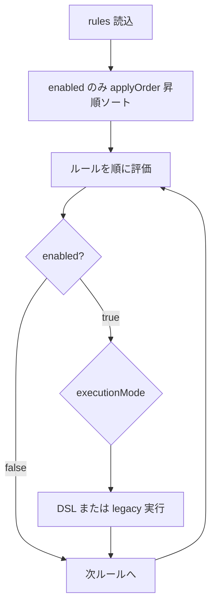

| ルール | applyOrder | enabled | 配台時の扱い |
|--------|------------|---------|--------------|
| L2 | 10 | true | **1 番目**に評価 |
| L4 | 20 | false | **スキップ**（順序は保持、再有効化で同位置） |
| L10 | 30 | true | **2 番目**に評価 |
| L13 | 40 | true | **3 番目**に評価 |

**同一フェーズ・同一タスクへの競合効果**（例: 速度上書き）:

- **`applyOrder` が小さいルールを先**に適用
- 後続ルールが **上書き可能な action**（`set_speed_mpm` 等）なら後勝ち
- **`block_candidate` 等の除外**が先に成立したら、後続の割当系は原則効かない（action 種別テーブルで定義）
- 衝突チェッカーが **順序を変えても解消しない矛盾**を error として報告

**UI（`DispatchRuleListPane`）**

| 操作 | 動作 |
|------|------|
| **☑ ON/OFF** | `enabled` トグル。OFF 行はグレー、キャンバス編集は可 |
| **≡ ドラッグ** | 行並べ替え → `applyOrder` を 10 刻みで自動再採番 |
| **↑↓ ボタン** | 1 行ずつ順序変更（キーボード可） |
| **すべて ON/OFF** | 一括有効化／無効化（確認ダイアログ） |
| **順序番号列** | 有効のみ 1,2,3… を表示（OFF は「—」） |
| **フッター要約** | `有効 3 件: L2 → L10 → L13` |

参照: 行 DnD は [`MainShellTabOrganizerTabController`](code_java/src/main/java/jp/co/pm/ai/desktop/MainShellTabOrganizerTabController.java) パターン。Python は `execution_planner.py` が `sorted(rules, key=applyOrder)` + `enabled` フィルタ。

**適用トレース sidecar** の各イベントに **`apply_order`** と **`sequence_in_run`**（その配台実行内の N 番目）を記録 → タイムライン上で適用順が見える。

### 有効/無効と legacy 併存（保険）

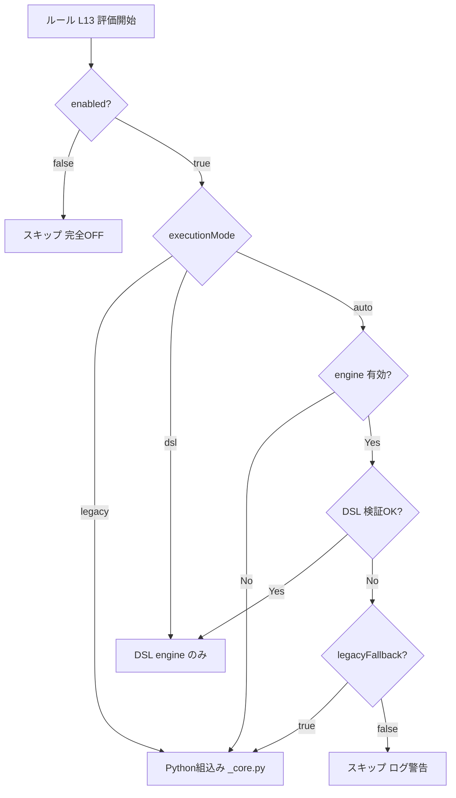

| executionMode | ユーザー向け名称 | 動作 |
|---------------|------------------|------|
| **`auto`** | **自動**（推奨） | engine ON かつ DSL 検証 OK → 新ルール。それ以外 → **従来ルール**（保険） |
| **`dsl`** | **新ルール** | DSL のみ。従来は **呼ばない**（二重適用防止） |
| **`legacy`** | **従来** | `_core.py` 組込みのみ。JSON グラフは **編集用に保持**（実行には使わない） |

**二重適用は禁止**: 同一 `id`（L13 等）で DSL と legacy が **同時に効かない**。engine フック内で `RuleDispatchPlan` が id ごとに実行元を 1 つに決定する。

**従来ルールの存続**: Phase 1〜2 では `_core.py` の L2〜L13 ハードコードを **削除しない**。Phase 3 の legacy 削除は **別途判断**（現場が DSL 移行完了するまで維持）。

**export 時の初期値**: 全 L 番号を生成。`enabled: true`, `executionMode: "legacy"`, **`applyOrder` は L2=10, L3=20 … のように 10 刻み**（並べ替え余地を確保）

- **`schemaVersion`** … ファイル形式の版（整数・単調増加）。ノード型追加・params 改名・グラフ構造変更時に +1
- **`engineMinVersion`** … このファイルの実行に必要な engine 実装版（SemVer 文字列・参考情報）
- **`savedAt`** … 最終保存 ISO-8601（バックアップファイル名にも利用）
- ルートの旧フィールド名 `version` は **v0（未指定）→ v1 マイグレーションで `schemaVersion` に昇格**（後方互換）

### スキーマ版アップと互換変換

DSL／engine を更新して **旧 JSON がそのままでは読めない／意味が変わる** 場合に備え、読込パイプラインに **段階マイグレーション** を組み込む（正本パターン: [`UserProfileStore.migrateProfileEnvelope`](code_java/src/main/java/jp/co/pm/ai/desktop/config/UserProfileStore.java)）。

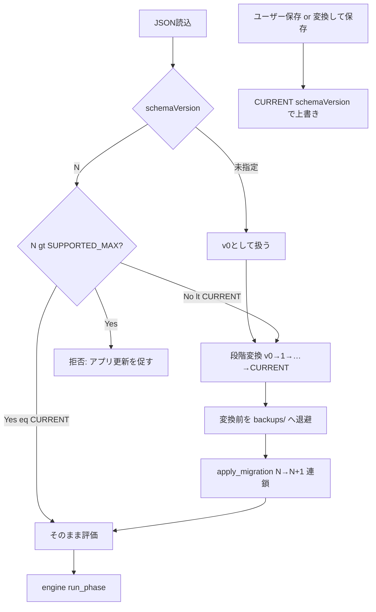

| 定数（Java / Python 共通値） | 意味 |
|------------------------------|------|
| `CURRENT_SCHEMA_VERSION` | このビルドが **書き出す** 版（初期値 `1`） |
| `SUPPORTED_SCHEMA_MAX` | このビルドが **読める上限**。超過はエラー（新しすぎるファイル） |
| `ENGINE_IMPLEMENTATION_VERSION` | engine 実装の SemVer（ログ・`engineMinVersion` 検証用） |

**マイグレーション実装（新規）**

| モジュール | 役割 |
|------------|------|
| [`dispatch_rule_migrations.py`](code/python/planning_core/dispatch_rule_migrations.py) | `migrate_document(raw: dict) -> dict` — `while ver < CURRENT: apply_migration(ver, ver+1)` |
| `apply_migration_v0_to_v1` 等 | **1 段階ずつ**変換（一気に飛ばさない）。rename・ノード型置換・deprecated params 移動 |
| [`DispatchRuleMigrationService.java`](code_java/src/main/java/jp/co/pm/ai/desktop/dispatch/rules/DispatchRuleMigrationService.java) | Java 側も同一ロジック（Jackson `ObjectNode`）。**評価は Python 正本だが UI 読込は Java 単体でも変換可能** |
| `code/python/tools/migrate_dispatch_special_rules.py` | CLI: `--in PATH --out PATH [--dry-run]`（CI・手動変換用） |

**変換トリガ（3 経路）**

1. **自動（読込時）** — ビルダー読込、または **段階1～3.2 開始時 capture 後**の `load_rules` が旧版を検出 → メモリ上で最新版に変換して評価。**ディスクは触らない**（安全側）。**実行中の子プロセスは凍結ファイルを再読込しない**
2. **明示（UI）** — 旧版検出時にステータス表示「schemaVersion 1 → 2 に変換可能」＋ **「変換して保存」** ボタン → `backups/` 退避後、作業正本を最新版で上書き
3. **CLI / 一括** — 工場共有フォルダ内の JSON をアップデート前に `migrate_dispatch_special_rules.py` で変換

**バックアップ方針**（マイグレーション・復元の内部退避）

- スキーマ変換保存・**履歴からの復元**の直前に `backups/` へ現行ファイルを退避（ユーザーが履歴一覧からは基本非表示）
- 直近 N 件（例: 20）を超えたら古い backup を削除

### 編集履歴と復元（ユーザー向け）

**目的**: ルール編集の **過去状態を残し、ワンクリックで戻す**。誤操作・試行錯誤後のロールバックを現場で完結させる。

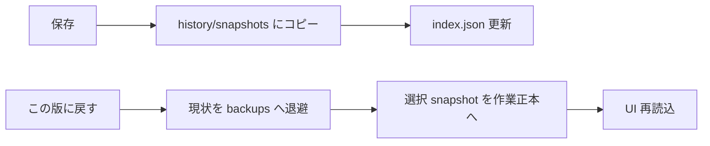

**スナップショット種別（`kind`）**

| kind | トリガ | ラベル例 |
|------|--------|----------|
| **`auto_save`** | 「保存」成功時 | `2026-05-26 14:30 保存` |
| **`auto_restore_guard`** | 復元直前の現状退避 | `復元前の自動退避` |
| **`manual`** | 「スナップショット」ボタン（Phase 2） | ユーザー入力メモ（例: `試験前`） |
| **`import`** | テンプレ／legacy export 取込時 | `初期インポート` |

**`history/index.json`（例）**

```json
{
  "version": 1,
  "maxEntries": 50,
  "entries": [
    {
      "id": "20260526-143022",
      "kind": "auto_save",
      "label": "保存",
      "savedAt": "2026-05-26T14:30:22+09:00",
      "schemaVersion": 1,
      "snapshotFile": "snapshots/20260526-143022_save.json",
      "summary": "L13 閾値 20→15、L4 OFF"
    }
  ]
}
```

- **`summary`**: 直前スナップショットとの diff 要約（Java/Python 共通ロジック `history_diff.py` / `DispatchRuleHistoryDiff`）
- **保持件数**: 既定 **50**（`maxEntries` 超過で最古を削除。env `PM_AI_DISPATCH_RULE_HISTORY_MAX` で変更可）

**UI（履歴パネル）**

ツールバー **[履歴▼]** または右ペインタブ:

```
┌─ 編集履歴 ─────────────────────────────────────────────────────────────┐
│ ● 2026-05-26 14:30  保存        L13 閾値 20→15        [プレビュー][戻す]│
│ ○ 2026-05-26 13:05  自動退避    （復元前）              [プレビュー][戻す]│
│ ○ 2026-05-26 11:00  保存        L4 OFF                  [プレビュー][戻す]│
└────────────────────────────────────────────────────────────────────────┘
```

| 操作 | 動作 |
|------|------|
| **[戻す]** | 確認ダイアログ → 現状を `auto_restore_guard` で退避 → 選択 snapshot を作業正本にコピー → ビルダー再読込 |
| **プレビュー** | 差分要約（変更ルール id・enabled・applyOrder・主要 params）を Inspector 表示。Phase 2 で JSON diff |
| **現在** | 一覧先頭に「現在（未保存変更あり）」を表示（セッション内 dirty 時） |

**独立モジュール**

| モジュール | 役割 |
|------------|------|
| [`history_store.py`](code/python/planning_core/dispatch_rules/history_store.py) | append_snapshot / restore / prune / diff_summary |
| [`DispatchRuleHistoryStore.java`](code_java/src/main/java/jp/co/pm/ai/desktop/dispatch/rules/history/DispatchRuleHistoryStore.java) | UI から同一 API |
| `DispatchRuleHistoryPane.java` | 履歴一覧・復元・プレビュー |
| `DispatchRuleHistoryDiff.java` | 2 snapshot 間の要約 diff |

**保存フロー統合**: 「保存」成功 → `history_store.append_snapshot(kind=auto_save)` → その後 `dispatch_special_rules.json` 書き込み（または書き込み前内容を snapshot 化してから上書き）。

**Phase 割当**

| Phase | 内容 |
|-------|------|
| **1** | 保存時 auto_save + index + 履歴パネル + ワンクリック復元 |
| **2** | manual スナップショット（メモ付き）+ diff summary 強化 |
| **3** | セッション内 Undo/Redo スタック（任意・履歴とは別） |

### 段階1～3.2 実行中も編集可（ルール適用タイミング）

**目的**: 長時間の段階1／2.0／2.1 や段階3.0/3.1/3.2 パイプライン中も **特別ルールを編集・保存できる**。一方で **実行中の子プロセスが参照するルールは開始時点で固定**し、途中変更が配台結果を汚さない。

**現状の制約**（[`MainShellController.applyRunTabGating`](code_java/src/main/java/jp/co/pm/ai/desktop/MainShellController.java)）:

- `runLock` 取得中（段階1／2.0 Python 実行、または `activeDispatchTrialKind == STAGE3` の旧配台試行、または **段階3.x パイプライン busy**）は **「実行・ログ」以外のメインタブを `setDisable(true)`** し、強制的に実行タブへ戻す（**特別ルールタブのみ例外**）
- 特別ルールタブ（`MainShellTabId.SPECIAL_RULES`）も現状は **編集不可**

**変更方針**

| 項目 | 方針 |
|------|------|
| **タブ gating** | `pipelineBusy` 中も **`SPECIAL_RULES` のみ `setDisable(false)`**。ユーザーがビルダーへ切替えても **強制で実行タブへ戻さない**（他タブは従来どおり無効） |
| **再実行ロック** | `runLock` は維持 — 実行中の **段階1～3.2 の再開始**は不可（二重起動防止） |
| **ルール凍結** | 各段階 **開始直前**に作業正本を **`run_snapshots/` へコピー**。子プロセス env `PM_AI_DISPATCH_SPECIAL_RULES_JSON` は **凍結パスのみ**（実行中に作業正本を再読込しない） |
| **編集の効力** | 実行中の UI 編集・「保存」は **作業正本 + `history/` のみ更新**。**現在走っている処理には反映されない** |
| **次回への反映** | **次にその段階を開始した瞬間**の capture が新ルールを使う（段階2 保存 → 同じ段階2 実行中は旧 snapshot のまま → **次の段階2 開始**で新 snapshot） |

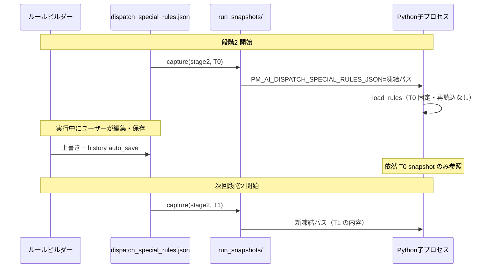

**段階ごとの「ルールが効くタイミング」**（詳細は上記 **「2026-06 ロジック再検討」** の表を正とする）

| 段階 | 実行中に DSL/legacy が評価されるか | 凍結 snapshot の意味 |
|------|-----------------------------------|---------------------|
| **段階1** | **通常は評価しない**（タスク抽出のみ） | 編集可の一貫性 + **直後の段階2.0** 用に「開始時点の正本」を記録 |
| **段階2.0** | **評価する** | **必須**。実行中編集は **当該段階2.0 結果に無効** |
| **段階2.1** | **評価する** | **必須**（overlay 未接続 → **rework-snapshot-overlay**） |
| **段階3.0** | **評価する** | 枝番分解後の配台A。開始 snapshot 固定 |
| **段階3.1** | **評価する** | 時間外 hybrid + 配台A。3.0 とは **別 run_id** |
| **段階3.2** | **評価する** | 数量厳守モード。3.0/3.1 とは **別 run_id** |

**注意（適用タイミングの UX 必須表示）**

1. **idle**: 「編集は **次回** 段階1～3.2 実行開始時に適用」
2. **pipeline 実行中**: バナーに **段階名** + **凍結時刻** + **snapshot id** + 「**今保存してもこの実行には反映されません**」
3. **dirty（未保存）**: 「未保存 — 次回実行にも **未反映**。保存してください」
4. **保存直後（実行中）**: 「保存済み — **次回** 段階○ 開始から適用（**今の実行は {時刻} snapshot**）」
5. **履歴復元（実行中）**: 確認ダイアログで **「実行中の配台には影響しません。次回実行から反映」** を明示（`auto_restore_guard` は従来どおり）

**ディレクトリ（作業正本と分離）**

```
dispatch_special_rules/
  dispatch_special_rules.json     ← 作業正本（常時編集・保存先）
  history/                        ← 編集履歴（ユーザー復元用）
  run_snapshots/                  ← 実行開始時凍結（子プロセス専用・上書きしない）
    stage2_0_20260526-143001_a1b2.json
    stage3_0_20260526-150512_c3d4.json
    stage3_1_20260526-151200_d5e6.json
  run_snapshots/index.json        ← run_id, stage, capturedAt, sourceHash, path
```

- **`history/` と `run_snapshots/` を混同しない** — 履歴復元は作業正本のみ。実行中の子プロセスは **run_snapshots を読むだけ**
- 保持: 直近 **20 run**（`PM_AI_DISPATCH_RULE_RUN_SNAPSHOT_MAX`）。古い JSON は prune

**Java 実装**

| クラス | 役割 |
|--------|------|
| `DispatchRuleStageRunOverlay` | 段階開始前: migrate 済み正本を copy → env 上書き → `DispatchRuleBuilderRunContext` 更新 |
| `DispatchRuleRunSnapshot` | capture / index 更新 / activeRunId 参照 |
| `DispatchRuleBuilderRunContext` | `pipelineBusy`, `activeStage`, `snapshotId`, `snapshotCapturedAt`, `workingFileDirty` — ビルダーが購読 |
| `DispatchRuleRunStatusBanner` | 上記 5 状態の文言・色（黄=実行中、橙=dirty） |

**`MainShellController` 配線（最小）**

1. 段階1／2.0／2.1 起動直前・段階3.0/3.1/3.2 パイプライン開始直前・`beginDispatchTrialGating(STAGE3)` 直前 → `stageRunOverlay.captureForStage(stageKey, ui)`（**rework-snapshot-overlay**）
2. `applyRunTabGating` → `t.getId()` が `specialRules` の Tab は **disable 除外**；選択強制も **SPECIAL_RULES 選択中はスキップ**
3. 正常／異常終了 → `builderRunContext.clearActiveRun()`（バナーを idle に）

**Python 実装**

| モジュール | 役割 |
|------------|------|
| [`run_snapshot.py`](code/python/planning_core/dispatch_rules/run_snapshot.py) | `capture_run_snapshot(stage, work_path) -> path`；index 追記；**実行中ファイル変更を検知しても reload しない**（env パス固定） |
| `hook_adapter.load_rules` | env の JSON パスのみ読む（親 JVM が snapshot を渡す前提） |
| `trace_recorder` | 各イベントに `run_snapshot_id` を付与（適用トレースと凍結版の対応） |

**Phase 割当**

| Phase | 内容 |
|-------|------|
| **1** | タブ gating 例外 + 段階2.0／3.0 の capture + バナー + `run_snapshots/index.json` + sidecar `run_snapshot_id` |
| **1 後半** | 段階1 開始時 capture + **2.1/3.1/3.2 overlay 接続**（rework-snapshot-overlay） |
| **2** | 実行中ドライラン（**現 run には非適用**の明示付き）+ 適用トレースで snapshot 版フィルタ |

**将来の版アップ例（設計メモ）**

| 版 | 変更内容 | マイグレーション処理 |
|----|----------|----------------------|
| v0→v1 | 初版正式化 | ルート `version` → `schemaVersion`、`rules[]` 必須化、旧 `priority` → **`applyOrder`** |
| v1→v2（例） | ノード型 rename | `type` マップ表で置換、`params` キー rename |
| v2→v3（例） | ポート名変更 | `edges[].fromPort/toPort` 変換表 |

**テスト**

- `code/python/tests/test_dispatch_rule_migrations.py` — 各版の **golden JSON**（入力→期待出力）を固定
- Java `DispatchRuleMigrationServiceTest` — 同一 golden を Java でも検証（Python と結果一致）
- 回帰: マイグレーション後も legacy 配台結果と一致

**拒否条件**

- `schemaVersion > SUPPORTED_SCHEMA_MAX` → 読込拒否（「アプリを更新してください」— UserProfileStore と同文案）
- マイグレーション中に **不明ノード型** または **不可逆な欠落** → 変換中止、backup のみ残しエラー詳細を UI 表示

### ノード型カタログ（§B 全体）

| カテゴリ | ノード型 | 対応ルール | 適用フェーズ |
|----------|----------|------------|--------------|
| **スコープ** | `scope.process_machine` | 工程名×機械名 | 全フェーズ |
| | `scope.process_pipeline` | 加工内容 `接続→SEC` 等 | 全フェーズ |
| | `scope.roll_pipeline_flag` | B-2/B-3 EC・検査・巻返し | sort / assign |
| **条件** | `filter.row_conditions` | L4〜L8 列条件 | queue_build / need |
| | `filter.in_progress` | B-1 | sort |
| **集計** | `metric.wip_total_rolls` | L10/L11/L13 総 WIP | eligible_filter |
| | `metric.request_roll_diff` | B-4.1/B-6.1 同一依頼差 | eligible_filter |
| | `metric.pipeline_frame` | B-2/B-3 ロール枠 | assign |
| **比較** | `compare.threshold` | 上限・閾値（旧 env 値） | eligible_filter |
| **アクション** | `action.block_candidate` | WIP 上限で上流除外 | eligible_filter |
| | `action.block_downstream` | ゲートで SEC 除外 | eligible_filter / probe |
| | `action.set_speed_mpm` | L4〜L8 → 20 | queue_build |
| | `action.set_min_team` / `action.set_required_team` | L2/L3/L7 | need_explore |
| | `action.reorder_trial_adjacent` | B-2/3, B-4.2, B-6.2 | trial_order |
| | `action.set_sort_tier` | B-1, B-2/B-3 帯 | sort_key |
| | `action.trial_order_priority` | L12/PN 優先（将来） | trial_order |
| | `action.timeline_start_floor` | B-6 SEC 開始下限 | timeline |
| **定数** | `const.number` / `const.string` | 閾値・工程名 | — |

**条件ノード**は配台不要と同一サブスキーマをネスト:

```json
{ "type": "filter.row_conditions", "params": {
  "require_all": false,
  "conditions": [{ "column": "製品幅", "op": "eq", "value": 935 }]
}}
```

**エッジ意味**: データフロー（スコープ → 条件 → 集計 → 比較 → アクション）。1 ルール = 1 グラフ。**有効ルール**は **`applyOrder` 昇順**で順に評価（同一フェーズ内）。

---

## 2. Python 評価エンジン

新規パッケージ **`code/python/planning_core/dispatch_rules/`**（`_core.py` 外・自己完結）:

```
planning_core/dispatch_rules/
  __init__.py              # 公開 API のみ re-export
  paths.py                 # JSON 作業パス（Java DispatchRulePaths と同型）
  schema.py                # RuleSet / RuleDocument dataclass
  migrations.py            # schemaVersion 段階変換
  execution_planner.py     # enabled フィルタ + applyOrder ソート + executionMode → dsl|legacy|skip
  engine.py                # load_rules / run_phase
  hook_adapter.py          # _core から呼ぶ唯一の薄い入口
  trace_recorder.py        # 配台時適用イベント → sidecar JSON
  trace_schema.py
  preview.py               # 単 task 1 行要約（Inspector 用・軽量）
  simulation.py            # 試走エンジン: 段階的 SimulationStep 列を生成（アニメーション正本）
  simulation_schema.py     # SimulationResult / SimulationStep / TaskSnapshot
  conflict_checker.py      # ルール間ロジック衝突検出（静的解析）
  conflict_schema.py       # ConflictReport / ConflictKind
  history_store.py         # 編集履歴スナップショット・復元・prune
  history_diff.py          # スナップショット間 diff 要約
  run_snapshot.py          # 段階1～3.2 開始時凍結・index・active run_id
  legacy_bridge.py         # 従来 _core 関数への委譲（移動せずラップ）
  context.py               # RuleContext
  phases.py                # RulePhase enum
  nodes/                   # ノード executor（1 型 1 ファイル）
    __init__.py
    registry.py
    scope_process_machine.py
    metric_wip_total_rolls.py
    action_block_candidate.py
    ...
  cli/
    validate_rules.py      # --validate-rules
    migrate_rules.py       # マイグレーション CLI
code/python/tools/
  export_legacy_special_rules_json.py
code/python/tests/dispatch_rules/
  test_migrations.py
  test_execution_planner.py
  test_simulation.py
  test_conflict_checker.py
  fixtures/dispatch_special_rules_v*.json
  fixtures/conflict_reports_*.json
```

**`_core.py` 側（変更最小）**: 各フック点で `from planning_core.dispatch_rules.hook_adapter import maybe_run_phase` 等 **1 行 import + 1 行呼び出し**のみ。legacy 本体は `_core.py` 内に残し、`legacy_bridge.py` が **import して委譲**（コピーしない）。

```python
# hook_adapter.py — _core から見える表面 API
def maybe_run_phase(phase: str, ctx: dict, legacy_fn: Callable) -> Any: ...
```

新規 [`engine.py`](code/python/planning_core/dispatch_rules/engine.py):

```python
class RulePhase(Enum):
    QUEUE_BUILD = "queue_build"
    TRIAL_ORDER = "trial_order"
    SORT_KEY = "sort_key"
    ELIGIBLE_FILTER = "eligible_filter"
    ASSIGN_PROBE = "assign_probe"
    NEED_EXPLORE = "need_explore"
    TIMELINE = "timeline"

def load_rules(path: str | None) -> RuleSet: ...
def plan_execution(rule_set: RuleSet) -> RuleDispatchPlan: ...  # id → dsl | legacy | skip
def run_phase(phase: RulePhase, ctx: RuleContext, plan: RuleDispatchPlan) -> RulePhaseResult: ...
```

**読込フロー**: `engine.load_rules` → `migrations.migrate_document` → `execution_planner.plan_execution` → `run_phase`（いずれも `dispatch_rules/` 内）。

**`RuleContext`** に渡すもの（既存 dict をラップ）:

- 対象 `task` / 全 `task_queue`
- 当日 `day`、集計済み WIP、同一依頼ロール差
- `process_content_tokens`、`roll_pipeline_*` フラグ

**`_core.py` フック置換（薄い差分）**

| 現行関数 | フェーズ | 移行後 |
|----------|----------|--------|
| `_apply_dispatch_speed_special_rules_enumerated_md` | QUEUE_BUILD | `run_phase` → speed action |
| `_reorder_task_queue_*_consecutive` 系 | TRIAL_ORDER | adjacency action |
| `_generate_plan_task_queue_sort_key` の b_tier | SORT_KEY | sort_tier action |
| `_trial_order_flow_eligible_tasks` WIP/ゲート | ELIGIBLE_FILTER | block_* actions |
| `_trial_order_hard_precheck_blocks_assign_probe` | ASSIGN_PROBE | 同上 |
| L2/L3/L7 need 分岐 | NEED_EXPLORE | team actions |
| `_b6_sec_start_floor_from_connection_timeline` | TIMELINE | timeline_floor action |

B-2/B-3 の **完全二相・設備占有** は最も複雑なため、**Phase 2** で専用ノード `scope.roll_pipeline_b2` + `action.two_phase_inspection` として移植（Phase 1 では legacy 併用可）。

**移行用シード**

- スクリプト `code/python/tools/export_legacy_special_rules_json.py` — 現行 L2〜L13 + env 既定値から JSON を生成
- 生成 JSON と legacy 実行結果の **同一入力回帰テスト**（既存 stage2 出力 JSON 比較）

**フィーチャフラグ**

| 変数 | 既定 | 意味 |
|------|------|------|
| `PM_AI_DISPATCH_RULE_ENGINE` | `0` | `1` で DSL engine 経路を **全体有効化**（ルール単位 `executionMode` と併用） |
| `PM_AI_DISPATCH_SPECIAL_RULES_JSON` | 自動解決 | 作業 JSON パス |
| `PM_AI_DISPATCH_RULE_LEGACY_FALLBACK` | `1` | `0` で auto 時の従来フォールバックを **無効**（DSL 専用試験用） |
| `PM_AI_DISPATCH_RULE_RUN_SNAPSHOT_MAX` | `20` | `run_snapshots/` 保持件数 |

- 既存 WIP env（`WIP_LIMIT_*`）は **DSL 内 const ノードの既定値**として import 時に埋め込み。**従来経路が有効な間は env も引き続き効く**（二重管理期間は export 時に DSL へ同期）

**保存 UX（ビルダー UI）**

- 「保存」でサブフォルダが無ければ `Files.createDirectories` してから JSON 書き出し
- パス表示は Exclude タブ同様 `pathField` に解決後絶対パスを表示（手動上書き可）
- サマリ Excel の出力先（`PM_AI_SUMMARY_AI_DISPATCH_WORKBOOK`）変更時は、作業 JSON パスも連動して再解決（env タブ同期）

---

## 3. JavaFX ノードエディタ UI（視覚優先）

### タブ構成

[`SpecialRulesTab.fxml`](code_java/src/main/resources/jp/co/pm/ai/desktop/fxml/SpecialRulesTab.fxml) を **子 TabPane** 化:

| 子タブ | 誰向け | 見た目 |
|--------|--------|--------|
| 要約 / 列挙 | 仕様確認 | 現行 Markdown（変更なし） |
| **ルールビルダー** | **現場・設定担当** | 色分け Canvas（メイン） |
| **ルール試走** | **設定検証・教育** | 実タスク投入 + **アニメーション試走**（本番配台と独立） |
| **適用トレース** | 配台後の確認 | 段階2/手動修正の **実適用イベント**を一覧・タイムライン表示 |
| JSON | 開発・障害調査 | monospace TextArea |

### ビルダー必須 UI 要素

| 領域 | 視覚要素 |
|------|----------|
| **パレット** | カテゴリ見出し＋色付きチップ。ドラッグ時ゴーストも同色 |
| **キャンバス** | ドット格子、ズーム（ホイール）、パン（中ボタン）、**左→右自動整列** |
| **ノード** | 角丸矩形・左色帯・アイコン・2 行要約・入出力ポート（丸） |
| **エッジ** | ベジェ曲線・矢印・ホバーで太線 |
| **Inspector** | フォーム（列名 ComboBox、閾値 Spinner）。**ライブ要約**（自然文）を最上部 |
| **ミニマップ** | 右下固定。全体位置を把握 |
| **凡例** | 6 色カテゴリを常時表示 |
| **ルール一覧** | **適用順列・ON/OFF・DnD 並べ替え**・実行元 Combo・一括 ON/OFF |
| **ステータス** | schema バッジ、検証 OK/NG、**実行元バッジ**（DSL / Legacy / OFF）、保存パス |
| **実行状態バナー** | 段階1～3.2 実行中: 凍結 snapshot 時刻・id・「次回から反映」。idle/dirty 時も適用タイミングを常時表示 |

### Java パッケージ（独立）

**新規ディレクトリ** `code_java/src/main/java/jp/co/pm/ai/desktop/dispatch/rules/` に UI・モデル・サービスを **すべて配置**。既存 Controller は **委譲のみ**。

```
dispatch/rules/
  model/           DispatchRuleGraphModel, RuleNode, RuleEdge, ExecutionMode
  migration/       DispatchRuleMigrationService
  history/         DispatchRuleHistoryStore, DispatchRuleHistoryDiff
  validation/      DispatchRuleValidationService, DispatchRuleConflictChecker
  execution/       DispatchRuleExecutionPlanner
  paths/           DispatchRulePaths          ← 作業 JSON パス（AppPaths は委譲 1 メソッド）
  stage/           DispatchRuleStageRunOverlay, DispatchRuleRunSnapshot, DispatchRuleBuilderRunContext
  trace/           DispatchRuleTraceLoader, ApplicationEvent
  ui/
    editor/        GraphEditorPane, NodeView, EdgeView, Minimap, Legend
    palette/       DispatchRulePalettePane
    inspector/     DispatchRuleInspectorPane, SummaryRenderer
    list/          DispatchRuleListPane
    trace/         ApplicationTracePane, TimelinePane, BadgeSupport, GraphHighlightSupport
    conflict/      DispatchRuleConflictPane, ConflictRuleLinkRenderer
    history/       DispatchRuleHistoryPane
    runstatus/     DispatchRuleRunStatusBanner
    simulation/    DispatchRuleTestLabPane, SimulationAnimator, TaskPicker（3.4）
    template/      DispatchRuleTemplateCatalog
  SpecialRulesBuilderTabController.java   ← ビルダー子タブ専用 Controller
  DispatchRuleTestLabTabController.java ← 試走子タブ専用 Controller
  DispatchRuleDryRunService.java          ← preview 1 行用（試走は SimulationService）
code_java/src/main/resources/jp/co/pm/ai/desktop/fxml/dispatch/rules/
  SpecialRulesBuilderTab.fxml
  fragments/       （必要なら Pane 単位 FXML）
code_java/src/test/java/jp/co/pm/ai/desktop/dispatch/rules/
  ...Tests
```

**既存ファイルへの接続（配線のみ）**

| 既存ファイル | 変更内容 | 目安行数 |
|--------------|----------|----------|
| [`SpecialRulesTabController.java`](code_java/src/main/java/jp/co/pm/ai/desktop/SpecialRulesTabController.java) | TabPane 化 + `SpecialRulesBuilderTabController` を load | ~30 |
| [`SpecialRulesTab.fxml`](code_java/src/main/resources/jp/co/pm/ai/desktop/fxml/SpecialRulesTab.fxml) | 子 Tab 追加 | ~15 |
| [`AppPaths.java`](code_java/src/main/java/jp/co/pm/ai/desktop/config/AppPaths.java) | `dispatchSpecialRulesJsonPath` → `DispatchRulePaths` 委譲 + env キー定数 | ~15 |
| [`MainShellController.java`](code_java/src/main/java/jp/co/pm/ai/desktop/MainShellController.java) | overlay + TraceLoader.reload + **`applyRunTabGating` 特別ルール例外** + runSnapshot capture 呼び出し | ~25 |
| [`DispatchInteractiveTabController.java`](code_java/src/main/java/jp/co/pm/ai/desktop/DispatchInteractiveTabController.java) | `BadgeSupport.attach(table)` 1 呼び出し | ~5 |
| [`MainShellInnerTabCatalog.java`](code_java/src/main/java/jp/co/pm/ai/desktop/config/MainShellInnerTabCatalog.java) | 子タブ見出し追加（**ルール試走**含む） | ~8 |
| [`Stage2PythonChildEnv.java`](code_java/src/main/java/jp/co/pm/ai/desktop/Stage2PythonChildEnv.java) | 新 env キー伝播 | ~10 |
| [`ui_ref_env_defaults.json`](code_java/src/main/resources/jp/co/pm/ai/desktop/ui_ref_env_defaults.json) | 新 env 2〜3 件 | 数行 |
| [`_core.py`](code/python/planning_core/_core.py) | `hook_adapter` 呼び出し | **各フック点 2 行以内** |

**触らない（ロジック追加禁止）**: `EquipmentGraphicGanttPane`、`ExcludeRulesTabController`、`_core.py` の legacy 関数本体、その他配台コア。

### 新規クラス一覧（`dispatch/rules/` 内）

| クラス | 役割 |
|--------|------|
| `DispatchRuleGraphModel` / `RuleNode` / `RuleEdge` | Jackson モデル（DSL と 1:1） |
| `DispatchRuleNodeTypeRegistry` | ノード型定義・ポート・パラメータスキーマ |
| `DispatchRuleGraphEditorPane` | Canvas: 描画・パン・ズーム・**自動レイアウト** |
| `DispatchRuleNodeView` | 色帯・アイコン・2 行要約・ポート |
| `DispatchRuleEdgeView` | ベジェ＋矢印 |
| `DispatchRulePalettePane` | 色付きカテゴリパレット |
| `DispatchRuleInspectorPane` | フォーム + **ライブ要約（自然文）** |
| `DispatchRuleMinimapPane` | 全体俯瞰 |
| `DispatchRuleLegendPane` | 6 色凡例 |
| `DispatchRuleSummaryRenderer` | グラフ → 日本語 1 文要約（Inspector / ツールチップ） |
| `DispatchRuleListPane` | 適用順 TableView・DnD・enabled トグル・applyOrder 再採番 |
| `DispatchRuleOrderDragSupport` | 行 DnD と applyOrder 永続化 |
| `DispatchRuleExecutionPlanner` | id ごと DSL/legacy/skip を決定（二重適用防止） |
| `DispatchRuleGraphTabController` | 読込・保存・検証・dry-run 起動 |
| `DispatchRuleValidationService` | 単一グラフの構造検証（孤立ノード・型不一致・必須ポート） |
| `DispatchRuleConflictChecker` | **複数ルール間**のロジック衝突検出（Python 正本と同一結果） |
| `DispatchRuleConflictPane` | 衝突一覧・双ルールジャンプ・競合ノードの橙枠表示 |
| `DispatchRuleMigrationService` | 読込時 schemaVersion 判定・変換（内部 backups/ 退避） |
| `DispatchRuleHistoryStore` | スナップショット追加・一覧・復元・件数 prune |
| `DispatchRuleHistoryPane` | 履歴一覧・プレビュー・**この版に戻す** |

**操作（視覚フロー重視）**

1. ルール一覧で **L4 を OFF**、**L13 を L10 の上へドラッグ** → `applyOrder` 更新 → フッター `L2→L13→L10`
2. 試験で問題あれば L13 実行元を **従来** に切替
3. 「衝突」→ 順序変更で解消可能か確認
4. 「保存」→ 自動で **history スナップショット**追加後に JSON 書き込み
5. 誤った変更 → **[履歴] → この版に戻す**（復元前の現状も自動退避）

**参照実装**: Canvas/線 [`EquipmentGraphicGanttPane`](code_java/src/main/java/jp/co/pm/ai/desktop/ui/EquipmentGraphicGanttPane.java)、ライブプレビュー [`PushButtonDesignTabController`](code_java/src/main/java/jp/co/pm/ai/desktop/PushButtonDesignTabController.java)、DnD [`MainShellTabOrganizerTabController`](code_java/src/main/java/jp/co/pm/ai/desktop/MainShellTabOrganizerTabController.java)

---

## 3.4 ルール試走ラボ（実タスク投入・アニメーション検証）

**目的**: 段階2.0 を回さなくても、**実際の plan_input タスク**を選び、編集中ルール（**未保存可**）を **視覚的に面白く**通して「どこで止まる／変わるか」を理解できる **サンドボックス**。**適用トレース**（本番 sidecar）が **実実行の記録**なのに対し、試走は **what-if シミュレーション**。

**3 つの画面の役割分担**

| 画面 | いつ使う | データ源 |
|------|----------|----------|
| **ルール試走**（本節） | ルール編集直後・現場説明・閾値調整 | 選択 task + **エディタ上のルール JSON** |
| **適用トレース**（本番） | 段階2.0/3.x 実行後の事後確認 | sidecar `dispatch_rule_applications.json` |
| **Inspector ライブ要約** | 1 行だけ素早く確認 | `preview.py`（試走タブへ誘導） |

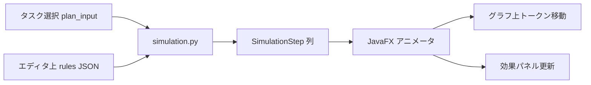

### 画面レイアウト（ワイヤ）

```
┌─ ルール試走 ───────────────────────────────────────────────────────────────┐
│ タスク: [plan_input から選択 ▼]  Y6-3 / 接続 / 熱融着…  [一覧から選ぶ…]   │
│ 試走対象ルール: [L13 接続→SEC WIP ▼]  日付: [2026-05-26 ▼]  WIP前提: [自動▼]│
│ [▶ 再生] [⏸] [⏭ 1ステップ] [↺ 最初]  速度 [====●====] 1.0x              │
├───────────────────────────────┬──────────────────────────────────────────┤
│ フェーズ帯（横スクロール）      │  タスクカード（試走中の状態）              │
│ ■QUEUE ■ELIGIBLE ▶TRIAL □SORT │  依頼 Y6-3  工程:接続  速度:—→20m/分     │
│   ●───●───●───○───○           │  判定: 🚫 候補から除外（L13）              │
├───────────────────────────────┴──────────────────────────────────────────┤
│  ルールグラフ（ビルダーと同一 Canvas・試走モード）                         │
│     ┌🎯┐ ──●──▶ ┌📊┐ ──●──▶ ┌⚖┐ ──●──▶ ┌🚫┐                              │
│     │対象│       │WIP│       │≥20│       │除外│  ← 現在ノードはパルス＋光る │
│     └──┘       └───┘       └───┘       └───┘                              │
│        ～～～ タスクトークン（● Y6-3）がエッジ上を移動 ～～～                │
├──────────────────────────────────────────────────────────────────────────┤
│ ステップ 3/7 │ L13 │ eligible_filter │ 集計 WIP=21 ≥ 20 → 候補除外        │
│ [ビルダーで編集] [この閾値で再試走] [ルール OFF で比較試走]（Phase 2）      │
└──────────────────────────────────────────────────────────────────────────┘
```

### タスクの選び方（実データ）

| ソース | 優先 | 備考 |
|--------|------|------|
| [`plan_input_tasks.xlsx`](output/plan_input_tasks.xlsx) | **既定** | `PlanInputTabController` が読込済みなら **メモリ上の行**を TableView で選択 |
| 段階1 プレビュー表 | 代替 | plan_input 未読込時 |
| 手動 task_id 入力 | 開発用 | ComboBox 編集可 |

- 選択行の **主要列**（依頼NO・工程・機械・製品幅・加工内容・換算数量）を **タスクカード**に表示
- **複数タスク連続試走**（キュー再生）は Phase 2。Phase 1 は **1 タスク固定**

### アニメーション（視覚的にわかりやすく・面白く）

| 要素 | 演出 | 実装 |
|------|------|------|
| **タスクトークン** | 小さな丸＋依頼NO ラベルが **エッジに沿ってベジェ移動** | `PathTransition` / 自前ベジェ補間（[`EquipmentGraphicGanttPane`](code_java/src/main/java/jp/co/pm/ai/desktop/ui/EquipmentGraphicGanttPane.java) の線描画を流用） |
| **ノード状態** | 未訪問 → **アクティブ（パルス光）** → 通過（緑✓）／拒否（赤✗）／変更（黄⚡） | `ParallelTransition` + 色帯の `FillTransition` |
| **フェーズ帯** | 配台フェーズを **左→右のコンベア**として表示。現在フェーズが **スライドハイライト** | 上部 `HBox` + `TranslateTransition` |
| **数値カウント** | WIP 集計ノードで **18→19→20** とカウントアップ、閾値超えで **赤フラッシュ** | ノード上オーバーレイ Label + `Timeline` |
| **効果サウンド** | 任意・既定 OFF | Phase 3。除外=短い低音、通過=クリック音（`PM_AI_UI_SOUNDS` 既存方針に従う） |
| **比較試走** | 同一 task で **ルール ON/OFF** を **実線 vs 点線トークン**で同時表示 | Phase 2 |

**再生コントロール**: ▶ 再生 / ⏸ 一時停止 / ⏭ 1 ステップ / ↺ リセット / 速度 0.5×・1×・2×（`Slider`）

**試走中の編集**: グラフは **読取専用**（試走モード）。パラメータ変更は **ビルダーへ戻る**か **[この閾値で再試走]**（Inspector 連携）で即再実行。

### Python 試走 API（正本）

[`simulation.py`](code/python/planning_core/dispatch_rules/simulation.py):

```python
@dataclass
class SimulationStep:
    sequence: int
    phase: str              # RulePhase 値
    rule_id: str
    node_id: str
    node_type: str
    edge_from: str | None   # アニメーション用
    edge_to: str | None
    effect: str | None      # pass | block_candidate | set_speed_mpm | ...
    summary_ja: str
    metrics: dict           # wip_total, threshold, ...
    task_snapshot: dict     # 試行後の task 主要フィールド

def simulate_task(
    document: dict,
    task_row: dict,
    *,
    rule_id: str | None = None,   # None = 有効ルール全体を applyOrder 順
    day: str | None = None,
    context_overrides: dict | None = None,
) -> SimulationResult: ...
```

- **評価本体**は `engine.run_phase` と **同一 executor**（結果の乖離を防ぐ）
- legacy ルールは `legacy_bridge` を **1 ステップずつ**ラップして `SimulationStep` に変換
- WIP 等の **前提コンテキスト**は段階2 未実行時:
  - 既定: **簡易自動推定**（同一依頼・同一日の plan_input 行から WIP 近似）
  - 上級: ユーザーが **WIP 前提**を Spinner で上書き（「接続 WIP=19 から試す」等）
- CLI: `code/python/tools/simulate_dispatch_rules.py --rules PATH --task-json PATH`（CI golden 用）

**Java 呼び出し**: [`DispatchRuleSimulationService`](code_java/src/main/java/jp/co/pm/ai/desktop/dispatch/rules/simulation/DispatchRuleSimulationService.java) が **軽量 Python 子プロセス**（段階2 より短い `simulate_dispatch_rules.py`）を起動。リクエスト JSON に **エディタ上の未保存 `rules[]`** を含める（ディスク保存不要）。

### Java モジュール

```
dispatch/rules/simulation/
  DispatchRuleSimulationService.java    # 子プロセス起動・JSON 往復
  DispatchRuleSimulationResult.java
  DispatchRuleSimulationStep.java
  DispatchRuleSimulationAnimator.java   # Step → Timeline マッピング
  DispatchRuleSimulationPlayback.java   # play/pause/step/speed 状態機械
  ui/
    DispatchRuleTestLabPane.java        # 試走タブ本体（Canvas + コントロール）
    DispatchRuleTestLabController.java
    DispatchRuleTaskPickerDialog.java   # plan_input 行選択
    DispatchRuleTaskCardPane.java       # タスク状態カード
    DispatchRulePhaseStripPane.java     # フェーズ帯
    DispatchRuleSimulationStepPane.java # ステップ説明テキスト
fxml/dispatch/rules/
  DispatchRuleTestLabTab.fxml
```

- グラフ描画は **ビルダーと `DispatchRuleGraphEditorPane` を共有**し、`GraphEditorMode.SIMULATION` で試走専用オーバーレイ（トークン・ノード状態）を載せる
- 試走タブでルール変更 → **ビルダーのモデルを dirty 共有**（保存はユーザー操作）

### 適用タイミング・実行中との関係

| 状況 | 試走の挙動 |
|------|------------|
| **通常** | エディタ上のルール（未保存含む）で即試走 |
| **段階1～3.2 実行中** | 試走 **可能**（特別ルールタブ gating 例外と同様）。バナー「**試走はシミュレーションのみ。実行中の配台には影響しません**」 |
| **run_snapshots 凍結版との比較** | Phase 2: 「**本番 snapshot 版で試走**」トグル — 次回実行に効くルール vs 今エディタ上の差分を並べて確認 |

### Phase 割当

| Phase | 内容 |
|-------|------|
| **1** | `simulation.py`（L13/L4・単一 rule_id）+ 試走タブ + **ステップ手動**（⏭）+ ノードハイライト + plan_input 1 行選択 |
| **2** | **▶ 連続アニメーション** + フェーズ帯 + WIP カウンタ + 全有効ルール applyOrder 通し + ON/OFF 比較試走 |
| **3** | 複数タスクキュー再生 + 試走結果の GIF/ログ export（任意）+ 教育用テンプレ「L13 デモ試走」 |

### テスト

| 種別 | 内容 |
|------|------|
| **Python** | golden: 固定 task_row + rules → `SimulationStep[]` 固定（legacy 一致） |
| **Java** | `SimulationAnimatorTest` — Step 列から Timeline キーフレーム数が期待通り |
| **手動** | L13 閾値 20→15 に変更 → 再試走で **除外↔通過がアニメで反転**すること |

**参照実装（アニメーション）**: [`EquipmentGraphicGanttPane`](code_java/src/main/java/jp/co/pm/ai/desktop/ui/EquipmentGraphicGanttPane.java)（Canvas・ベジェ）、[`PushButtonDesignTabController`](code_java/src/main/java/jp/co/pm/ai/desktop/PushButtonDesignTabController.java)（ライブ更新）

---

## 3.5 ルール適用の可視化（配台・タスク割当時）

> **注**: 節番号 3.5 はドキュメント構成上の番号。**旧「段階3.5」パイプラインとは無関係**（時間外再配台は **段階3.1**）。

**目的**: 段階2.0 や段階3.x・手動修正で **実際にタスクへ割当／除外**されたとき、**どの特別ルール（L13 等）が効いたか**をコードやログを読まずに把握する。

### データ（sidecar・独立ファイル）

配台結果と同階層（`dispatch_special_rules/` または段階2 出力 JSON 隣）に **適用トレース**を書き出す:

```
dispatch_special_rules/
  dispatch_special_rules.json
  dispatch_rule_applications.json      ← 最新配台の適用イベント（上書き）
  traces/
    applications_20260526-153012.json  ← 実行ごと履歴（任意）
```

**イベント 1 件の例**:

```json
{
  "task_id": "Y6-3-接続-01",
  "day": "2026-05-26",
  "rule_id": "L13",
  "apply_order": 40,
  "sequence_in_run": 3,
  "run_snapshot_id": "stage2_0_20260526-143001_a1b2",
  "pipeline_stage": "stage2_0",
  "rule_task_id": "Y6-3",
  "branch_task_id": "",
  "execution_source": "dsl",
  "phase": "eligible_filter",
  "effect": "block_candidate",
  "reason_code": "H-SR-B6",
  "summary_ja": "WIP上限により接続を当日候補から除外",
  "graph_node_ids": ["n3", "n5"]
}
```

**記録元（Python `dispatch_rules/trace_recorder.py`）**

- DSL engine の `run_phase` が block/set_speed 等を返したとき **必ず 1 イベント**
- legacy 経路は [`_agent_debug_special_rule_block_reason`](code/python/planning_core/_core.py) の `H-SR-*` を **同スキーマに正規化**して記録（二重記録しない）
- 既存 `[配台トレース task=…]` ログは維持。sidecar は **UI 向け構造化**の追加

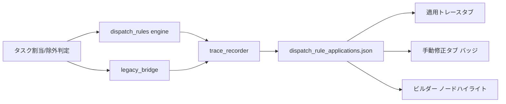

### 画面 A — 「適用トレース」子タブ（特別ルール内）

```
┌─ 適用トレース ─────────────────────────────────────────────────────────┐
│ ソース: [最新段階2.0 ▼]  依頼NO [Y6-3 ▼]  日付 [2026-05-26 ▼]  [再読込] │
├────────────────────────────────────────────────────────────────────────┤
│ タイムライン（横）  08:00 ──●L13除外──●L4速度20──●割当OK──────── 19:00 │
├───────────────────────────────┬────────────────────────────────────────┤
│ イベント一覧                   │ 詳細 + ルールグラフ連動                 │
│ ● L13 接続 候補除外 09:15     │  task: Y6-3-接続-01                    │
│ ○ L4  SEC 速度→20   10:00     │  効果: 候補から除外                     │
│ ✓ 割当成功          11:30     │  [ビルダーで L13 を開く] → 該当ノード赤枠 │
└───────────────────────────────┴────────────────────────────────────────┘
```

| UI 要素 | 動作 |
|---------|------|
| **色付きドット（タイムライン）** | ルール id ごとにビルダーと **同色**（L13=橙系 WIP 等） |
| **イベント一覧** | task_id / 工程 / 効果 / reason_code でフィルタ |
| **グラフ連動** | 行選択 → ルールビルダーで `graph_node_ids` のノードを **パルス赤枠** |
| **ドライラン** | 試走タブへ誘導 — **本番 sidecar 無しでも** plan_input + エディタルールで simulate |

### 画面 B — 配台計画手動修正タブ（行バッジ）

[`DispatchInteractiveTabController`](code_java/src/main/java/jp/co/pm/ai/desktop/DispatchInteractiveTabController.java) には **ロジックを書かず**、[`DispatchRuleApplicationBadgeSupport`](code_java/src/main/java/jp/co/pm/ai/desktop/dispatch/rules/ui/trace/DispatchRuleApplicationBadgeSupport.java) を注入:

```
│ 依頼NO │ 工程 │ 機械 │ … │ 特別ルール │
│ Y6-3   │ 接続 │ …    │   │ [L13🚫]    │  ← ホバーで summary_ja ツールチップ
│ Y6-3   │ SEC  │ …    │   │ [L13⏸][L4⚡] │
```

- **🚫** 候補除外、**⏸** ゲート待ち、**⚡** 速度/人数変更、**↔** 試行順隣接 等のアイコン
- 行クリック → 特別ルール「適用トレース」タブへジャンプ（同一 task_id を選択）

### 画面 C — ビルダー内「ライブ適用プレビュー」（編集中・1 行）

Inspector 下部に **選択 task_id**（ComboBox）向け **1 行要約**:

> 「この task を 2026-05-26 に割当すると → **L13 で接続が除外**」

`preview.py` で即時算出。**詳細な通過アニメーション**は **[ルール試走] タブ**（3.4）へ誘導するリンクを併記。

### 独立モジュール追加

```
dispatch_rules/
  trace_recorder.py      # イベント append・sidecar 書き出し
  trace_schema.py
  preview.py             # 単 task ドライラン
dispatch/rules/trace/
  DispatchRuleApplicationEvent.java
  DispatchRuleTraceLoader.java
  ui/trace/
    DispatchRuleApplicationTracePane.java
    DispatchRuleTimelinePane.java
    DispatchRuleApplicationBadgeSupport.java
    DispatchRuleGraphHighlightSupport.java
```

**既存への配線**: `MainShellController` 段階2 成功後に `DispatchRuleTraceLoader.reloadFromLatestStage2(...)` を 1 呼び出し。手動修正タブは `bindShell` 時に BadgeSupport を register。

### Phase 割当

| Phase | 内容 |
|-------|------|
| **1** | `trace_recorder` + L13/L4 イベント + 適用トレースタブ（一覧のみ） |
| **1** | **試走 MVP**: simulation.py + 試走タブ + ステップ手動 + plan_input タスク選択 |
| **2** | タイムライン + 手動修正バッジ + グラフハイライト連動 |
| **2** | **試走アニメーション** + フェーズ帯 + ON/OFF 比較 + 全ルール通し試走 |
| **3** | traces/ 履歴 + 計画結果ビューア連携（任意）+ 試走キュー・デモテンプレ |

---

## 3.6 ルール間ロジック衝突チェック

**目的**: 有効なルールが複数あるとき、**同じタスク・同じフェーズで矛盾する効果**（速度の食い違い、除外と必須の両立不可 等）がないか **保存前・検証時**に検出する。

### 衝突の種類（`ConflictKind`）

| 種別 | 深刻度 | 例 | 検出方法 |
|------|--------|-----|----------|
| **effect_contradiction** | error | L4/L6 とも SEC・速度 `set_speed_mpm` だが条件が **重なり得る**のに値が異なる | スコープ＋フェーズ＋action 型＋条件交差 |
| **block_vs_require** | error | 一方が `block_candidate`、他方が同一スコープで割当必須相当 | フェーズ `eligible_filter` 交差 |
| **duplicate_scope_action** | warning | 同一 process×machine・同一 phase・同一 action が 2 ルール（**applyOrder 未整理**） | シグネチャ一致 |
| **apply_order_tie** | warning | 有効 2 ルールが **同一 applyOrder** かつスコープ交差 | applyOrder 比較 |
| **dsl_legacy_divergence** | warning | 同一 id で `executionMode:auto/dsl` かつ DSL パラメータが **legacy 既定と不一致** | legacy export 比較 |
| **pipeline_incompatible** | error | L10 スリット→SEC ゲートと L13 接続→SEC ゲートが **同一 task 行**に両方効く想定外組合 | process_pipeline 解析 |

**静的解析の流れ**（配台実行なし）:

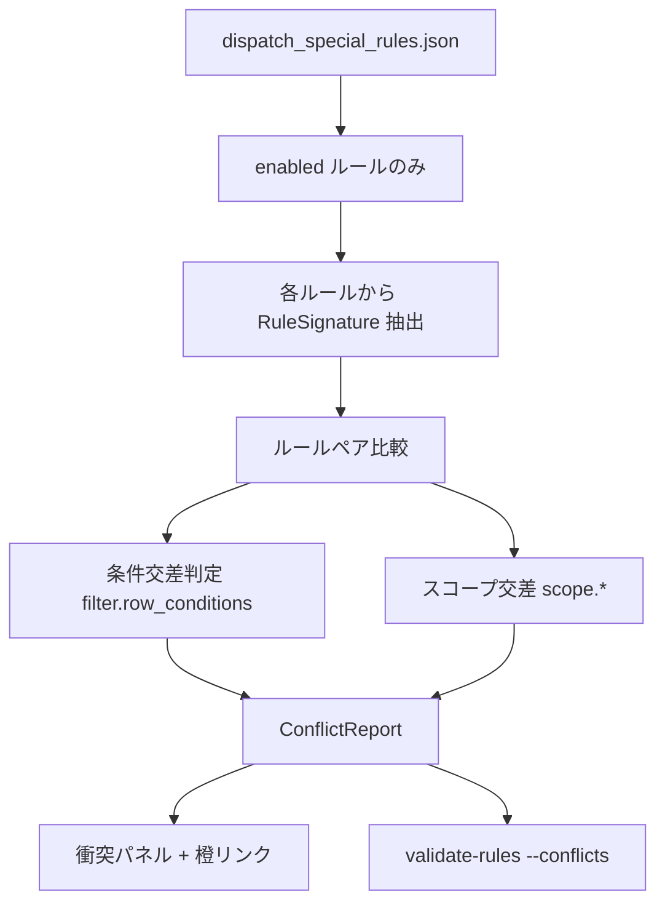

**`RuleSignature`（内部）**: `rule_id`, `phases[]`, `processes[]`, `machines[]`, `pipelines[]`, `actions[]`（型+params 正規化）, `condition_ast`（簡易）

**Python 正本**: [`conflict_checker.py`](code/python/planning_core/dispatch_rules/conflict_checker.py)

```python
def check_rule_conflicts(document: dict) -> ConflictReport: ...
# ConflictReport: conflicts[], error_count, warning_count
```

Java [`DispatchRuleConflictChecker`](code_java/src/main/java/jp/co/pm/ai/desktop/dispatch/rules/validation/DispatchRuleConflictChecker.java) は **同一 golden** で結果一致（構造検証 `ValidationService` とは別クラス）。

### UI（衝突パネル）

ツールバー **[衝突]** または検証時に自動表示:

```
┌─ ロジック衝突 ──────────────────────────────────────────────────────┐
│ ● error  L4 ↔ L6  同一SEC行で速度20が二重定義（条件が重なり得る）      │
│          [L4を開く] [L6を開く]  競合ノード: L4.n3, L6.n2              │
│ △ warn   L13 applyOrder=40 = L10 applyOrder=40  適用順が未確定       │
└──────────────────────────────────────────────────────────────────────┘
```

| 視覚 | 動作 |
|------|------|
| **橙の点線** | ルール一覧上で衝突ペア L4—L6 を結ぶ |
| **競合ノード橙枠** | 両方のグラフで該当 action/compare ノードを強調 |
| **ステータスバー** | `⚠ 衝突 error 1 / warn 1` — クリックでパネル展開 |
| **保存** | `error_count > 0` → 確認ダイアログ（「衝突のまま保存」／キャンセル） |
| **段階2 前（任意）** | `PM_AI_DISPATCH_RULE_BLOCK_ON_CONFLICT=1` で error 時に実行中断を選択可 |

### 実行タイミング

1. **編集中** — 「衝突」ボタン／検証ボタンに含める（debounce 500ms）
2. **保存前** — 自動実行
3. **CLI** — `validate_rules.py --conflicts`（CI 用）
4. **Phase 2** — plan_input の **サンプル行**（先頭 N 行）で条件交差を実データ補強

### テスト

- `test_conflict_checker.py` — L4/L6 重複、L13 OFF 時は衝突なし、apply_order_tie
- Java golden 一致
- 手動: 意図的衝突 → 橙リンク → 片方 OFF → 解消

### Phase 割当

| Phase | 内容 |
|-------|------|
| **1** | `conflict_checker` 骨格 + effect_contradiction + duplicate_scope + UI パネル MVP |
| **2** | 条件交差の精緻化 + dsl_legacy_divergence + 段階2 前ブロック（env 任意） |
| **3** | サンプル plan 行シミュレーション + pipeline_incompatible |

**環境変数タブ連携**: [`env-vars-managed-by-sheet-and-tsv.mdc`](.cursor/rules/env-vars-managed-by-sheet-and-tsv.mdc) に `PM_AI_DISPATCH_SPECIAL_RULES_JSON` / `PM_AI_DISPATCH_RULE_ENGINE` / `PM_AI_DISPATCH_RULE_LEGACY_FALLBACK` / `PM_AI_DISPATCH_RULE_BLOCK_ON_CONFLICT`（任意）/ **`PM_AI_DISPATCH_RULE_HISTORY_MAX`**（既定 50）を追加。

---

## 4. ドキュメント同期

[`dispatch-docs-sync.mdc`](.cursor/rules/dispatch-docs-sync.mdc) に従い:

- JSON export 時に [`特別ルール列挙.md`](特別ルール列挙.md) へ機械可読行を追記する **オプション**（手動 Markdown 編集は残す）
- [`特別ルール.md`](特別ルール.md) は要約更新（ビルダー UI の説明段落を追加 — **ユーザー依頼時のみ**）
- L9/L12 未実装分は DSL ノード型を先に定義し、engine 実装はフラグ `experimental: true`

---

## 5. 実装フェーズ（推奨順）

### Phase 1 — 基盤 + WIP/速度（縦串 PoC 含む）

- DSL スキーマ v1 + **`schemaVersion` / マイグレーション骨格**（v0→v1、`CURRENT`/`SUPPORTED_MAX` 定数）
- `dispatch_rule_engine.py` 骨格 + `load_rules` 内 migrate フック
- L13/B-6 相当グラフを legacy と **結果一致** させる回帰
- L4（速度 1 件）で QUEUE_BUILD 経路を証明
- `conflict_checker` 骨格 + UI 衝突パネル MVP
- **編集履歴**: 保存時 snapshot + 履歴パネル + ワンクリック復元
- **実行中編集**: `applyRunTabGating` 特別ルール例外 + `run_snapshots/` 凍結 + `DispatchRuleRunStatusBanner` + 段階2.0～3.2 capture（**rework-snapshot-overlay** で 2.1/3.1/3.2 接続）
- Java: **視覚優先ビルダー MVP** + **適用トレース一覧**（L13 イベント）+ **試走タブ MVP**（ステップ手動・L13/L4）
- `trace_recorder` + sidecar JSON 書き出し（`run_snapshot_id` 付与）
- サマリ同階層サブフォルダ・`DispatchRulePaths` / `dispatch_rules/paths.py`・`StageRunOverlay`
- **完了条件**: §8 検証ループ（Phase 1 スコープ）合格

### Phase 2 — §B 残り（人数・隣接・ソート）

- L2/L3/L7（NEED_EXPLORE）、L10/L11（WIP 他経路）
- **適用トレース**: タイムライン + 手動修正バッジ + グラフノードハイライト
- B-6.2 / B-4.2 / B-2 EC 隣接（TRIAL_ORDER）
- B-1 / B-2/B-3 sort_tier（SORT_KEY）
- **試走**: 連続アニメーション・フェーズ帯・WIP カウンタ・ルール ON/OFF 比較
- legacy export 全 L 番号 → JSON 一括生成
- `PM_AI_DISPATCH_RULE_ENGINE=1` を session 既定で試験可能に
- **完了条件**: §8 検証ループ（Phase 1+2 累積）合格

### Phase 3 — 複雑パイプライン + 未実装 L

- B-2/B-3 完全二相・設備占有を DSL 化
- L9/L12 ノード実装
- Markdown 自動 export、試走 **複数タスクキュー** + デモテンプレ完成
- **legacy 削除は必須にしない** — 現場が全 L を `executionMode: dsl` で安定運用した後、別リリースで `_core.py` 組込みを段階廃止（保険期間は Phase 2 完了後も継続可）
- **完了条件**: §8 検証ループ（**全 Phase・全体**）合格 → ユーザーへ完了報告

---

## 6. テスト戦略

| 種別 | 内容 |
|------|------|
| **Python 単体** | 各ノード型 executor、phase ごとの RuleContext モック |
| **回帰** | 同一 plan_input + master で legacy vs engine の dispatch JSON diff（許容: 試行順 tie-break のみ） |
| **Java 単体** | GraphModel シリアライズ、ValidationService、**MigrationService golden テスト** |
| **マイグレーション** | 各 `schemaVersion` の golden JSON 往復（Python + Java） |
| **手動** | L13 OFF / 実行元切替 → sidecar イベント変化。手動修正行バッジと一致 |
| **トレース** | golden sidecar JSON + UI フィルタ回帰 |
| **衝突** | L4/L6 競合 golden + OFF で解消 |
| **履歴** | 保存→snapshot 追加、復元→作業正本一致、復元前 guard 退避 |
| **実行中編集** | 段階2 実行中に正本を変更しても **凍結 JSON の hash が不変**；終了後再 capture で新 hash |
| **gating 例外** | pipelineBusy 中に SPECIAL_RULES タブが disable されない UI テスト |
| **試走** | golden SimulationStep 列 + L13 閾値変更で除外/通過が反転 |
| **試走×実行中** | 段階2 実行中に試走しても凍結 snapshot / sidecar が変化しない |
| **二重適用** | 同一 id で DSL+legacy が同時発火しないことを単体テスト |

---

## 8. 実装完了後の内部テスト・修正ループ（必須・エージェント動作）

**目的**: 実装を「書いた」で終えず、**自動テスト＋該当スモークを十分実行**し、失敗があれば **修正を自動で行い再実行**する。**すべて合格するまで同一作業内で反復**してから Phase 完了／全体完了を報告する。

### いつ実行するか

| タイミング | スコープ |
|------------|----------|
| **各 Phase 完了時** | 当該 Phase で触ったモジュール＋累積 golden（§6 表の該当行） |
| **全体実装完了時** | §8.2 の **フルスイート** + §8.3 スモークチェックリスト全項目 |
| **不具合修正ターン** | 修正 diff の影響範囲に応じた **最小再実行セット** → 問題が残れば **フルスイート** |

### 修正ループ（エージェント必須手順）

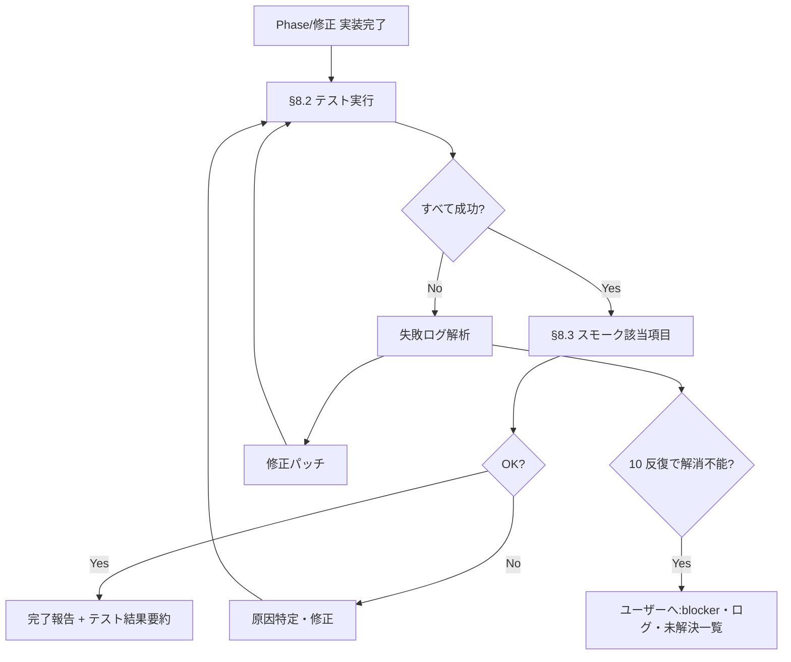

1. **テスト実行** — 下記コマンドを **エージェントがターミナルで実行**（推測で「通るはず」と報告しない）
2. **失敗時** — スタックトレース・golden diff から原因を特定し **修正**
3. **再実行** — 同一スイートを **成功するまで繰り返し**（1 ターン内で完遂）
4. **スモーク** — 自動化できない JavaFX 操作は §8.3 チェックリストで確認（可能なら TestFX／起動スモーク）
5. **報告** — 実行コマンド・成功件数・修正した不具合の **一行要約** を応答に含める

**反復上限**: 同一不具合で **10 回**修正→再テストしても解消しない場合はループを止め、**blocker** としてユーザーにログ・再現手順・試した対策を報告（無限ループ禁止）。

### 自動テストスイート（実行コマンド）

**一括入口（新規）**: [`scripts/verify_dispatch_rules.sh`](scripts/verify_dispatch_rules.sh)

```bash
# リポジトリルートから（WSL では rtk 経由可）
scripts/verify_dispatch_rules.sh --phase 1   # Phase 1 最小
scripts/verify_dispatch_rules.sh --phase 2   # Phase 1+2 累積
scripts/verify_dispatch_rules.sh --full      # 全体完了時
```

スクリプト内部で順に実行:

| 順 | 対象 | コマンド（例） |
|----|------|----------------|
| 1 | Python 単体 | `python -m pytest code/python/tests/dispatch_rules/ -q --tb=short` |
| 2 | Python CLI | `python code/python/tools/validate_dispatch_rules.py --conflicts`（fixture JSON） |
| 3 | legacy 回帰 | `python code/python/tests/dispatch_rules/test_legacy_parity.py`（Phase 1 以降） |
| 4 | Java コンパイル | `cd code_java && ./mvnw -q compile` |
| 5 | Java 単体 | `cd code_java && ./mvnw -q test -Dtest=jp.co.pm.ai.desktop.dispatch.rules.**.*Test` |
| 6 | マイグレーション golden | Python + Java 同一 fixture 一致（§6） |
| 7 | simulation golden | `test_simulation.py`（試走 Step 列） |

[`code-java-maven-build.mdc`](.cursor/rules/code-java-maven-build.mdc) に従い **`./mvnw` 優先**。Python はリポジトリ既定の venv／`PYTHONPATH=code/python` をスクリプト側で設定。

**Phase 別の最小セット**

| Phase | 必須 |
|-------|------|
| **1** | pytest（migrations, execution_planner, simulation L13/L4, conflict MVP）+ Java compile + `DispatchRuleMigration*Test` + legacy L13/L4 parity |
| **2** | 上記 + 全 L golden + trace sidecar + `test_simulation` 拡張 |
| **3** | `--full` 全件 + B-2/B-3 パイプライン golden |

### スモークチェックリスト（手動／半自動）

自動テストでカバーしきれない項目。**Phase 完了報告前**に該当行を確認（エージェントは JavaFX 起動可能な環境なら **可能な限り自ら実行**）:

| # | 確認 | Phase |
|---|------|-------|
| S1 | 特別ルールタブ → ビルダー表示・保存・履歴復元 | 1 |
| S2 | 段階2 実行中も特別ルールタブ編集可・バナー「次回から反映」 | 1 |
| S3 | 試走: plan_input 行選択 → ステップ/アニメで L13 除外が見える | 1–2 |
| S4 | 適用トレース: 段階2 後 sidecar 読込・グラフハイライト | 1–2 |
| S5 | 衝突パネル: L4/L6 競合検出 → 順序変更で warning 解消 | 1–2 |
| S6 | 実行中編集保存 → 同一段階2 結果不変 → 次回段階2 で反映 | 1 |
| S7 | `PM_AI_DISPATCH_RULE_ENGINE=1` で legacy と dispatch JSON 一致（許容 diff 内） | 2 |
| S8 | 試走 ON/OFF 比較・フェーズ帯アニメ | 2 |

**記録**: スモーク結果は応答に ✅/❌ 表で記載。❌ は **修正ループに戻る**（自動化可能ならテスト化して pytest/mvn に追加）。

### 修正時の優先順位

1. **コンパイル／import エラー** — 最優先
2. **golden / parity 不一致** — engine・legacy_bridge・execution_planner を疑う
3. **Java/Python マイグレーション不一致** — 正本 Python、Java は追随
4. **UI 単体テスト失敗** — モデル・シリアライズを先に直し、FXML は後
5. **スモークのみ失敗** — 再現手順を最小化し、可能なら **回帰テストに昇格**

### 完了報告に含める項目（必須）

- 実行した `verify_dispatch_rules.sh` の **phase/full** と **exit code**
- pytest / mvn の **成功件数**（失敗→修正があった場合は **修正内容 1 行ずつ**）
- スモークチェックリスト **該当行の ✅/❌**
- 未解決 blocker があれば **ログ抜粋と次の手**

### Git

- 検証ループ **合格後**に `.cursor/rules/git-commit-push-after-code-changes.mdc` に従い commit/push（ユーザーが「コミットしない」と明示した場合のみ除外）

---

## 7. 主要リスクと対策

| リスク | 対策 |
|--------|------|
| `_core.py` 肥大・退行 | **`dispatch_rules/` 新パッケージ** + hook 各 2 行以内。legacy は bridge 委譲のみ |
| B-2/B-3 二相の DSL 化が重い | Phase 3 に延期、Phase 1〜2 は legacy 併用 |
| ノード UI 工数 | MVP でも **色・要約・テンプレ・ミニマップ** は必須。Undo/複数ルール同時編集は Phase 2 |
| 条件列名の不一致 | exclude と同じ列名定数を Python/Java で共有リスト化 |
| **適用が見えない** | sidecar + 適用トレースタブ + 手動修正バッジ + グラフハイライト + **試走ラボ** |
| **ルール効果が想像しづらい** | 実タスク試走 + トークンアニメ + WIP カウンタ + ON/OFF 比較 |
| **ルール矛盾で配台が不安定** | conflict_checker + 衝突 UI + 保存前警告 + 任意で段階2 前ブロック |
| **DSL 移行の不安** | ルール ON/OFF + executionMode + legacy 併存。初期 export は `legacy` 既定 |
| **誤編集で設定破壊** | history/ + ワンクリック復元 |
| **実行中編集で配台が途中変わる** | run_snapshots 凍結 + バナー + 次回実行から反映の明示 |
| **実行中タブが開けない** | `applyRunTabGating` で特別ルールタブのみ例外 |
| **スキーマ版アップで設定が壊れる** | `schemaVersion` + 段階 migrate + backups/ + UI「変換して保存」+ golden テスト |
| **段階2.5 再設計との混同** | 2.5 用ノード・正本切替は **追加しない**。整列は手動修正＋段階3 前処理。2.5 再設計は **別プラン** |
| **snapshot キーが粗い** | rework-snapshot-overlay: `stage2_0`…`stage3_2` + trace `pipeline_stage` 一致 |
| **枝番タスクで WIP が狂う** | rework-rule-task-id: `rule_task_id` 集計（段階1-3.2 と同 PR） |
| **実装だけしてテスト不足** | §8 必須ループ + `verify_dispatch_rules.sh` + Phase 完了条件 + 10 反復上限で blocker 報告 |

---

## 9. Phase 4 — パイプライン整合（rework todos）

Phase 1〜3 で **DSL・ビルダー・試走・トレースの MVP は完了**。2026-06 の製品変更（段階2.5 削除・段階1〜3.2 再編）に合わせ、**実行タイミングと rule scope** を直すフェーズ。

| todo id | 完了条件（要約） |
|---------|------------------|
| `rework-snapshot-overlay` | 全 `PipelineExecutionTimingKind` + STAGE2_1 起動前に capture。`run_snapshots/index.json` の `stage` が `stage2_0` 等。バナーが 3.2 表記 |
| `rework-rule-task-id` | L10/L11/L13 の WIP・同一依頼差が **枝番行でも親依頼で集計**。golden 回帰更新 |
| `rework-trace-stage3` | sidecar に `pipeline_stage` / `rule_task_id` / `branch_task_id`。適用トレース UI で 3.0/3.1/3.2 フィルタ |
| `rework-test-lab-input3` | 試走タスクピッカーが **入力3表**行を選択可。simulation リクエストに parent コンテキスト |
| `rework-banner-terminology` | プラン・Java 文言から 3.5/2.5 を排除（本更新でプラン側は概ね完了） |
| `rework-stage25-docs-gap` | 2.5 **再設計プラン**確定まで DSL ノード追加なし（ドキュメントは依頼時のみ [`配台ルール.md`](code/要件定義/配台ルール.md) 同期） |

**検証**: `verify_dispatch_rules.sh --phase rework`（将来追加）または既存 full + 手動 S2/S6/S7 を **段階2.0/3.0** で再実施。

**段階1-3.2 計画との分担**

| 領域 | 段階1-3.2 計画 | 本プラン rework |
|------|----------------|-----------------|
| 配台可能日時・段階2.0 開始 | `stage2-dispatch-start` 等 | 触らない（hook は既存） |
| 枝番分解・入力3表 | `stage3-input-builder` | 触らない |
| `rule_task_id` / 親ID集計 | `rule-task-id-refactor` | **同一実装**（engine + trace + 試走） |
| run_snapshot overlay | 記載薄 | **本プラン rework-snapshot-overlay** |

---

## 変更ファイル（想定）

### 新規（独立パッケージ＝ここにロジックの 9 割以上）

**Python** — `planning_core/dispatch_rules/` 一式（上記ツリー）、`tools/`、`tests/dispatch_rules/`

**スクリプト** — [`scripts/verify_dispatch_rules.sh`](scripts/verify_dispatch_rules.sh)（§8 一括検証）

**Java** — `jp.co.pm.ai.desktop.dispatch.rules.**` 一式、`fxml/dispatch/rules/`

**データ** — `code/json/dispatch_special_rules/dispatch_special_rules.json`（テンプレ）

### 既存（配線のみ・ロジックを書かない）

- [`SpecialRulesTabController.java`](code_java/src/main/java/jp/co/pm/ai/desktop/SpecialRulesTabController.java) / [`.fxml`](code_java/src/main/resources/jp/co/pm/ai/desktop/fxml/SpecialRulesTab.fxml)
- [`AppPaths.java`](code_java/src/main/java/jp/co/pm/ai/desktop/config/AppPaths.java) — 委譲
- [`MainShellController.java`](code_java/src/main/java/jp/co/pm/ai/desktop/MainShellController.java) — overlay capture（**Phase 4 で 2.1/3.x 拡張**）
- [`MainShellInnerTabCatalog.java`](code_java/src/main/java/jp/co/pm/ai/desktop/config/MainShellInnerTabCatalog.java)
- [`Stage2PythonChildEnv.java`](code_java/src/main/java/jp/co/pm/ai/desktop/Stage2PythonChildEnv.java)
- [`ui_ref_env_defaults.json`](code_java/src/main/resources/jp/co/pm/ai/desktop/ui_ref_env_defaults.json)
- [`_core.py`](code/python/planning_core/_core.py) — `hook_adapter` 呼び出しのみ

### 触らない

- メインシェル新規トップタブ、`EquipmentGraphicGanttPane` 等の既存 UI 本体
- `_core.py` 内 legacy 特別ルール関数の **本体**（bridge から参照するだけ）
- WebView / 新 Maven graph 依存
