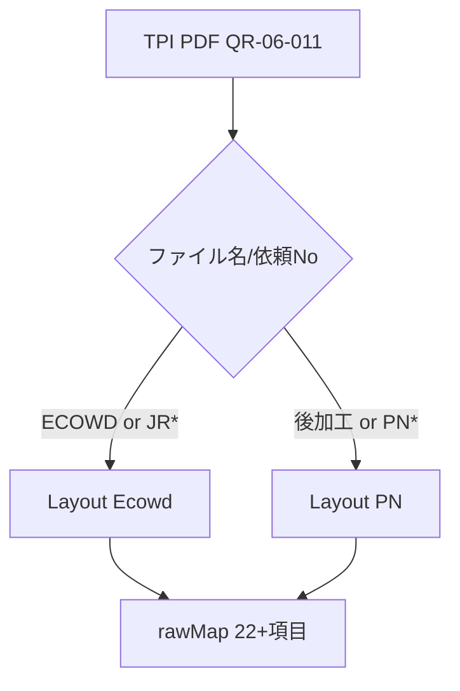
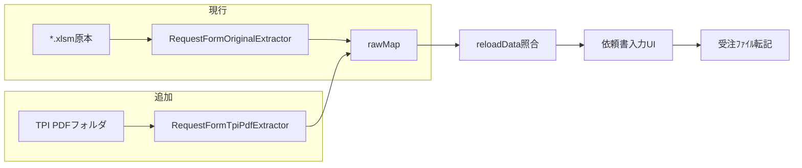

# TPI PDF依頼書 半自動入力プラン（解析結果反映版）

## サンプルPDF解析結果（8件・2026-06-22）

**アクセス経路**: UNC は WSL 直アクセス不可。**Windows ドライブ `M:` → `\\192.168.0.101\共有フォルダ`** 経由で読取可能。

| ファイル名 | 依頼Ｎｏ | 様式 |
|-----------|---------|------|
| ECOWDシート加工注文書（JR260603).pdf | JR260603 | ECOWD |
| ECOWDシート加工注文書（JR260604).pdf | JR260604 | ECOWD |
| ECOWDシート加工注文書（JR260604-1熱融着).pdf | JR260604-1 | ECOWD（枝番・特記） |
| ECOWDシート加工注文書（JR260605).pdf | JR260605 | ECOWD |
| ECOWDシート加工注文書（JR260701).pdf | JR260701 | ECOWD |
| 後加工注文書（PN04-03)20260416.pdf | PN04-03 | 後加工 |
| 後加工注文書（PN06-01)20260522.pdf | PN06-01 | 後加工 |
| 後加工注文書（PN06-02)20260522　黒.pdf | PN06-02 | 後加工 |

### PDF形式判定

- **テキストPDF（OCR不要）**: PDFBox `export:text -encoding UTF-8` で日本語読取可能。
- **フォント警告あり**: `Invalid ToUnicode CMap in font CIDFont+F3` — プレーンテキストの**出現順がレイアウトと一致しない**ため、本番抽出は **座標付き TextStripper（PDFBox LocationTextStripper 系）必須**。ラベル行＋固定矩形の併用。
- **共通様式ID**: 冒頭 `ＱＲ－０６－０１１（１）`（東レペフ加工品 注文書テンプレート）。
- **発行元**: 東レペフ加工品株式会社。**宛先**: `（外注加工）N122F　長岡産業（株）湖南工場 2026` → **ユーザー** = 長岡産業系（湖南工場）。

### 2系統レイアウト

#### A. ECOWD / JR 系（例: JR260604-1）

**ファイル名パターン**: `ECOWDシート加工注文書（{依頼No}{任意特記}).pdf`

**PDF本文から読める代表項目**（JR260604-1）:

| rawMap キー | 抽出元（例） | 備考 |
|------------|-------------|------|
| 依頼Ｎｏ | `ＪＲ２６０６０４-１ 2026` / ファイル名 | 全角→半角正規化 |
| 希望納期 | `年6月22日 湖南` | 年=発行年または2026固定。`2026-06-22` |
| 品名 | `40040`（加工製品①行） | |
| 製品 | `R10W` + `870` + 幅`95` + 長さ`190m` | `buildSpecName` → `R10W-870-95X190m`（品番・タイプ・幅・長さの切り分け要座標） |
| 数量1 | `190 ｍ`（加工賃行） | JR系は加工賃＝数量のことが多い |
| 梱-等1 / 色1 / 区分1 | 製品行付近 `95 ﾗｲﾄｸﾞﾚｰ` 等 | 座標で列对齐 |
| 原反品名 / 原反 | `7A1` + `FEL4004AY 10WD 1000` | 原反 spec 連結 |
| 原反数量 | `100` + `200m` | 投入原反①行 |
| 在庫場所 | 特記 `入庫お願い` / P番号 | 要オペレータ確認可 |
| 投入日 | `6/10`, `6/22` | 原反ブロック |
| 契約Ｎｏ | `X000080855` | 出荷指図・契約No |
| 加工内容 | `接続・分割` / `JR屋根：EC（片面）穴あけ` | ■内容１■ ブロック |
| ＥＣ面 | `EC（片面）` | `normalizeEcSideForForm` |
| 用途 | `JR屋根` → `JR（屋根）` | `translateYoto` 拡張 |
| 加工賃 | `190 ｍ` | |
| 特記事項1 | `赤テープ：つなぎありのため熱融着必要` | ヘッダ付近・ファイル名「熱融着」 |
| 特記事項2 | `・入庫お願いします。『P000075425』` | P番号は在庫/出荷参照 |

#### B. 後加工 / PN 系（例: PN04-03）

**ファイル名パターン**: `後加工注文書（{依頼No}){YYYYMMDD}.pdf`

**PDF本文から読める代表項目**:

| rawMap キー | 抽出元（例） | 備考 |
|------------|-------------|------|
| 依頼Ｎｏ | `PN04-03 2026` / ファイル名 | |
| 希望納期 | `年4月30日 湖南` | |
| 品名 | `7C8`（加工製品①） | PN系は品名のみで spec 不足のことが多い |
| 製品 | `FEL3002BY05WDLG-EC` 行 | EC製品コードを spec 代替またはマスタ照合 |
| 数量1 | `2,300`（加工内容行） | `2,300 ｍ` |
| 原反 | `7A1` + `（ツナギ無し）` + 長さ | |
| 契約Ｎｏ | `X000079828` | |
| 投入日 | `4/28`, `6/1` | |
| 加工内容 | `EC（片面） 22 ロール品 or カット品` | |
| ＥＣ面 | `EC（片面）` | |
| 用途 | `V（TPI）` 既定 | SC行 `SC：52201 投入先：HFN1` は特記/投入場所ヒント |
| 投入場所 | `HFN1` / `52201` | `inferFeedLocation` 補助 |
| 特記事項2 | ラベル貼付指示（メールボックス） | |

### 依頼Ｎｏ取得優先順

1. PDF本文 `注文書` ブロック（`ＪＲ…` / `PN…` + 年）
2. ファイル名 `（…）` 内
3. 手入力フォールバック（要確認ステータス）

### ファイル名 regex（正規化用）

- ECOWD: `ECOWDシート加工注文書[（(](?<no>JR\d{6}(?:-\d+)?[^）)]*)[）)]`
- 後加工: `後加工注文書[（(](?<no>PN\d{2}-\d{2})[）)]?(?<date>\d{8})?`

---

## 現行システムとの差分（変更なし部分）

- 依頼書入力は **Excel `.xlsm` のみ**スキャン（[`ReconciliationApp.reloadData()`](code_java/src/main/java/jp/co/pm/ai/desktop/reconciliation/ReconciliationApp.java) L3128–3129）。
- 抽出正本は [`RequestFormOriginalCellLayout`](code_java/src/main/java/jp/co/pm/ai/desktop/reconciliation/RequestFormOriginalCellLayout.java) のセル座標。
- PDF 既存用途は **Excel→PDF プレビュー**のみ。
- TPI PDF フォルダは **`PM_AI_REQUEST_FORM_ORIGINAL_DIR` とは別**。読取専用。

---

## フェーズ1: 設定・フォルダ解決

TPI 依頼書 PDF のスキャン先は **環境変数** で指定する。環境変数タブ・`session_defaults`・工場初期化から変更可能。

| 項目 | 内容 |
|------|------|
| 環境変数キー | `PM_AI_REQUEST_FORM_TPI_PDF_DIR`（`AppPaths.KEY_PM_AI_REQUEST_FORM_TPI_PDF_DIR`） |
| **初期値（湖南工場既定）** | `\\192.168.0.101\共有フォルダ\湖南工場\湖南共有\002  加工G\●配台AIシステム\共有DATA\TPI依頼書` |
| 解決 | [`AppPaths.resolveRequestFormTpiPdfDir(ui)`](code_java/src/main/java/jp/co/pm/ai/desktop/config/AppPaths.java) — 環境変数が空のとき `defaultRequestFormTpiPdfDirForFactory(工場)` にフォールバック |
| 定数 | `AppPaths.DEFAULT_PM_AI_REQUEST_FORM_TPI_PDF_DIR_KONAN` に上記 UNC を定義 |
| 永続化 | [`init_setting/session_defaults_konan.json`](init_setting/session_defaults_konan.json) の `envVars` に `value` として同 UNC を設定。`EnvVarDocs` / 環境変数タブの説明文も追加（[env-vars-managed-by-sheet-and-tsv.mdc](.cursor/rules/env-vars-managed-by-sheet-and-tsv.mdc) 準拠） |
| 国分工場 | 初期スコープは湖南のみ。国分の TPI PDF フォルダが決まるまで `defaultRequestFormTpiPdfDirForFactory(KOKUBU)` は空（未設定）とし、環境変数タブで手動指定 |
| UI | 環境変数タブに「フォルダ...」選択。依頼書入力タブのログにも解決後パスを出力 |
| 読取専用 | 原本フォルダ（`PM_AI_REQUEST_FORM_ORIGINAL_DIR`）と同ポリシー — フォルダ配下への書込・削除禁止 |

---

## フェーズ2: PDF抽出レイヤ（解析結果に基づく設計）

### 2-A. 正本クラス（2レイアウト）

| クラス | 対象 |
|--------|------|
| `RequestFormTpiPdfLayoutEcowd` | ECOWD/JR* |
| `RequestFormTpiPdfLayoutPn` | 後加工/PN* |
| `RequestFormTpiPdfFieldLayout` | 共通ラベル座標・regex・年組み立て |

**抽出アルゴリズム（本番）**:

1. ファイル名から様式判定 + 依頼Ｎｏ候補
2. PDFBox **LocationTextStripper** で `(text, x, y, page)` リスト取得
3. ラベルアンカー（`依頼ＮＯ．` `加工製品　①` `投入原反　①` `■内容　１■` `希望納期`）から相対矩形で値取得
4. プレーンテキスト regex は **補助**（特記・P番号・契約No `X\d{9}`）
5. 出力 rawMap は Excel 版と **同一キー名**
6. `製品` / `原反` は [`JuchuSheetColumnLayout.buildSpecName`](code_java/src/main/java/jp/co/pm/ai/desktop/reconciliation/JuchuSheetColumnLayout.java) で連結
7. `契約Ｎｏ` は [`resolveContractNoFromOriginalCell`](code_java/src/main/java/jp/co/pm/ai/desktop/reconciliation/RequestFormOriginalExtractor.java) 再利用

[`RequestFormTpiPdfExtractor.java`](code_java/src/main/java/jp/co/pm/ai/desktop/reconciliation/RequestFormTpiPdfExtractor.java):

- 入力: `File pdfFile`
- 出力: `List<Map<String,String>>`（1 PDF = 1 依頼）
- メタ: `原本ファイル名`, `原本シート名=_pdf`, `原本種別=TPI_PDF`, `TPI様式=ECOWD|PN`

### 2-B. TPI向けフォーム初期値

| 項目 | 自動設定 |
|------|----------|
| 加工区分 | `TPI` |
| 用途 | JR系→`JR（屋根）`、PN系→`V（TPI）`（`translateYoto` 拡張） |
| ＥＣ面 / ﾄﾘﾐﾝｸﾞ | `normalizeEcSideForForm` / 加工内容から推定 |
| 投入場所 | `inferFeedLocation` + PN系 `投入先：HFN1` |
| 加工内容 | TPI PDF 時はフォームへ転記（`FORM_EXTRACT_RAW_KEYS` 拡張） |

### 2-C. テストフィクスチャ

解析済み8件を [`code_java/src/test/resources/tpi-request-forms/`](code_java/src/test/resources/tpi-request-forms/) に配置（git 追跡はチーム判断。機微データ注意）。

期待値は `.tmp/*.txt` ダンプを正として各 rawKey をアサート。

---

## フェーズ3: 照合パイプライン統合

[`ReconciliationApp.reloadData()`](code_java/src/main/java/jp/co/pm/ai/desktop/reconciliation/ReconciliationApp.java) 拡張:

- `PM_AI_REQUEST_FORM_TPI_PDF_DIR` 配下 `*.pdf` をスキャン
- `RequestFormTpiPdfExtractor` → `rawRequests` に merge
- parse cache: `PARSE_SCHEMA_VERSION` = `request-form-tpi-pdf-v1`
- 同一依頼Ｎｏで Excel 原本あり → **Excel 優先**、PDF は「PDFのみ」表示
- ステータス: `新規自動追加（TPI PDF）` / `原本相違あり（TPI PDF）` / `要確認（項目不足）`

---

## フェーズ4: UI・半自動ワークフロー

1. 依頼書入力タブ → TPI PDF フォルダ自動スキャン
2. 未登録・相違・要確認を一覧表示（加工区分=TPI）
3. 行選択 → **左: 原本PDF直接プレビュー**、右: フォーム（抽出値初期入力）
4. 不足項目を手修正 → 受注ファイルへ自動転記
5. 転記済みは parse cache meta に記録（フォルダは読取専用のためファイル移動しない）

[`renderOriginalSheetInGrid`](code_java/src/main/java/jp/co/pm/ai/desktop/reconciliation/ReconciliationApp.java): `原本種別=TPI_PDF` 時は TPI PDF ディレクトリから直接 `displayPreviewPdf`。

---

## フェーズ5: 検証

| テスト | 内容 |
|--------|------|
| `RequestFormTpiPdfExtractorTest` | 8件フィクスチャ rawMap |
| `RequestFormTpiPdfFieldLayoutTest` | spec 連結・日付・依頼No regex |
| 手動 | UNC 全件スキャン → 転記 → 受注ﾌｧｲﾙ確認 |

---

## リスクと対策（更新）

| リスク | 対策 |
|--------|------|
| テキスト出現順の乱れ | LocationTextStripper + ラベルアンカー（解析で確認済み） |
| PN系 製品 spec 不足 | FEL* ECコード行を spec 代替。マスタ候補検索（既存 UI） |
| JR/PN レイアウト差 | 2 Layout クラス + ファイル名判定 |
| CMap 警告 | 座標抽出 + 全角数字正規化。OCRは不要（現サンプル） |
| 特記の取りこぼし | regex 補助 + 要確認フラグ |

---

## 変更ファイル（想定）

| ファイル | 変更 |
|----------|------|
| [`ReconciliationApp.java`](code_java/src/main/java/jp/co/pm/ai/desktop/reconciliation/ReconciliationApp.java) | PDFスキャン・プレビュー・defaults |
| [`AppPaths.java`](code_java/src/main/java/jp/co/pm/ai/desktop/config/AppPaths.java) | TPI PDF dir |
| [`RequestFormSourceCache.java`](code_java/src/main/java/jp/co/pm/ai/desktop/reconciliation/RequestFormSourceCache.java) | PDF parse cache |
| **新規** `RequestFormTpiPdfLayoutEcowd.java` / `RequestFormTpiPdfLayoutPn.java` | 座標正本 |
| **新規** `RequestFormTpiPdfExtractor.java` | PDF→rawMap |
| [`RequestFormOriginalExtractor.java`](code_java/src/main/java/jp/co/pm/ai/desktop/reconciliation/RequestFormOriginalExtractor.java) | TPI defaults・translateYoto(JR) |
| [`init_setting/session_defaults_konan.json`](init_setting/session_defaults_konan.json) | 環境変数既定 |
| **新規** `code_java/src/test/resources/tpi-request-forms/*.pdf` | 8件フィクスチャ |

---

## 実装順序

1. ~~フェーズ0 解析~~ **完了**（本ドキュメント）
2. フェーズ1 + 2 — 環境変数 + Extractor（Ecowd/Pn）+ 8件テスト
3. フェーズ3 — reloadData 統合
4. フェーズ4 — プレビュー・UI
5. フェーズ5 — 実データ検証

**実装開始の合図**: 「プラン実行して」「実装して」等の明示指示後に着手。
