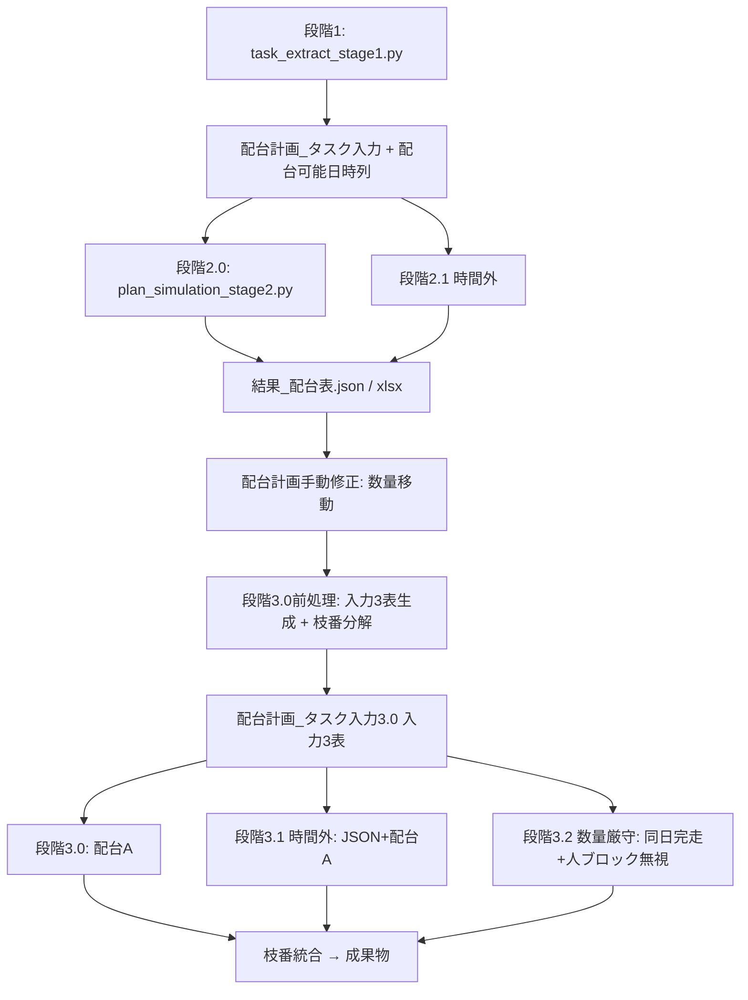
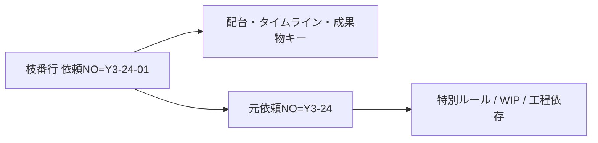
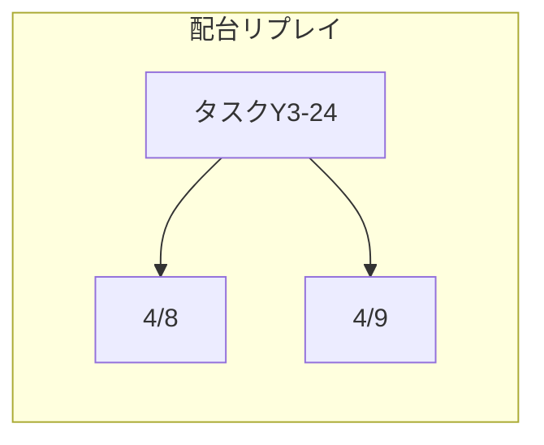

# 段階1〜3.2 配台ロジック見直し計画

## 現状とギャップ

| ユーザー要件 | 現行実装 | ギャップ |
|---|---|---|
| 配台可能日時（原反投入日 12:45） | 内部のみ `same_day_raw_start_limit=13:00`（[`_core.py` L13074](code/python/planning_core/_core.py)） | 列なし・時刻不一致 |
| 段階2.0＝配台開始を配台可能日時に | 配台開始は `run_date` + データ抽出時刻正規化 | 列ベース未連動 |
| 段階2.1(時間外) | [`plan_simulation_stage2_1.py`](code/python/plan_simulation_stage2.py) + JSON勤怠 | UI/名称は近いが入力は入力1表のみ |
| 段階3.0〜3.2 | 単一「段階3」ボタン + JSON試行（[`stage2_identical_dispatch_runner.py`](code/python/planning_core/stage2_identical_dispatch_runner.py)） | 入力3表・枝番分解・統合なし |
| 特別ルールと枝番 | `task_id`=依頼NO のみ | 親子紐付け列なし |

**配台A** = 既存 [`_generate_plan_impl()`](code/python/planning_core/_core.py)（段階2 runner 経由）。新ステージも同一エンジンを使い、入力 DataFrame と env フラグで挙動を分岐する。

**時間外（ユーザー選択: hybrid）**: 内部は現行の `overtime_simulation_overrides.json` + `apply_overtime_simulation_overrides()` を維持。ウィザード UI は master 勤怠表を**プレビュー編集**し、確定時に JSON 化（物理 master 書き換えはしない）。ユーザーには「master 時間外を一時適用して配台→元に戻す」体験を提供する。

---

## 全体アーキテクチャ

---

## フェーズ1: 段階1 — 配台可能日時列

### 仕様
- 新列 **`配台可能日時`**（datetime 文字列 `YYYY/MM/DD HH:MM`）
- 算出: `max(原反投入日_上書き ?? 原反投入日, run_date)` の日付 + **12:45**（定数 `DISPATCHABLE_FROM_TIME = time(12, 45)`）
- 原反投入日が空の行: 列も空（段階2は従来どおり `run_date` 起点）
- 手動上書き列 **`配台可能日時_上書き`** + 参照列 `（元）配台可能日時_上書き` を [`plan_input_sheet_column_order()`](code/python/planning_core/_core.py) に追加（[`原反投入日_上書き`](code/python/planning_core/_core.py) と同パターン）

### 変更箇所
| 層 | ファイル | 内容 |
|---|---|---|
| Python | [`_core.py`](code/python/planning_core/_core.py) | 列定数・段階1出力・`build_task_queue` で `same_day_raw_start_limit` を **12:45** に変更し列値を優先 |
| Python | [`task_extract_stage1.py`](code/python/task_extract_stage1.py) | 段階1完了時に列を埋める |
| Java | [`PlanInputTabController.java`](code_java/src/main/java/jp/co/pm/ai/desktop/PlanInputTabController.java) | 列表示・保存・再読込 |
| Java | [`SpreadsheetPlanInputCellEditSupport`](code_java/src/main/java/jp/co/pm/ai/desktop/ui/SpreadsheetPlanInputCellEditSupport.java) | 日時列編集 |

### 13:00 → 12:45
[`same_day_raw_start_limit`](code/python/planning_core/_core.py) とコメント・[`RawInputMorningDispatchRateWarning`](code_java/src/main/java/jp/co/pm/ai/desktop/dispatch/RawInputMorningDispatchRateWarning.java) の閾値を **12:45 基準**に更新。業務仕様変更のため [`配台ルール.md`](code/要件定義/配台ルール.md) は**ユーザー依頼時のみ**同期。

---

## フェーズ2: 段階2.0 — 配台開始日時の切替

### 仕様
- 段階2.0（現「段階2 実行」）は **配台開始日時 = 各行の配台可能日時**（上書き列優先）
- グローバル `run_date` は **全タスクの配台可能日時の最小日** を採用（それより前の日には割付しない）
- `macro_now` 下限: 配台可能日時とデータ抽出時刻の **max**

### 変更箇所
- [`build_task_queue_from_planning_df`](code/python/planning_core/_core.py): 列 `配台可能日時` を読み `start_date_req` / `earliest_start_time` / `same_day_raw_start_limit` に反映
- [`_generate_plan_impl`](code/python/planning_core/_core.py): `run_date` 決定ロジックに `dispatchable_min_date` を追加
- [`PipelineExecutionTimingKind.java`](code_java/src/main/java/jp/co/pm/ai/desktop/PipelineExecutionTimingKind.java): `STAGE2_0` ラベル追加（表示は「段階2」でも可）
- [`PlanInputTab.fxml`](code_java/src/main/resources/jp/co/pm/ai/desktop/fxml/PlanInputTab.fxml): ボタン文言を「段階2」→「段階2.0」に変更（任意）

---

## フェーズ3: 段階2.1(時間外) — hybrid 時間外

### 仕様（現行2.1の拡張）
1. 段階2.0 完了 + `結果_配台表.json` 存在を前提
2. [`OvertimeSimulationWizard`](code_java/src/main/java/jp/co/pm/ai/desktop/OvertimeSimulationWizard.java) 起動（master 勤怠プレビュー編集 UI）
3. 確定 → `overtime_simulation_overrides.json`（既存）
4. [`plan_simulation_stage2_1.py`](code/python/plan_simulation_stage2_1.py) で配台A（**入力1表**、配台可能日時適用済み）
5. 成果物を `output/` 正本へ上書き（[`Stage21OutputPromoter`](code_java/src/main/java/jp/co/pm/ai/desktop/dispatch/Stage21OutputPromoter.java) 流用）
6. 実行後 JSON は削除または無効化（「書き戻し」相当）

### UI
- [`DispatchInteractiveTab.fxml`](code_java/src/main/resources/jp/co/pm/ai/desktop/fxml/DispatchInteractiveTab.fxml): ボタン名 **「段階2.1(時間外)」**
- 段階2.0 未完了時は disabled + ツールチップ

---

## フェーズ4: 入力3表と枝番分解（段階3.0 前処理）

### 新データ
- ファイル: 既存 [`plan_input_tasks.xlsx`](code/python/planning_core/_core.py) に **第2シート** `配台計画_タスク入力3.0`（環境変数 `PM_AI_PLAN_INPUT_STAGE3_SHEET`）
- Java: **新タブ** `planInputStage3`（[`MainShellTabId`](code_java/src/main/java/jp/co/pm/ai/desktop/MainShellTabId.java) + [`MainShellTabLayoutDefaults`](code_java/src/main/java/jp/co/pm/ai/desktop/config/MainShellTabLayoutDefaults.java)）— 列構成は入力1表と同一 + 以下2列

| 追加列 | 用途 |
|---|---|
| **元依頼NO** | 枝番行の親タスク ID（特別ルール scope） |
| **配台枝番** | 表示用連番（01, 02…） |

### 枝番分解アルゴリズム（新規 Python モジュール `planning_core/stage3_input_builder.py`）

入力: [`結果_配台表.json`](code_java/src/main/java/jp/co/pm/ai/desktop/dispatch/ResultDispatchDocument.java) の `(段階3前)` 数量セル（手動修正後）

1. タスク×工程×機械×**配台日** ごとに `(段階3前)` > 0 のセルを走査
2. 元行（入力1表）を複製し:
   - **依頼NO** = `{元依頼NO}-{枝番2桁}`（例 `Y3-24-01`）
   - **換算数量** = セル数量（m）
   - **元依頼NO** = 元の依頼NO
   - **配台可能日時** = `{配台日} {定常始業}`（master A15、なければ `DEFAULT_START_TIME`）
   - **原反投入日** = 配台日（同日制約整合）
3. 元タスク行は入力3表に**含めない**（枝番行のみ配台対象）
4. 特別指定・備考 AI・加工速度_上書き等は元行からコピー
5. 入力3表を xlsx 保存 + Java タブ再読込

### ゲート
- 段階2.0 成功フラグ（`結果_配台表.json` + pipeline state）が無いと段階3系ボタン disabled
- 「入力3表を生成」ボタンを [`DispatchInteractiveTabController`](code_java/src/main/java/jp/co/pm/ai/desktop/DispatchInteractiveTabController.java) に配置

---

## フェーズ5: 段階3.0 — 配台A + 枝番統合

### 配台実行
- 新スクリプト [`plan_simulation_stage3_0.py`](code/python/plan_simulation_stage3_0.py) → `run_stage3_generate_plan(input_sheet=STAGE3_SHEET)`
- runner: [`stage3_identical_dispatch_runner.py`](code/python/planning_core/stage3_identical_dispatch_runner.py)（stage2 runner を一般化）
- env: `PM_AI_PLAN_INPUT_STAGE3=1`, `PM_AI_PLAN_INPUT_PATH` + シート名で **入力3表** を `load_planning_tasks_df` 相当で読込

### 枝番統合（新規 `planning_core/stage3_branch_merge.py`）
配台後タイムライン / `結果_配台表` を **(元依頼NO, 工程名, 機械名, 配台日)** でグループ化:

- **依頼NO** → 枝番除去（元依頼NO）
- **加工開始日時** → min(枝番行)
- **加工終了日時** → max(枝番行)
- **当日配台数量** → sum
- **メンバー名** → 統合表示（既存 `_format_dispatch_table_member_like_equipment_schedule` 流用）

統合後 JSON/xlsx を正本 `output/` に上書き。

---

## フェーズ6: 段階3.1(時間外)

- 前提: 入力3表が存在・段階3.0 完了（または入力3表再編集後）
- フロー: 入力3表タブで手動修正 → **段階3.1(時間外)** → 時間外ウィザード（hybrid）→ `plan_simulation_stage3_1.py`（入力3表 + JSON 勤怠）→ 枝番統合 → 正本上書き

---

## フェーズ7: 段階3.2(数量厳守)

### 仕様
- 入力: 入力3表
- **同一暦日内完走必須**: 配台可能日時の日付と同じ日に加工完了（未達は hard fail または shortage 記録）
- **定常外 OK・人ブロックなし**:
  - 新 env `PM_AI_STAGE3_2_QTY_STRICT=1`
  - `_generate_plan_impl` に `stage3_qty_strict_mode=True` を追加
  - 工場枠: 終業を 23:59 まで拡張（現 [`_interactive_trial_calendar_legacy_active`](code/python/planning_core/_core.py) と同趣旨）
  - 人側: 定常終了（A15/B15）による **終業直前デファー・小残 defer を無効化**（設備のみ配台）
  - 機械カレンダーは維持（設備占有は尊重）

### 実行後
- 枝番統合（3.0 と同一）
- 新スクリプト [`plan_simulation_stage3_2.py`](code/python/plan_simulation_stage3_2.py)

---

## 特別ルール適用方針（枝番タスク）

### 基本原則: **dispatch ID ≠ rule scope ID**

### ルール別適用表

| ルール種別 | 適用キー | 枝番での扱い |
|---|---|---|
| L4–L8 速度（列値） | 行属性（幅・製品名等） | 複製行の列値をそのまま使用 |
| L6/L7 依頼NO部分一致 | `元依頼NO` で判定 | 枝番依頼NOではなく親で JR/PN 判定 |
| need シート条件 | `元依頼NO` | `match_need_sheet_condition(condition, parent_tid)` |
| L10/L11/L13 WIP | **`rule_task_id = 元依頼NO`** | 枝番行の完了ロールを親 ID で集計 |
| §A 同一依頼工程依存 | **`rule_task_id`** | `_task_blocked_by_same_request_dependency` を `rule_task_id` ベースに拡張 |
| §B-2 EC/検査パイプライン | **`rule_task_id`** | `_roll_pipeline_*` 集計を親単位に |
| L9/L12 試行順隣接 | **`rule_task_id`** + 暦日 | 同一親の枝番は連続試行順ブロックとして扱う |
| 備考 AI | 元行コピー | 分解時に全枝番へ同一解析結果をコピー（再解析しない） |
| DSL (`dispatch_rules/engine.py`) | `scope.process_machine` + 新フィルタ `parent_task_id` | ノード UI に親 ID 条件を追加（将来） |

### 実装要点（[`_core.py`](code/python/planning_core/_core.py)）

1. `build_task_queue_from_planning_df` で各 task dict に追加:
   - `parent_task_id`（列 `元依頼NO` または自身）
   - `rule_task_id` = `parent_task_id`（配台出力の `task_id` は枝番依頼NOのまま）
2. ヘルパー `_rule_task_id(task) -> str` を追加し、L10/L11/L13・§A・WIP 集計箇所を **一括置換**（grep 対象: `_trial_order_flow_eligible_tasks`, `_task_blocked_by_same_request_dependency`, WIP 集計関数）
3. 枝番統合時は **rule 適用結果は既にタイムラインに反映済み** — 統合は表示・成果物の集約のみ

### 文書
- [`特別ルール列挙.md`](特別ルール列挙.md) に「枝番タスクと元依頼NO」の節を追加（ユーザー依頼時）
- [`特別ルール.md`](特別ルール.md) 要約同期

---

## Java UI / パイプライン整理

### 新 enum 値（[`PipelineExecutionTimingKind`](code_java/src/main/java/jp/co/pm/ai/desktop/PipelineExecutionTimingKind.java)）
`STAGE2_0`, `STAGE2_1`, `STAGE3_0`, `STAGE3_1`, `STAGE3_2`

### ボタン配置

| タブ | ボタン | 前提 |
|---|---|---|
| 配台計画_タスク入力 | 段階2.0 | 入力1表保存済み |
| 配台計画手動修正 | 段階2.1(時間外) | 段階2.0完了 |
| 配台計画手動修正 | 入力3表を生成 | 段階2.0完了 + 手動修正保存 |
| 配台計画_タスク入力3.0（新タブ） | 段階3.0 | 入力3表存在 |
| 同上 | 段階3.1(時間外) | 段階3.0完了 |
| 同上 | 段階3.2(数量厳守) | 入力3表存在 |

### 既存「段階3」ボタン
- **段階3.0 に置換**（現 `dispatch_interactive_trial.py` 単体試行は deprecated 化または dev フラグ退避）
- 表示ラベル `(段階3前/後/改)` は手動修正表で維持し、3.0 入力生成のソースとする

### パイプライン state（新規 `PipelineStageGate.java`）
- `stage2Completed`, `stage3InputGenerated`, `stage30Completed` を session-state JSON に保持
- 各 `triggerStage*` で検証

---

## 配台リプレイ可視化（推奨・任意）

**結論: 可能。** 配台計画手動修正タブの **タスク×日付** 表上で、配台完了後にセルを順次ハイライトするリプレイは実装できる。

**段階マトリックス（段階1/2.0/3.0…の一覧表）は採用しない。** ツールバー等への常時表示は UI を圧迫するため計画から除外する。

### 現状

- ツールバー [`shellStageProgressBox`](code_java/src/main/resources/jp/co/pm/ai/desktop/fxml/MainShell.fxml): 段階実行中は **不定プログレスバー** のみ（「段階2.0 実行中…」ラベル）
- [`配台計画手動修正`](code_java/src/main/java/jp/co/pm/ai/desktop/DispatchInteractiveTabController.java): 既に **タスク×日付** の Spreadsheet マトリックス（数量セル）。配台**後**に `(段階3前/後)` 行が更新されるが、**埋まっていくアニメーションは無い**
- Python [`_log_stage2_phase_timing`](code/python/planning_core/_core.py): フェーズ計測は **ログのみ**。UI へ構造化進捗は未配線
- 設備ガント [`EquipmentGraphicGanttPane`](code_java/src/main/java/jp/co/pm/ai/desktop/ui/EquipmentGraphicGanttPane.java): 完了後のタイムライン表示（リアルタイム割付アニメではない）

### 可視化レベル（採用方針）

| レベル | 内容 | 採用 | 工数 | 備考 |
|---|---|---|---|---|
| ~~**A. パイプライン段階マトリックス**~~ | ~~行=段階1/2.0/2.1/3.0…、列=状態~~ | **不採用** | — | 常時表示は邪魔。`PipelineStageGate` はボタン活性のみに使用 |
| **B. 配台結果リプレイ** | 行=タスク（または元依頼NO）、列=配台日。配台**完了後**に JSON 順でセルを順次ハイライト | **推奨** | 中 | Python 変更不要。`結果_配台表.json` を時系列ソートして JavaFX `Timeline` で再生 |
| **C. 配台Aライブ進捗** | 配台**実行中**に割付確定ごとにセル更新 | 任意 | 大 | Python NDJSON 出力 → Java パース。性能確認後 |

### 推奨: 配台リプレイ（B）

**配置**: [`配台計画手動修正`](code_java/src/main/java/jp/co/pm/ai/desktop/DispatchInteractiveTabController.java) タブ内（「再生」ボタン等）。**メインシェルツールバーには載せない。**

**配台リプレイ（段階2.0/3.0/3.2 成功後にボタン or 自動）**

1. `結果_配台表.json` + timeline JSON から `(task_id, 配台日, qty, 加工開始日時)` を時刻順にソート
2. 対応する [`DispatchInteractiveTabController`](code_java/src/main/java/jp/co/pm/ai/desktop/DispatchInteractiveTabController.java) のセルへ **200〜400ms 間隔**で背景色をフェードイン（`Timeline` + `-fx-background-color`）
3. 枝番タスクは **元依頼NO 行**に集約してからリプレイ（統合前後どちらかを選択可能）
4. 再生速度スライダー・一時停止・スキップ

**C. ライブ進捗（任意・フェーズ2）**

- Python: `_assign_one_roll_trial_order_flow` 等の割付確定点で `dispatch_progress_event` を NDJSON 1 行出力
- Java: `MainRunTabController` の stdout リーダーがイベントを配台計画手動修正タブへ転送
- 日次ループ単位の粗い進捗から着手し、性能を確認

### 新規ファイル（可視化）

| ファイル | 役割 |
|---|---|
| `DispatchReplayController.java` | timeline/JSON → 再生キュー |
| `dispatch_progress_events.py`（任意） | 配台A ライブイベント出力 |

### 実装順序への位置づけ

- **配台リプレイ（B）**: パイプライン本体（段階1〜3.2）が動いた**後**（UX 向上・デバッグに有効）
- **ライブ進捗（C）**: 配台A の割付ロジックが安定してから（`_core.py` へのフックは差分が広い）

---

## テスト方針

| 層 | 内容 |
|---|---|
| Python unit | `stage3_input_builder`: 枝番分解・配台可能日時・数量合計保存 |
| Python unit | `stage3_branch_merge`: min/max 時刻・数量合算 |
| Python unit | `_rule_task_id` 経由で L10 WIP が親単位集計されること |
| Python integration | 既存 fixture で 段階1→2.0→3.0→3.2 の smoke |
| Java unit | `PipelineStageGate` ボタン enable/disable |
| 手動 | 時間外 hybrid UI → JSON 生成 → 配台 → 勤怠復元確認 |

---

## 実装順序（推奨）

1. **配台可能日時列 + 12:45**（段階1/2.0 の土台）
2. **PipelineStageGate + ボタン rename**
3. **stage3_input_builder + 入力3表タブ**
4. **rule_task_id リファクタ**（特別ルール）
5. **stage3 runner + 枝番統合**（3.0）
6. **2.1/3.1 hybrid 時間外**（既存 wizard 再利用）
7. **3.2 数量厳守モード**
8. **DispatchReplayController（配台リプレイ）** — 配台計画手動修正タブ内。段階マトリックスは実装しない
9. **旧段階3 deprecate + ドキュメント**（依頼時）
10. **（任意）配台A ライブ進捗 NDJSON**

---

## 主要変更ファイル一覧

- Python: [`_core.py`](code/python/planning_core/_core.py), 新規 `stage3_input_builder.py`, `stage3_branch_merge.py`, `stage3_identical_dispatch_runner.py`, `plan_simulation_stage3_{0,1,2}.py`
- Java: [`MainShellController.java`](code_java/src/main/java/jp/co/pm/ai/desktop/MainShellController.java), [`DispatchInteractiveTabController.java`](code_java/src/main/java/jp/co/pm/ai/desktop/DispatchInteractiveTabController.java), 新規 `PlanInputStage3TabController.java`, `PipelineStageGate.java`
- FXML: [`PlanInputTab.fxml`](code_java/src/main/resources/jp/co/pm/ai/desktop/fxml/PlanInputTab.fxml), [`DispatchInteractiveTab.fxml`](code_java/src/main/resources/jp/co/pm/ai/desktop/fxml/DispatchInteractiveTab.fxml), 新規 `PlanInputStage3Tab.fxml`
- 設定: [`MainShellTabId.java`](code_java/src/main/java/jp/co/pm/ai/desktop/MainShellTabId.java), [`MainShellTabLayoutDefaults.java`](code_java/src/main/java/jp/co/pm/ai/desktop/config/MainShellTabLayoutDefaults.java), [`MainShellInnerTabCatalog.java`](code_java/src/main/java/jp/co/pm/ai/desktop/config/MainShellInnerTabCatalog.java)（子タブなし）
