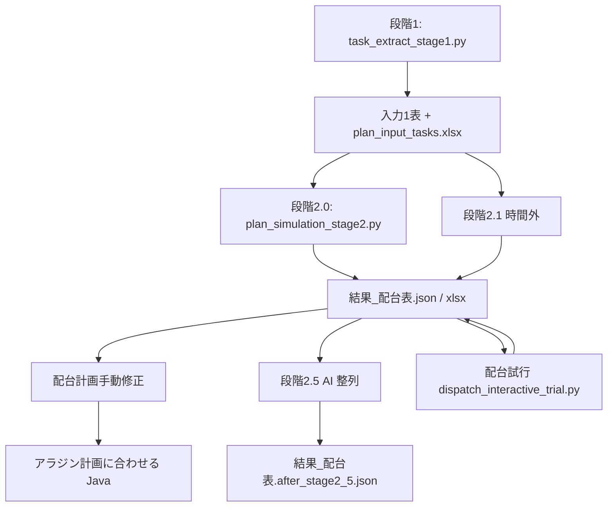

# 段階別配台入出力リファレンス

JavaFX デスクトップが実行する **段階1〜段階2.1**、**段階2.5**、**配台試行** および関連操作について、**何を入力に何を配台し、何が出力されるか**を整理した文書です。実装の正はソースコード（`MainShellController`、`planning_core/_core.py`、`stage2_identical_dispatch_runner.py` 等）です。

**開発運用**: 本書を更新したときは **`段階別配台入出力.html` を同内容に同期**してください（`.cursor/rules/md-paired-html-sync.mdc`）。

---

## 1. 用語

| 用語 | 意味 |
|------|------|
| **配台A** | `planning_core._core._generate_plan_impl()` による本配台エンジン（旧 `generate_plan`）。段階2.0 / 2.1 / 配台試行が共通利用。 |
| **入力1表** | Excel シート **配台計画_タスク入力**（環境変数 `PM_AI_PLAN_INPUT_PATH` / `TASK_PLAN_SHEET`）。段階2.0・2.1 の計画タスク正本。 |
| **結果_配台表** | 配台成果の JSON（`結果_配台表.json`）および同名 Excel シート。タスク×配台日×数量のワイド表の正本。 |
| **正本 output** | 既定 `{リポジトリ}/output/`（`PM_AI_OUTPUT_DIR` で上書き可）。 |

### 1.1 日付セル内ラベル（配台計画手動修正）

| 表示ラベル | 旧称（互換読取） | 意味 |
|------------|------------------|------|
| **`(配台計画)`** | `(段階3前)` | 編集目標（当日配台数量）。手動修正の正。 |
| **`(手動改定)`** | `(段階3後)` 等 | 配台試行後の実績行（読取専用）。 |
| **`(配台計画改)`** | `(段階3改)` 等 | 試行後に当日配台数量を手動変更したセル。 |

定数は `DispatchQtyCellLineLabels`。旧 JSON・旧成果物の `(段階3前)` / `(段階3後)` / `(段階3改)` および `(段階3.x後)` 系も表示互換で読み取る。

---

## 2. 全体パイプライン

**廃止（2026 以降）**: 段階3.0 / 3.1 / 3.2、入力3表、`build_stage3_input.py`、`stage3_*` モジュールはパイプラインから除去済み。再配台は **配台試行** のみ。

---

## 3. 段階別詳細

### 3.1 段階1 — タスク抽出（配台前処理）

| 項目 | 内容 |
|------|------|
| **UI** | 実行・ログタブ → **段階1 実行** |
| **Python** | `code/python/task_extract_stage1.py` |
| **配台の有無** | **配台は行わない**。加工計画DATA 等から **配台計画_タスク入力用の行** を生成する。 |

**主な入力**

| 入力 | パス / 備考 |
|------|-------------|
| 加工計画DATA | ネットワークまたは `.pm-ai-cache/network-source/`（`PM_AI_TASK_INPUT_SOURCE_DIR`） |
| 実績明細 | 同上系（`PM_AI_ACTUAL_DETAIL_SOURCE_DIR`） |
| 受注ファイル | `PM_AI_REQUEST_FORM_JUCHU_FILE`（シート「受注ﾌｧｲﾙ」） |
| master.xlsm | `PM_AI_MASTER_WORKBOOK`（定常始業・機械・勤怠等） |
| アラジン加工計画 | `PM_AI_ALADDIN_MASTER_DIR` 等 |

**主な出力**

| 出力 | パス / 備考 |
|------|-------------|
| 計画入力ブック | `{output}/plan_input_tasks.xlsx` または `PM_AI_PLAN_INPUT_PATH` へ反映 |
| シート「タスク一覧」 | 段階1 抽出結果（プレビュー用） |
| 段階1 プレビュー | `{output}/stage1_task_input_table.xlsx` |
| 配台不要ルール JSON | サマリ Excel 同階層 `stage1_exclude_rules.json` |
| 整形アラジン計画 | `{output}/shaped_aladdin_plan.json`（納期管理・手動修正の (アラ計画) 表示用） |
| 配台可能日時列 | 入力1表に **配台可能日時** / **配台可能日時_上書き** を付与（原反投入日 + 12:45 等） |

**後続**: ユーザーが **配台計画_タスク入力** タブで特別指定・配台不要等を編集 → 段階2.0 へ。

---

### 3.2 段階2.0 — 初回フル配台（配台A）

| 項目 | 内容 |
|------|------|
| **UI** | 配台計画_タスク入力タブ → **段階2.0 実行** |
| **Python** | `code/python/plan_simulation_stage2.py` → `run_stage2_generate_plan()` |
| **配台内容** | 入力1表の全タスクを **配台A** で日次割付。need/surplus、納期リトライ、特別ルール（L 系）、§A/§B 等を適用。 |

**主な入力**

| 入力 | 備考 |
|------|------|
| **入力1表** | `PM_AI_PLAN_INPUT_PATH`、シート `TASK_PLAN_SHEET`（既定「配台計画_タスク入力」） |
| master.xlsm | 工場時間・機械カレンダー・勤怠・速度シート |
| `stage1_exclude_rules.json` | 配台不要ルール |
| `dispatch_special_rules.json` | §B 特別ルール（`PM_AI_DISPATCH_SPECIAL_RULES_JSON`） |
| ルックアップ表 | `code/` 配下 CSV/TXT（原反・ロール単位長さ等） |
| 加工途中翌日配台 JSON | 任意（`PM_AI_STAGE2_IN_PROGRESS_NEXT_DAY_DISPATCH_JSON`） |
| 環境フラグ | `PM_AI_STAGE2_SKIP_TODAY_DISPATCH`（当日配台しない）、実績速度 `PM_AI_LEARNED_SPEED_ENABLED` 等 |

**主な出力**（既定 `{output}/`）

| 出力 | 備考 |
|------|------|
| **`結果_配台表.json`** | **配台表正本**。列: 依頼NO・工程・機械名・配台日・**当日配台数量** 等 |
| **`結果_配台表.xlsx`** | 同上（`PM_AI_STAGE2_WRITE_EXCEL=1`） |
| **production_plan** | `計画*.xlsx` / JSON（設備ガント・納期管理の元） |
| **member_schedule** | `人員*.xlsx` / JSON |
| `shaped_aladdin_plan.json` | 更新される場合あり |
| `shaped_processing_actuals.json` | 実績整形キャッシュ |
| 特別ルールトレース | sidecar JSON（dispatch-rules trace） |

**前提**: 配台計画手動修正・入力1表とも **未保存不可**（dirty ブロック）。

---

### 3.3 段階2.1（時間外）— 入力1表のフル再配台

| 項目 | 内容 |
|------|------|
| **UI** | 配台計画_タスク入力タブ → **段階2.1(時間外)** → 残業/休出ウィザード → 確定 |
| **Python** | `code/python/plan_simulation_stage2_1.py`（`PM_AI_STAGE2_1_OVERTIME=1`） |
| **配台内容** | 段階2.0 と **同一配台A**。master 勤怠を **一時上書き**（`overtime_simulation_overrides.json`）してフル再配台。 |

**主な入力**

| 入力 | 備考 |
|------|------|
| **入力1表** | 段階2.0 と同じ |
| **`結果_配台表.json`** | 段階2.0 済みであることの前提チェック（実行時は入力1表から再配台） |
| **`overtime_simulation_overrides.json`** | ウィザード確定後（一時ファイル、実行後削除方針） |
| master / ルール / ルックアップ | 段階2.0 と同様 |

**主な出力**

| 出力 | 備考 |
|------|------|
| **`output/stage21/結果_配台表.json`** | 試行出力（正本は上書きしない） |
| 同上 xlsx / production_plan / member_schedule | stage21 配下 |
| 成功時 | Java `Stage21OutputPromoter` が **メイン `output/` 正本へ反映**。(段階2後)/(段階2.1後) 比較用 sidecar 保存 |

**操作日以前の暦日**はウィザード説明どおり変更対象外のロジックは **段階2.1 Python 側**（配台A + 残業 env）に依存。

---

### 3.4 段階2.5(AI) — アラジン整列（再配台ではない）

| 項目 | 内容 |
|------|------|
| **UI** | 配台計画手動修正タブ（**段階2.5(AI) ボタンは現在 UI 停止**）。段階2 成功後 **自動実行** チェックあり |
| **Python** | `code/python/plan_simulation_stage2_5_ai.py` → `stage2_5_ai_runner.py` |
| **配台内容** | **配台A は実行しない**。`shaped_aladdin_plan.json` に沿い **既存 JSON の日別数量をロール単位で再配分**（Java 手動「アラジン計画に合わせる」と同趣旨の AI/学習パイプライン）。 |

**主な入力**

| 入力 | 備考 |
|------|------|
| **`結果_配台表.json`** | 段階2 正本 |
| **`shaped_aladdin_plan.json`** | 同 output 配下 |
| 学習アーカイブ | `PM_AI_LEARNING_ARCHIVE_*`（推論のみモード可） |

**主な出力**

| 出力 | 備考 |
|------|------|
| **`結果_配台表.after_stage2_5.json`** | 整列後（段階2 正本は保持） |
| sidecar | `結果_配台表.json.stage2_5_applied.json` |
| 配台表正本切替 | UI `PM_AI_DISPATCH_TABLE_ACTIVE_SOURCE=stage2_5` で参照先変更 |

---

### 3.5 配台計画手動修正（段階スクリプト外・必須工程）

| 項目 | 内容 |
|------|------|
| **UI** | **配台計画手動修正** タブ |
| **入力** | **`結果_配台表.json`**（段階2 以降の正本） |
| **操作** | 日付セルの **当日配台数量** の編集・ドラッグ移動、試行順変更、列表示フィルタ |
| **出力** | 保存で **`結果_配台表.json` + xlsx** 上書き（`export_result_dispatch_from_json.py`） |

**関連ボタン（配台スクリプトではない）**

| ボタン | 処理 |
|--------|------|
| **アラジン計画に合わせる** | Java `DispatchAladdinPlanAligner`：翌日以降を (アラ計画) に沿い **ロール単位**で日間再配分。`shaped_aladdin_plan.json` 参照。配台試行後は (配台計画) 数量の自動整列は不可。 |
| **配台リプレイ** | 配台完了後の可視化（再配台ではない） |

---

### 3.6 配台試行（インタラクティブ）

| 項目 | 内容 |
|------|------|
| **UI** | 配台計画手動修正（`dispatchTrialButton` は **非表示**。プログラムから `startDispatchTrial` 等で起動） |
| **Python** | `code/python/dispatch_interactive_trial.py` → `run_interactive_dispatch_trial_from_result_dispatch_json()` |
| **配台内容** | **入力1表** + **手動修正 JSON の rows** をマージ。`PM_AI_INTERACTIVE_TRIAL_STAGE2_PARITY=1` で **段階2と同一条件**の配台A。セル指定数量（interactive_dispatch_targets）あり。 |

**主な入力**

| 入力 | 備考 |
|------|------|
| **`結果_配台表.json`** | 編集済み rows / columns |
| **入力1表** | 計画タスクのベース |
| 加工計画DATA | 静的列補完用（任意） |

**主な出力**

| 出力 | 備考 |
|------|------|
| **`結果_配台表.json`** | 配台結果（入力パスへ同期） |
| **`dispatch_trial_shortages.json`** | op_shortage / as_shortage / dispatch_qty_shortfall 等 |
| xlsx export | Java 側 `ResultDispatchTrialPython` |
| UI 表示 | **(配台計画)** / **(手動改定)** / **(配台計画改)** 行ラベル |

段階3.0〜3.2 パイプライン廃止後、手動修正表からの **唯一の再配台経路**。

---

## 4. 成果物の読み方（配台表 JSON）

`結果_配台表.json` の 1 行 ≒ **1 タスク × 1 配台日** の割付。

| 列（代表） | 意味 |
|------------|------|
| 依頼NO / タスクID | タスク識別 |
| 工程 / 機械名 | 割付先 |
| **配台日** | 暦日 |
| **当日配台数量** | その日に配台する長さ (m)。手動修正・**(配台計画)** 表示の正 |
| 実配台数量 | 配台試行後にタイムライン実績が載る列（**(手動改定)** UI） |

Excel **結果_配台表** シート・配台計画手動修正ワイド表・納期管理ビューは同一 JSON を異なる投影で表示。

---

## 5. 主要ファイル一覧（既定 `{output}/`）

| ファイル | 生成段階 | 用途 |
|----------|----------|------|
| `plan_input_tasks.xlsx` | 段階1 | 計画入力ブック（入力1表） |
| `stage1_exclude_rules.json` | 段階1 | 配台不要 |
| `shaped_aladdin_plan.json` | 段階1/2 | (アラ計画) 数量ルックアップ |
| **`結果_配台表.json`** | 2.0 / 2.1 / 試行 | **配台表正本** |
| `結果_配台表.after_stage2_5.json` | 2.5 | 整列後（任意正本） |
| `output/stage21/結果_配台表.json` | 2.1 試行 | 正本反映前 |
| `計画*.xlsx` / `人員*.xlsx` | 2.0 / 2.1 / 試行 | ガント・スケジュール |
| `dispatch_trial_shortages.json` | 配台試行 | 不足・警告 |
| `overtime_simulation_overrides.json` | 2.1 ウィザード | 一時勤怠上書き |

---

## 6. 環境変数（代表）

| 変数 | 段階 | 意味 |
|------|------|------|
| `PM_AI_PLAN_INPUT_PATH` | 2〜試行 | 計画入力 Excel パス |
| `PM_AI_OUTPUT_DIR` | 全般 | 出力ディレクトリ（既定 `output/`） |
| `PM_AI_MASTER_WORKBOOK` | 1〜2 | master.xlsm |
| `PM_AI_STAGE2_SKIP_TODAY_DISPATCH` | 2.0 | 1=当日配台しない |
| `PM_AI_STAGE2_1_OVERTIME` | 2.1 | 1=残業シミュ有効 |
| `PM_AI_OVERTIME_SIMULATION_JSON` | 2.1 | 残業 overrides パス |
| `PM_AI_INTERACTIVE_TRIAL_STAGE2_PARITY` | 試行 | 1=段階2同一条件で配台試行 |
| `PM_AI_DISPATCH_TABLE_ACTIVE_SOURCE` | UI | `stage2` / `stage2_5` 正本切替 |
| `PM_AI_LEARNED_SPEED_ENABLED` | 2〜 | 実績速度上書き（実行・ログチェック） |

詳細は環境変数タブ・`EnvVarDocs.java`・`設定_環境変数_雛形.tsv` を参照。

---

## 7. 実行順序（推奨）

1. **段階1** → 入力1表編集  
2. **段階2.0** → `結果_配台表.json`  
3. （任意）**段階2.1** 時間外  
4. （任意）**段階2.5** または手動 **アラジン計画に合わせる**  
5. **手動修正** → 保存  
6. （必要時）**配台試行** — 手動表から段階2同一条件で再配台

---

## 8. 参照実装

| 領域 | ファイル |
|------|----------|
| 段階定数・起動 | `code_java/.../MainShellController.java` |
| 出力パス | `code_java/.../config/AppPaths.java` |
| 日付セルラベル | `code_java/.../dispatch/DispatchQtyCellLineLabels.java` |
| 配台A 本体 | `code/python/planning_core/_core.py`（`_generate_plan_impl`） |
| 段階2 ランナー | `code/python/planning_core/stage2_identical_dispatch_runner.py` |
| 配台試行 | `code/python/dispatch_interactive_trial.py` |
| 業務ルール文章 | `code/要件定義/配台ルール.md` |

---

*最終更新: 2026-08-09（段階3パイプライン除去後）*
