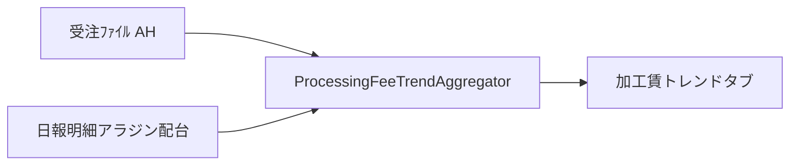

# 加工賃トレンド（独立グラフ）設計

## 目的

受注ﾌｧｲﾙの **AH（加工賃）** を単価とし、加工日ごとの実績／予定 m に乗じた **円建て進捗** を、既存の加工トレンド（m）とは別の独立画面で可視化する。

## 決定事項

| 項目 | 内容 |
|------|------|
| 配置 | メインシェル **新規タブ**「加工賃トレンド」。既存 m 複合グラフには系列を追加しない |
| 単価 | 受注ﾌｧｲﾙ **AH 列**（`JuchuSheetColumnLayout.Col.KAKOCHIN`）。列 index 固定 |
| 縦軸に使わない列 | AO（受注金額(修正)）、AN 単価、AU 加工金額 等は初版対象外 |
| 数量 | 既存加工トレンドと同系統の **工程延べ m**（日報／明細／アラジン／配台） |
| 日付軸 | **加工日**（実績）／予定の日付列。受注日・希望納期でのバケットはしない |
| 結合 | **依頼No** で AH を付与 |
| 日次系列 | 実績円・予定円（棒） |
| 累計系列 | **実績累計円**・**予定累計円**（折れ線）。m トレンドの累計 Path と同様に独立描画を推奨 |
| 単位 | 円（¥）。m チャートと Y 軸・スケールを共有しない |

## 計算

- 行（または日×依頼）の金額 = `m × AH`（AH は円/m 相当の加工賃単価）
- 日次実績円 = その日の実績行の金額合計
- 日次予定円 = その日の予定行の金額合計
- 実績累計円 = 期間開始〜各日の実績円の累積（当日までで止める等、m 側 `includeActualCumPoint` に揃える）
- 予定累計円 = 期間開始〜各日の予定円の累積

AH 欠落・非数値・依頼No 不一致: 当該行は **0 円**（件数は警告またはソースサマリに出す）。AH の改行複数値は既存 AO 数式と同様、解釈できる場合は先頭または TEXTSPLIT 相当の合計方針を実装計画で固定する。

## データフロー

- 受注原本ディレクトリは **読取専用**（`PM_AI_REQUEST_FORM_ORIGINAL_DIR`）。必要なら `.pm-ai-cache` へコピーして読む。
- 既存 m の `DayPoint` は汚染しない。円専用の `Result`／日次点を持つ。

## UI（初版）

- 期間プリセット・実績ソース・予定ソースは加工トレンドと同系（ロジック再利用可）
- 表示モード: 複合（日次棒＋累計折）／日次のみ／累計のみ（m トレンドに倣う場合）
- KPI 例: 期間実績円合計、期間予定円合計（差分は任意）
- Excel 出力は円専用（m 出力と混在させない）。出力先は加工トレンド同様 `.pm-ai-cache/exports/` 配下の専用フォルダでよい

## タブ登録

`MainShellTabId`・`MainShellTabLayoutDefaults`・`MainShell.fxml`／Controller・必要なら `MainShellInnerTabCatalog` を更新（`.cursor/rules/main-shell-tab-management.mdc`）。

## 非対象（初版）

- AO／AU を縦軸にすること
- 見込累計（当日 max(実績,予定) 分岐）の必須化（必要なら m 側に揃えて後続）
- 移動平均
- m チャートへのオーバーレイ

## リスク

- 工場別 xlsm の列ずれ（AH 見出し差）。正本は列 index
- 工程延べ m × 単価の二重計上（m トレンドと同趣旨の注記を UI に出す）
- 配列数式・未計算セルで AH が空
