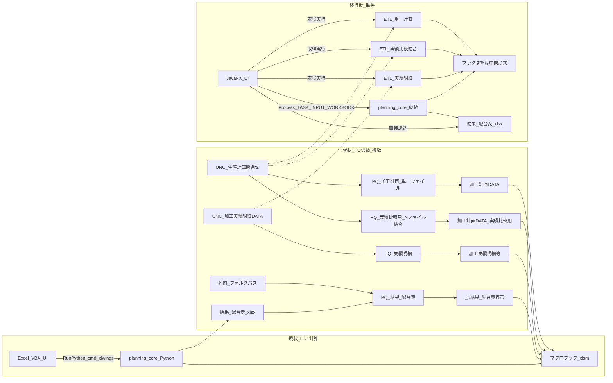

# Excel UI から JavaFX への大規模リファクタリング（プラン）

## 移行のスコープ（方針）

- **第一義**: **操作 UI を JavaFX に移す**（画面・入力・実行トリガ・ログ・結果表示）。Excel を前面の操作端としない。
- **既定の計算・入出力**: **`planning_core`（Python）をそのまま利用**する（子プロセス起動、環境変数、出力ファイル読込など）。**全面 Java 書き換えは対象外**とする（`_core.py` 規模・検証コストのため）。
- **オプション（第 2 段階以降）**: **プロファイルで時間・メモリが支配的な処理**（例: 日次ループ割付、巨大 DataFrame 変換、PQ 相当 ETL のうち頻繁に走る部分など）を特定し、**Java で高速化したモジュールに差し替える**ことを **視野に入れる**。その際は **入出力形式を変えず**、同一データで **Python 版と結果一致（許容誤差を定義）**を確認してから切り替える。
- **選ばないと決めるまで Java 化しない**: 「Java の方が速いから」だけでは移植しない。**計測根拠**と **保守コスト（ロジック二重管理）**のトレードオフを記録してから着手する。
- **生成コードの配置**: Java／JavaFX で新規に追加するソース・ビルドスクリプト・モジュール定義は **`code_java/`** を既定ルートとする。**`code/` は既存の Excel・VBA・Python（planning_core）ライン**のままとし、同一ツリーへの混在やパス衝突を避ける。
- **UI は OSS を優先し Excel に寄せる**: **オープンソース**かつ **Java／JavaFX と親和性が高い**ライブラリを **積極採用**し、**Excel のグリッド・セル編集に近い操作感**（行列・見出し・セル単位の入力など）を設計目標とする。詳細は下記「UI 技術方針」。

## 現状の把握（リポジトリ上の事実）

- **Java / JavaFX のコードベースは未存在**（`pom.xml` / `build.gradle` / `*.java` なし）。プロジェクト名は「JAVA」だが、実装の正は **Python**（[code/python/planning_core](code/python/planning_core)）と **Excel ブック**に集約されている。
- **配台ロジック**は `planning_core`（特に巨大な [code/python/planning_core/_core.py](code/python/planning_core/_core.py)）にあり、**VBA は主に起動・環境変数・xlwings／cmd 経由の子プロセス制御**を担う（例: [code/python/xlwings_console_runner.py](code/python/xlwings_console_runner.py) の `run_stage1_for_xlwings` / `run_stage2_for_xlwings` 等）。
- **データの入出力**は `TASK_INPUT_WORKBOOK` 環境変数で指す **マクロブック（.xlsm）**と **マスタ（例: `master.xlsm`）**のシート列と強く結合している（[code/python/planning_core/__init__.py](code/python/planning_core/__init__.py) 冒頭のパッケージ doc、[`workbook_env_bootstrap`](code/python/workbook_env_bootstrap.py) の「設定_環境変数」シート）。

### リポジトリ配置（`code` と `code_java` の役割分担）

| パス | 役割 |
|------|------|
| **`code/`** | **既存 Excel 版ライン**。VBA、`code/python`（planning_core）、要件定義ドキュメント等。従来どおりここを既存資産の正とする。 |
| **`code_java/`** | **JavaFX／Java で新規生成・追加するコード**の既定ルート（アプリ本体・Gradle/Maven・将来の選択的 Java モジュール）。**`code/` との混在・衝突を避ける。** |

CI・IDE のワークスペース設定でも **両ツリーを明示的に分ける**（例: Java プロジェクトのルートは `code_java` のみ）。

要件定義 HTML でも「Excel を前面の操作画面にしない」移行先の例として **JavaFX** が言及されている（[code/要件定義/工程管理AI配台システム_経営層向け説明.html](code/要件定義/工程管理AI配台システム_経営層向け説明.html) 付近）。

### UI 参照用ブック（設計時のたたき台）

- リポジトリ内の **[plan/UI参照用_生産管理_AI配台(RC1).xlsx](plan/UI参照用_生産管理_AI配台(RC1).xlsx)** を、**現行 UI のレイアウト・シート構成・操作イメージの参照**として使う（JavaFX の画面ワイヤー／画面一覧の起点）。
- 実装フェーズでは、このブックから **画面単位の対応表**（シート／ボタン／一覧 → JavaFX 画面・コントロール）を切る。

### UI 技術方針（Java 親和の OSS・Excel に近いフォーマット）

| 観点 | 方針 |
|------|------|
| **基本姿勢** | **オープンソース**で **Gradle／Maven から取り込みやすく**、**JavaFX 標準 API と共存しやすい**ものを優先。同等機能なら **保守・ライセンス・実績**で選ぶ（ライセンスは組織ポリシーで最終確認）。 |
| **グリッド（Excel ライク）** | 既定の検討対象として **ControlsFX** の **SpreadsheetView**（セル単位編集・結合・フィルタ等の土台）を **POC の起点**とする。単純一覧のみは **TableView** でよいが、**業務シート相当はスプレッドシート系コンポーネントを優先**。 |
| **書式・ファイル整合** | **`Apache POI`** を **読み書き・書式検証**に活用し、Python **openpyxl** との列・互換を確認できるようにする（同一 JVM 内で検証しやすい）。 |
| **その他（必要時）** | 複雑インセル編集なら **RichTextFX**、アイコンなら **Ikonli** 等（OSS・Apache 2.0 系が多い）を **要件が出た時点で**追加評価。 |
| **検証** | UI 参照ブックと並べて **見た目・操作のギャップ**を POC で確認してから全面適用。 |

## Power Query 正本（チャットでユーザーが貼付した M のみ）

### 文書化ルール（ハルシネーション防止）

- **リポジトリ格納の M 全文**: ユーザーがチャットで貼付した M は **[plan/power-query-m-sources.md](plan/power-query-m-sources.md)** の一覧どおり、`plan/01_*.m` … `plan/04_*.m` に保存している（トランスクリプトから抽出）。ブック内の最新 M と差分がある場合は **Excel 側を正**として `.m` を更新する。
- **出典の範囲**: 本節の **入力パス・関数名・列名・制御フロー**は、**本チャット内でユーザーが貼付した Power Query (M) 断片に現れる記述だけ**を根拠にする。リポジトリ内の `.xlsx` / `.xlsm` をこのプラン作成時点では開いて検証していない。
- **プランに書かないこと**: ブック内の **クエリの正式名称（Excel のクエリ一覧）とシート名の 1 対 1**、**「読み込み先テーブル」以外のロード設定**、ユーザーが M に含めていない **追加の変換ステップ**は **推測で補わない**。必要なら **[plan/UI参照用_生産管理_AI配台(RC1).xlsx](plan/UI参照用_生産管理_AI配台(RC1).xlsx)** を開き、Power Query エディタで **M をエクスポートして正本へ追記**する運用とする。
- **参照テーブルについて**: Power Query の **「参照」クエリ**や **最終的にワークシートに展開されるテーブル名**は、貼付 M だけでは特定できない場合がある。その場合は下表の「参照テーブル／ロード先」欄を **未確定（ブック要確認）** とする。

### 総覧（ユーザーが明示したクエリ名・入力・出力イメージ）

| ID | ユーザーが示した呼び名 | 入力の起点（M より） | 「最新」判定などファイル選択 | 出力側で M に現れる名前 |
|----|------------------------|----------------------|------------------------------|---------------------------|
| **PQ-A** | チャット上は「加工計画DATA」として説明。**PQ エディタ上のクエリ名はチャット未記載** | `Folder.Files("\\192.168.0.101\...\●DATA\生産計画問合せ")` | 非表示除外 → `Date created` **降順** → **先頭 1 件** `{0}` | 列 **`抽出時間`**（値は選ばれたファイルの `Date created`）。最終ステップ名は M 上 `抽出時間列の追加` |
| **PQ-B** | **`_q加工計画DATA_実績比較用`** | **PQ-A と同一 UNC** の `Folder.Files(...生産計画問合せ)` | `Date created` **降順** → **`Table.FirstN(..., 20)`**（コメントは「最新の8ファイル」とあるが **数値は 20**）→ 非表示除外 | 各ファイル処理後に列 **`抽出時間`**（各ファイルの `Date created`）。全体を **`Table.Combine`** 後 **`抽出時間` 降順ソート**。コメントに「重複の削除（Upsert）」があるが **提示 `in` はソートのみ** |
| **PQ-C** | **`_q加工実績明細DATA`** | `Folder.Files("\\192.168.0.101\...\002  加工G\●検査表作成\加工実績明細DATA")` | `Date accessed` **降順** → **`Table.FirstN(..., 1)`** → 非表示除外 | 変数 **`ファイル更新日時`**（先頭行の `Date modified`）。最終列 **`データ抽出時間`**（全行 `ファイル更新日時`）。列 **`累積実績`**・**`累積完了率`** 等 |
| **PQ-D** | **`_q結果_配台表`** | **`Excel.CurrentWorkbook(){[Name="フォルダパス"]}[Content]{0}[Column1]`** と **`結果_配台表.xlsx`** の連結 | 対象は **単一ファイル**（フォルダ走査なし） | `Excel.Workbook(...)` から **`Item="_t結果_配台表"` かつ `Kind="Table"`** の **`[Data]`**。続けて **`変更された型`** |

上表の **PQ-A〜D** の詳細ステップは以下に **M の出現順に近い形**で列挙する。

---

### PQ-A — 加工計画DATA（単一ファイル・生産計画問合せ）

**参照テーブル／シートへのロード先**: ユーザー提示 M には **クエリ名・シート名・「参照」作成の有無は含まれない** → **未確定（ブック要確認）**。

**ソース → 1 ファイルの決定**

1. `Folder.Files(パス)` … パス文字列はユーザー M の `パス = "\\\\192.168.0.101\\共有フォルダ\\湖南工場\\湖南共有\\生産管理システム\\管理システム\\●DATA\\生産計画問合せ"`（エスケープ表記は M 原文準拠）。
2. `Table.SelectRows(..., each [Attributes]?[Hidden]? <> true)`
3. `Table.Sort(..., {{"Date created", Order.Descending}})`
4. `最新ファイル = 並べ替えられたファイル{0}`
5. `現在の抽出時間 = 最新ファイル[Date created]`

**バイナリ → テーブル**

6. `現在のテーブル = ファイルの変換(最新ファイル[Content])` … **組み込みではなくブック内の同名関数**に依存。
7. `Table.Skip(現在のテーブル, 3)`
8. 全列について空文字 `""` を `null` に（`Table.TransformColumns` + `List.Transform(全列名, ...)`）

**見出し整形（ヘッダー領域のみ FillUp）**

9. `ヘッダーエリア = Table.FirstN(置き換えられた値, 2)`、`データエリア = Table.Skip(置き換えられた値, 2)`
10. `限定フィル = Table.FillUp(ヘッダーエリア, 全列名)` … FillUp の列リストは **`全列名`**
11. `結合 = Table.Combine({限定フィル, データエリア})`
12. `昇格されたヘッダー数 = Table.PromoteHeaders(結合, [PromoteAllScalars=true])`

**列名の再計算（`List.Buffer` + `List.Transform`）**

13. `旧ヘッダー`、`先頭行レコード = Table.First(昇格されたヘッダー数)`
14. `基準日` … `受注日` 列から有効シリアルの最小 → `#date(1899,12,30)` 加算、無ければ `Date.From(現在の抽出時間)`。`基準年`・`基準月` を派生。
15. `新ヘッダーリスト` … `_` 分割・末尾連番判定・先頭行との結合・`/` 日付の年補正（11–2 月と基準月の組み合わせで年 ±1）等（ユーザー M の `新見出し` ロジック全文に準拠）。
16. `見出しの更新 = Table.RenameColumns(..., List.Zip({旧ヘッダー, 新ヘッダーリスト}))`
17. `不要な先頭行を削除` … `先頭行レコード = null` でなければ `Table.Skip(..., 1)`

**仕上げ**

18. `回答納期` の `""` → `null`
19. `Table.TransformColumnTypes` … `受注日`,`原反投入日`,`出荷日`,`指定納期`,`回答納期`,`加工開始日`,`加工完了日` を `type date`
20. `Table.SelectRows(..., each [依頼NO] <> null and [依頼NO] <> "")`
21. 列名に `_加工速度` または `_加工時間` を **含む**列を `Table.RemoveColumns`
22. `抽出時間列の追加` … 列名 **`抽出時間`**、各行 `現在の抽出時間`、`type datetime`

---

### PQ-B — `_q加工計画DATA_実績比較用`（同一フォルダ・複数ファイル）

**参照テーブル／ロード先**: M 内にクエリ名 `_q加工計画DATA_実績比較用` は **チャットでユーザーが明示**。ワークシート名との対応は **未確定（ブック要確認）**。Python 側には **`加工計画DATA_実績比較用`** シート名がコード定数として存在する（[code/python/planning_core/_core.py](code/python/planning_core/_core.py) の `TASKS_SHEET_NAME_FOR_ACTUAL_GANTT_PLAN`）が、**PQ のロード先シート名と同一かはこのプランでは検証していない**。

**ソース → 最大 20 ファイル**

1. `Folder.Files` … **PQ-A と同一の生産計画問合せパス**
2. `Table.Sort(..., {{"Date created", Order.Descending}})`
3. `対象ファイル = Table.FirstN(並べ替えられたファイル, 20)` … **コメント「最新の8ファイル」と数値 20 の不一致はユーザー M 内の事実として記録**
4. 非表示除外

**各行（各ファイル）の内側クエリ**

5. `現在の抽出時間 = [Date created]`（行コンテキスト）
6. `現在のテーブル = ファイルの変換 (3)([Content])` … **PQ-A の `ファイルの変換` とは別名**
7. `Table.Skip(..., 3)`
8. `Table.ReplaceValue` … 列集合に **`倉庫       : 520201 湖南工場01本倉庫`** および **`Column2`〜`Column43`** を列挙（ユーザー M 原文）
9. `ヘッダーエリア` / `データエリア` に分割後、`Table.FillUp(ヘッダーエリア, フィル対象列)` … **`フィル対象列` は上記倉庫列＋Column2〜43 の明示リスト**（PQ-A の「全列名」と異なる）
10. `結合` → `PromoteHeaders`
11. `新ヘッダー = List.Transform(旧ヘッダー, each ...)` … PQ-A と同系の見出し変換（ユーザー M に **`List.Buffer` は無い**）
12. `見出しの更新`、`不要な先頭行を削除`、`回答納期` クリーンアップ、日付型、`依頼NO` フィルタ、`_加工速度`/`_加工時間` 列削除
13. **`抽出時間列の追加`** … 各ファイルの **`現在の抽出時間`**

**結合・終端**

14. `結合されたテーブル = Table.Combine(個別処理[処理済みテーブル])`
15. `並べ替えられた全データ = Table.Sort(結合されたテーブル, {{"抽出時間", Order.Descending}})` … **`in` はこれのみ**。コメントの「Upsert」と実装の差は **未解決フラグ**。

---

### PQ-C — `_q加工実績明細DATA`

**参照テーブル／ロード先**: クエリ名はユーザー明示。ロード先シートは **未確定（ブック要確認）**。

**ソース → 1 ファイル**

1. `Folder.Files("\\192.168.0.101\...\002  加工G\●検査表作成\加工実績明細DATA")`
2. `Table.Sort(..., {{"Date accessed", Order.Descending}})`
3. `保存された先頭行 = Table.FirstN(並べ替えられた行, 1)`
4. `ファイル更新日時 = 保存された先頭行{0}[Date modified]`
5. 非表示除外後、`ファイルの変換 (2)([Content])` 等で展開（ユーザー M の `RenameColumns`・`ExpandTableColumn` 連鎖に従う）
6. `Data` の展開列として **`Column1`〜`Column271`** を列挙（ユーザー M 原文どおり）
7. `Table.SelectRows(..., each [Column4] <> null)`
8. `Table.PromoteHeaders`

**中間変換・フィルタ**

9. 日付列の `TransformColumnTypes`
10. `Table.SelectColumns` で **検査備考を含めない列集合**（ユーザー M の長い列リスト）
11. 導出列 **`加工開始日時`**・**`加工終了日時`**・**`加工時間`**
12. `Table.SelectRows(..., each ([#"製造条件(内訳)"] = "長さ"))`
13. 列削減、`停機時間分(変換後)`、`加工開始日時(停機時間加算後)`、`Table.ReorderColumns`

**集計・結合**

14. `加工日付`、`日次集計`（`Table.Group` で `日次実績 = List.Max([実加工数])`）
15. `累積計算`（`依頼NO`・`工程名` 単位で日付昇順インデックス付き累積）
16. `Table.NestedJoin` / `ExpandTableColumn` で **`累積実績`** を明細へ
17. **`累積完了率`** … 換算数量が null または 0 なら 0、否则 累積実績÷換算数量、`Percentage.Type`
18. `加工日付` 列削除、**`データ抽出時間`** 追加（`each ファイル更新日時`）
19. 最終 `ReorderColumns`（ユーザー M の列順そのまま）

---

### PQ-D — `_q結果_配台表`

**参照テーブル／ロード先**: 取り込みオブジェクトは M 上 **`Item="_t結果_配台表"` かつ `Kind="Table"`**。ブック上のテーブル表示名とシート配置は **未確定（ブック要確認）**。

**ソース**

1. `現在のパス = Excel.CurrentWorkbook(){[Name="フォルダパス"]}[Content]{0}[Column1]`
2. `ファイルパス = 現在のパス & "結果_配台表.xlsx"`
3. `ソース = Excel.Workbook(File.Contents(ファイルパス), null, true)`
4. `_t結果_配台表_Table = ソース{[Item="_t結果_配台表", Kind="Table"]}[Data]`

**型の固定（ユーザー M に列挙されたそのまま）**

5. `変更された型 = Table.TransformColumnTypes(_t結果_配台表_Table, { ... })` … 列名・型の組は **ユーザー貼付 M のリスト全文と一致**する必要がある（プラン本文への再掲は冗長なため、**実装・検証時はチャット原文またはブックからエクスポートした M を一次資料とする**）。

---

### 本ドキュメントの保守手順

1. Excel で **[UI 参照ブック](plan/UI参照用_生産管理_AI配台(RC1).xlsx)** を開き、該当クエリの **詳細エディタで M を全文コピー**する。
2. 本プランの **PQ-A〜D** を、差分があれば **コピーした M にのみ基づき更新**する（推測で列名やステップを埋めない）。
3. 「参照テーブル」「ロード先シート」が分かった時点で、総覧表と各節の **未確定** を書き換える。

---

### 加工計画DATA と Power Query（データ供給の正）

「加工計画DATA」はブック内入力というより、**Power Query（M）で外部から生成**されている。JavaFX に UI を移すと **Excel 上の PQ 更新ボタンだけでは運用できない**ため、次をプランの前提に含める。

**詳細な変換ステップ**は **§ Power Query 正本の PQ-A** を一次記述とする（以下は移行方針の要約のみ）。

**データソース（要約・PQ-A と同一）**

- **フォルダ（UNC）**: `\\192.168.0.101\共有フォルダ\湖南工場\湖南共有\生産管理システム\管理システム\●DATA\生産計画問合せ`
- **ファイル選択**: 非表示以外を対象に **`Date created` 降順で先頭 1 ファイル**＝最新のみ使用。
- **変換の要点**: 先頭スキップ・空文字→null・ヘッダー／先頭行の結合と **`PromoteHeaders`**・列名の **`_連番` 除去と先頭行値との結合**・日付っぽい列名の **年跨ぎ補正（基準日は受注日列の最小シリアル or ファイル作成日時）**・型設定・`依頼NO` が空でない行のみ・列名に `_加工速度` / `_加工時間` を含む列削除・**`抽出時間`** 列に **現在選んだファイルの `Date created`** を付与。

**移行時の代替アーキテクチャ（どれかまたは併用を決める）**

| 方針 | 内容 | メリット／留意 |
|------|------|----------------|
| **PQ ロジックを Python に移植** | 同一 UNC から最新ファイルを選び、pandas で上記変換を再現し、`planning_core` が読む形式（シート相当の CSV または xlsx へ書き出し）にする | JavaFX から「データ取得実行」ボタンで完結可能。**M と Python の仕様一致検証**が必須 |
| **バッチ／タスクスケジューラ** | 定期的に変換済みファイルを共有フォルダの別パスへ出力し、アプリはそれを読む | Excel 不要。**鮮度と失敗時の通知**を運用設計 |
| **Excel 自動化で PQ のみ実行** | COM でブックを開きデータの更新のみ実行し保存（UI は JavaFX） | 実装は速い可能性。**Excel ライセンス・サーバ常駐・不安定さ**のリスク |
| **当面ハイブリッド** | 加工計画DATA の取得だけ Excel 側で更新→その後 JavaFX で配台のみ | 移行初期のリスク低減。**二重運用期間**が長くなりがち |

フェーズ 0 の棚卸しに **「PQ に依存するシート一覧」**と **「刷新後の単一取得パイプライン」**を追加する（**複数 UNC・複数 M パイプライン**を前提にする）。

### _q加工計画DATA_実績比較用 と Power Query（同一フォルダ・複数ファイル縦結合）

**ステップの正本**: § **PQ-B**。クエリ名 `_q加工計画DATA_実績比較用` はユーザーがチャットで明示。Python コードには **`加工計画DATA_実績比較用`** というシート名定数がある（[planning_core `_core.py`](code/python/planning_core/_core.py) の `TASKS_SHEET_NAME_FOR_ACTUAL_GANTT_PLAN`）が、**PQ のロード先シート名と同一かはブックで未検証**。

**移行上の示唆**

- PQ-A と **共通化できる処理**と、**N ファイル Combine・複数 `抽出時間`** の **分離**をコードで明示する。
- **Upsert** コメントと **実際の `in`（ソートのみ）** の差は ETL でも **未解決のまま踏まない**（§ PQ-B 参照）。

### _q加工実績明細DATA と Power Query（加工実績系）

**ステップの正本**: § **PQ-C**。ファイル選択は **`Date accessed`** ベースで **PQ-A/B と異なる**（総覧表）。

**移行上の示唆**

- **累積・日次 Max** など集計ロジックが重い。**pandas 移植時は PQ 出力とのゴールデン比較**が必須。

### _q結果_配台表 と Power Query（Python 出力 xlsx の読み戻し）

**ステップの正本**: § **PQ-D**。列型の一覧は **ユーザー貼付 M にそのまま存在**するため、実装時は **チャット原文またはブックからの M エクスポート**を一次資料とする。

**移行上の示唆**

- フォルダ走査が無く **出力ファイル直読で代替しやすい**。名前 **`フォルダパス`** は **アプリ設定へ移行**。
- **`planning_core` が `結果_配台表.xlsx` を出力する**ことはプラン上の **推定**に過ぎない（コードで確認したら正本に脚注を追加する）。

## 目標アーキテクチャ（推奨）

上図の **シート名・ノードラベル**は読みやすさのための略称。**PQ が実際にロードするテーブル／シート名は Excel ブック設定による**ため、確定情報は **§ Power Query 正本の総覧表と「未確定」欄**および、ブックからエクスポートした M を正とする。

- **UI 層**: Excel／VBA → **JavaFX**（デスクトップ）。これが本プロジェクトの主成果物。
- **ドメイン／計算（既定）**: **Python `planning_core` を子プロセスまたは将来は同一マシン上のサービスとして呼び出す**（`generate_plan` / `run_stage1_extract` 等）。**全面 Java 移植はスコープ外**。
- **ドメイン／計算（選択的・後追い）**: ボトルネックが **計測で特定できた場合のみ**、該当サブ問題を **Java ライブラリ化**し、JavaFX から直接呼ぶ／Python を薄いオーケストレーションに縮小する、などのハイブリッドを検討。**`_core.py` 全文移植は最終手段**とし、通常は **関数単位・パイプライン単位**が上限のイメージ。
- **永続化**: 移行初期は **既存の .xlsm/.xlsx シート構造を維持**し、Python がそのまま読める状態にするのがコスト最小。中長期で設定のみ JSON 化・DB 化するかは別判断。

## 主要な技術的ギャップ（必ず計画に含める）

1. **xlwings 依存**  
   一部処理は **Excel が開いた状態の COM（xlwings）**を前提にしている。JavaFX 単体では同等の「caller ブック」がないため、次のいずれかが必要になる。
   - **A**: 該当機能を **ファイルベースのみ**で完結するよう Python 側に経路を整理する（既に cmd 起動の `*.py` があるものは流用しやすい）。
   - **B**: 移行後も **Excel をバックグラウンドで起動**し xlwings を使う（運用・インストール複雑度は高い）。
   - **C**: Apache POI 等で Java から直接 xlsx を書き換え、Python はファイルのみ見る（二重実装リスクあり）。

   実務的には **A を優先**し、どうしても必要な箇所だけ B/C を検討するのが安全。

2. **マクロブックの役割の分解**  
   現状は「UI（シート）」「設定（設定_環境変数 等）」「Python へのパス受け渡し」が同一 `.xlsm` に混在。JavaFX 化では **「プロジェクトディレクトリ＋アクティブなタスクブックパス」**のような概念をアプリ側で明示管理する必要がある。

3. **インストール単位**  
   Python ランタイム・依存パッケージ・（必要なら）Excel／xlwings の bundling 方針（インストーラ、社内配布用 zip、バージョン固定）を早期に決める。

4. **複数 Power Query パイプライン**  
   上記のとおり **UNC・「最新」指標・変換内容がクエリごとに異なる**。さらに **同一 UNC でも**「最新 1 ファイルだけ」と「新しい順に N 本を縦結合」など **ファイル集合のポリシーが異なる**。JavaFX 化では **ETL ジョブをクエリ単位（またはドメイン単位）にモジュール化**し、共有の「フォルダからファイル列を得る」ユーティリティを **日付列の意味（created / accessed / modified）・先頭 N 件・非表示除外**までパラメータ化すると再発バグを減らせる。

5. **Excel 名前定義に依存する PQ**  
   `_q結果_配台表` のように **`Excel.CurrentWorkbook()` で名前を引く**クエリは、JavaFX では **名前定義を廃し**、**出力ルートパスをアプリ設定で明示**する。読み取りは **PQ なしでファイル API 十分**なことが多い。

6. **選択的 Java 化の境界**  
   UI を JavaFX にした後も **計算の大半は Python のまま**が前提。**Java に移す候補**は、(a) **プロファイルで全体時間の有意な割合**を占める処理、(b) **入力出力がファイル／行列として明確**でゴールデンテストしやすい処理、(c) **業務ルールの変更頻度が低い**純粋計算、などに限定する。**Gemini 連携・環境依存が強い部分**は Python 継続が現実的なことが多い。

## 推奨フェーズ（ロードマップ）

### フェーズ 0: 棚卸しと非機能要件の固定（短サイクル）

- VBA から呼ばれる **全エントリ**（段階1/2、ガント更新、配台試行順、パターン別段階2 等）を一覧化。根拠: [code/python/xlwings_console_runner.py](code/python/xlwings_console_runner.py) のエントリ一覧と [planning_core/__init__.py](code/python/planning_core/__init__.py) の公開 API 説明。
- 各機能が **cmd 起動で完結するか / xlwings 必須か**をマトリクス化（移行難易度の見積りに直結）。
- **[plan/UI参照用_生産管理_AI配台(RC1).xlsx](plan/UI参照用_生産管理_AI配台(RC1).xlsx)** から **画面・シート・ボタン対応表**のドラフトを作る。
- **Power Query 依存**を洗い出し（現時点: **加工計画DATA（単一ファイル）**、**_q加工計画DATA_実績比較用（同一フォルダ・複数ファイル結合）**、**_q加工実績明細DATA**、**_q結果_配台表（名前「フォルダパス」＋ `結果_配台表.xlsx`）**）。共有フォルダ系については「PQ 代替」のどれを主経路にするか **意思決定**し、**ゴールデンファイル比較**の検証方針を書く。実績明細系は **累積実績・累積完了率・停機加算日時**を含め **行単位・集計列の双方**を検証する。実績比較用は **複数 `抽出時間` の縦結合後の行数・並び**に加え、**Upsert コメントと最終 M の差分**を仕様として確定する。**結果_配台表**は **出力ファイル直読＋列型マニフェスト**で十分か確認し、名前定義の移行先を決める。

### フェーズ 1: JavaFX プロジェクト基盤（新規）

- **`code_java/`** を Java プロジェクトのルートとし、**Gradle（または Maven）＋ JavaFX SDK（モジュールパスまたは依存）**を追加する（**`code/` 配下には Java プロジェクトを置かない**）。依存には **ControlsFX**（SpreadsheetView）・必要に応じ **Apache POI** を **バージョン固定で**宣言する。
- パッケージング方針: `jlink` / `jpackage`（Windows 向け .exe 配布を想定する場合）。

### フェーズ 2: 「シェルアプリ」— 計算は Python、そのまま（MVP）

- JavaFX から `ProcessBuilder` 等で **`py -3.x` + 既存スクリプト**（例: [code/python/plan_simulation_stage2.py](code/python/plan_simulation_stage2.py)、[code/python/task_extract_stage1.py](code/python/task_extract_stage1.py)）を実行。
- 実行前に **`TASK_INPUT_WORKBOOK`** および必要なら **`PYTHONUTF8` 等**を子プロセス環境に設定（VBA がしていることの代替）。
- ログは **stdout/stderr または [code/python](code/python) 既存の log 配下**を UI でテール表示。終了コードは VBA が参照している `log/stage_vba_exitcode.txt` 等と整合させるか、Java 側はプロセスの exit code を主に見る設計に整理。

この段階で **「Excel を開かずに配台を回せる」**最低限の価値が出る（データ編集はまだ Excel でも可）。

### フェーズ 3: データ編集 UI の置換（コア工数）

- 主要シート（例: 「加工計画DATA」「配台計画_タスク入力」）を **OSS のスプレッドシート系（既定案: ControlsFX SpreadsheetView）を優先**して編集し、単純フォーム部分は **TableView／フォーム**と組み合わせる。保存時に **openpyxl と列互換のある xlsx/xlsm**として書き出す（**Apache POI** での検証・往復を検討）。
- **加工計画DATA**、**加工計画DATA_実績比較用（_q 相当）**、**加工実績明細系** について、編集 UI と別に **「共有フォルダから再取得（PQ 相当）」**アクションを JavaFX に用意する想定（フェーズ 0 で決めた ETL 経路に接続。クエリが複数あれば **取得ボタンを分けるか一括ジョブにするか**を UI 設計で決める。同一フォルダでも **単一版と N ファイル結合版は別ジョブ**）。
- **結果_配台表（`_q結果_配台表` 相当の画面）** は、配台実行後に生成される **`結果_配台表.xlsx`** を **出力フォルダから直接読み込み**して表示する（PQ 再現より **読込 API の方が優先**）。リフレッシュは「最新の配台結果を再読込」で足りる。
- 列定義の正は Python 側の定数（`_core.py` の `PLAN_*` / `TASK_*` 等）に合わせる必要があるため、**単一の「列定義マニフェスト」（JSON または共有生成スクリプト）**を検討すると保守が楽。

### フェーズ 4: xlwings 必須機能の縮小または代替実装

- フェーズ 0 のマトリクスに従い、残った xlwings 依存を **Python 側でファイル I/O 化**するか、限定的な別手段を選ぶ。

### フェーズ 5: VBA／Excel 依存の縮退

- 運用で JavaFX が主流になったら、マクロブックは **互換エクスポート目的のみ**に縮小、または廃止を検討。

### フェーズ 6（任意）: 重い処理の Java 化検討

- **前提**: フェーズ 2〜4 が運用可能で、**実データでのボトルネックが判明**していること。
- **手順**: JVM と Python 双方で **同じ入力**に対する **時間・メモリの計測** → ホットスポットを **関数／モジュール粒度**でリスト化 → **`code_java/` 配下に Java モジュール**として実装（JNI、プロセス間通信、または CSV バイナリ経由のパイプなど）→ **ゴールデン一致テスト** → フラグで切替。
- **スコープ管理**: 「全部 Java」ではなく **検証可能な単位**まで。**配台ルールの文章の正**（[配台ルール.md](配台ルール.md)）と実装の両方を更新する必要がある変更は、Python/Java のどちらを正にするか事前に決める。

## ドキュメント・ルールとの関係

- **配台ロジックを変える場合**は [配台ルール.md](配台ルール.md)（リポジトリ内の業務文章の正）との整合が必要（`.cursor/rules/dispatch-docs-sync.mdc` の趣旨）。
- **巨大ファイル** `_core.py` の読み方は [code/python/planning_core/_core_FILE_MAP.txt](code/python/planning_core/_core_FILE_MAP.txt) を前提に局所調査する（`.cursor/rules/planning-core-huge-file.mdc`）。

## 意思決定が必要な論点（実装前に固めると安全）

| 論点 | 選択肢のイメージ |
|------|------------------|
| 計算コア | **既定: Python 継続**。重い部分のみ **計測後に Java 部分移植（ハイブリッド）**。**全面 Java 移植はスコープ外**として扱う |
| **Java ソースのルート** | **`code_java/`** に統一。**`code/` は既存 Excel／Python ラインのまま**とし衝突を避ける |
| **グリッド UI（Excel 親和・OSS）** | **既定: Java と親和性の高い OSS を優先**（**ControlsFX SpreadsheetView** を POC 起点）。単純一覧は **TableView** で可。**Apache POI** で書式・往復検証を検討。ライセンス・保守で最終確定 |
| 保存形式 | 当面 **xlsm 互換** vs 早めに **DB/JSON＋エクスポート** |
| xlwings 代替 | **Python をファイル中心に寄せる（推奨）** vs Excel 常駐 |
| **加工計画DATA 供給** | **Python ETL で PQ 同等（推奨して検証）** vs バッチ vs Excel 自動化のみ |
| **加工計画DATA_実績比較用 供給** | 同上（**N ファイル縦結合・複数 `抽出時間`**。単一ファイル版との **共通化と差分**をコードで分離） |
| **加工実績明細（_q）供給** | 同上（**累積・完了率・複数日付キー**で検証コストが一段高い） |
| **結果_配台表の参照** | **出力 xlsx 直読＋設定で出力パス**（名前「フォルダパス」を廃止）。列型は M の `TransformColumnTypes` と整合 |

---

**まとめ**: **主目的は JavaFX UI**。**Java と親和性の高い OSS を積極利用**し、**Excel に近いグリッド UX**（既定案は ControlsFX SpreadsheetView 起点の POC）を目指す。新規 Java／JavaFX は **`code_java/`**、既存資産は **`code/`** と **ツリー分離**して衝突を避ける。Python は当面そのまま呼び出し、**全コードの Java 書き換えは求めない**。必要になれば **計測に基づき重い処理だけ Java 化**するオプションを残す。**複数 Power Query 由来データ**や **xlwings／PQ 代替**が技術的な主な負荷であり、**UI 移行とデータパイプライン整理が先行**、高速化はその後の選択となる。
