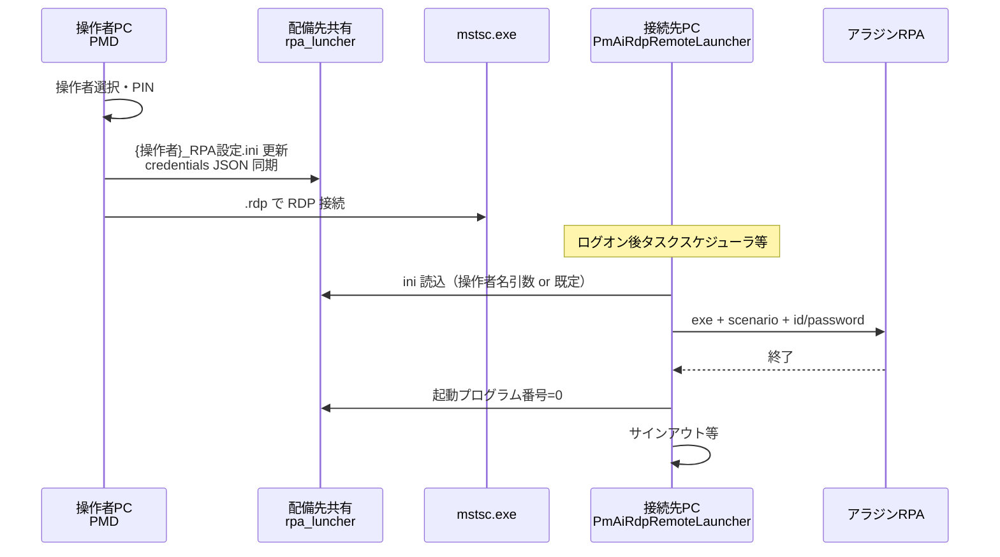

# リモートデスクトップ・ランチャー整理

配台システム（PMD）・リモートデスクトップ専用ポータブル（PmAiRpaLuncher）・接続先 C# ランチャー（PmAiRdpRemoteLauncher）の関係を一覧する。

**実装の正本**: `AppPaths.java` / `RequestFormRemoteDesktopPane.java` / `FactoryOperatorUserStore.java` / `tools/pm-ai-rdp-remote-launcher/`

---

## 0. ポータブル版の出力先（ローカルビルド）

| 製品 | ビルドスクリプト | 出力フォルダ（リポジトリ直下） |
|------|------------------|-------------------------------|
| **配台システム（PMD）** | `fast_package_app.ps1` | `pm-ai-package-release\`（`PMD_initial_install.zip` / `PMD_version_upgrade.zip`） |
| **リモートデスクトップ専用** | `fast_package_rdp_launcher.ps1` | `rpa_luncher_release\`（`PmAiRpaLuncher\PmAiRpaLuncher.exe` 等） |

配台 PMD にもリモートデスクトップタブはあるが、**専用ポータブル**は `rpa_luncher_release` を別途配布する。接続先 PC 向け exe（`PmAiRdpRemoteLauncher.exe`）は共有 `rpa_luncher` への配備（`launcher-deploy-seed`）が別。

---

## 1. 登場するプログラム（exe）

| exe | 役割 | 動く場所 | 中身 |
|-----|------|----------|------|
| **PMD.exe** | 配台システム本体（リモートデスクトップタブ含む） | 操作者 PC | C# スタブ → Java `PmAiFxApp` |
| **PmAiRpaLuncher.exe** | リモートデスクトップ専用ポータブル | 操作者 PC | C# スタブ → Java `RemoteDesktopFxApp` |
| **PmAiRdpRemoteLauncher.exe** | 接続先で RPA を起動 | RDP 先 PC | C# 単体（.NET） |

旧名 **PmAiRdpLauncher.exe** は配台 PMD と混同しやすいため改名済み。

---

## 2. リモートデスクトップ UI（2 つの起動経路）

`RequestFormRemoteDesktopPane` を共有する。

| 項目 | 配台 PMD | リモートデスクトップ専用（PmAiRpaLuncher） |
|------|----------|---------------------------------------------|
| エントリ | `PmAiFxApp` | `RemoteDesktopFxApp` |
| シェル | `MainShell`（多数タブ） | `RemoteDesktopShell`（最小タブ） |
| PC ローカル設定 | `%USERPROFILE%\.pm-ai-desktop` | `%USERPROFILE%\.pm-ai-desktop-rdp` |
| 操作者 bin | `factory-operator-users.bin` | `rdp-launcher-operator-users.bin`（DATA） |
| ポータブル出力 | `pm-ai-package-release` | `rpa_luncher_release` |

---

## 3. 共有フォルダ上の配置（配備先 `rpa_luncher` 例）

運用上の正本（UNC 例）:

```
\\192.168.0.101\共有フォルダ\掲示板\rpa_luncher\
  PmAiRdpRemoteLauncher.exe          … 接続先ランチャー
  PmAiRdpRemoteLauncher.version.txt
  RDP起動プロファイル.json           … 起動プロファイル名称・説明（UI 用）
  RPA設定.ini                        … 操作者未指定時（レガシー RAP設定.ini も読取可）
  {操作者名}_RPA設定.ini             … 操作者別 RPA 設定（後述）
  operator-aladdin-credentials.launcher.json … C# 向け資格情報キャッシュ
  launcher-logs\
    launcher-yyyyMMdd.log            … 接続先ランチャーの日次ログ（共有ミラー）
  DATA\
    rdp-launcher-operator-users.bin    … 操作者・PIN・資格情報（ini とは別）
```

**ini の正本置き場**は `PmAiRdpRemoteLauncher.exe` と **同階層**（`PM_AI_RDP_LAUNCHER_DEPLOY_DIR`）。レガシー `DATA\` 配下の ini は **読取フォールバック**のみ。

---

## 4. RPA設定.ini（操作者別）

### 4.1 ファイル名と場所

| 条件 | パス |
|------|------|
| 操作者 **細川** がセッションにいる | `...\rpa_luncher\細川_RPA設定.ini` |
| 操作者未設定 | `...\rpa_luncher\RPA設定.ini` |
| `PM_AI_RDP_LAUNCHER_INI` 指定 | そのフルパス（上書き） |

ファイル名は `{操作者名}_RPA設定.ini`。Windows 禁止文字（`\ / : * ? " < > |`）は `_` に置換。

レガシー: `RAP設定.ini` / `DATA\{操作者}_RAP設定.ini` も **既存ファイルがあるとき読取**する。

### 4.2 Java 側の挙動（PMD リモートデスクトップタブ）

1. **保存**（RPA 設定タブの「保存」）… セッション操作者に対応する ini へスロット定義・終了時セッション操作などを書き込む。
2. **接続直前** … 同 ini に以下を更新してから `mstsc` を起動する。
   - `起動プログラム番号`（1～9、接続中は 0 でタスクスケジューラ抑止）
   - 選択スロットの RPA exe / `--scenario` 引数
   - `操作者=`（セッション操作者名）
3. **資格情報 JSON** … `operator-aladdin-credentials.launcher.json` を ini と同じ親フォルダに同期。

操作者を変えると **別ファイル** を読み書きする。UI の「RPA設定.ini:」表示も操作者に追従する。

### 4.3 C# 側（PmAiRdpRemoteLauncher.exe）の挙動

タスクスケジューラや手動起動で exe が走ったとき:

1. ini パスを解決（下記「引数」）
2. ini を読み、`起動プログラム番号` のスロット行から RPA exe・引数を取得
3. ini の `操作者=` と `operator-aladdin-credentials.launcher.json` からアラジン `--id` / `--password` を付与
4. RPA 終了後、`終了時セッション操作` に従い切断またはサインアウト
5. 終了時に `起動プログラム番号=0` に戻す（二重起動抑止）

`起動プログラム番号=0` のときは RPA 起動・サインアウトともに行わない。

---

## 5. 各プログラムが参照する設定（一覧）

| 設定 | PMD（Java） | PmAiRdpRemoteLauncher（C#） |
|------|-------------|-----------------------------|
| **RPA設定 ini** | 読み書き（操作者別） | 読み取り（起動スロット・操作者・終了動作） |
| **RDP起動プロファイル.json** | 読み書き（UI のプロファイル名・説明） | 参照しない |
| **operator-aladdin-credentials.launcher.json** | 生成（bin から） | 読み取り（RPA ログイン ID/PW） |
| **操作者 bin** | 読み書き（工場 bin） | 参照しない（JSON 経由） |
| **.rdp プロファイル** | 読み取り・一部書込（画面サイズ等） | 参照しない |
| **session-state.json** | PC ローカル（環境変数タブ等） | 参照しない |
| **launcher-logs/launcher-yyyyMMdd.log** | UI でプレビュー可能 | 自身が書き込み（サブフォルダ自動作成） |

### 環境変数（主なもの）

| キー | 用途 |
|------|------|
| `PM_AI_RDP_LAUNCHER_DEPLOY_DIR` | `PmAiRdpRemoteLauncher.exe`・`RPA設定.ini` の配備先フォルダ |
| `PM_AI_RDP_LAUNCHER_INI` | ini フルパス上書き |
| `PM_AI_RDP_LAUNCHER_EXE` | ランチャー exe フルパス上書き |
| `PM_AI_RDP_OPERATOR_USERS_STORE_DIR` | 操作者 bin のフォルダ（既定 `DATA\`） |
| `PM_AI_REQUEST_FORM_RDP_PROFILE` | 接続用 `.rdp` |
| `PM_AI_RDP_LAUNCH_PROFILE_NUMBER` | 最後に使った起動プロファイル番号 |
| `PM_AI_OPERATOR_USER` | セッション操作者名（子プロセス env・ini 解決） |
| `PM_AI_RDP_EMBED_STARTUP_IN_PROFILE` | `1` のときのみ .rdp に alternate shell を書込 |

---

## 6. ログイン・認証

### 6.1 PM-AI アプリへの操作者ログイン（JavaFX）

| 方式 | 起動時ダイアログで操作者選択 + PIN |
| データ | `factory-operator-users.bin`（工場別） |
| ゲスト | 可（リモートデスクトップ接続は不可） |

### 6.2 Windows リモートデスクトップ（mstsc）

- ローカル PC から **`.rdp` プロファイル** で `mstsc.exe` を起動。
- 接続先 Windows / ドメインの資格情報（RDP ログオン）。

### 6.3 アラジン RPA ログイン（接続先 PC）

- Java が bin に保存した資格情報を **JSON に同期**。
- **PmAiRdpRemoteLauncher** が ini の `操作者=` に合わせて JSON から ID/PW を取り、RPA 起動引数に `--id` / `--password` を付与。

---

## 7. 引数（PmAiRdpRemoteLauncher.exe）

**ini パス解決順**:

1. `--ini <path>` または `--ini=<path>`
2. 環境変数 `PM_AI_RDP_LAUNCHER_INI`
3. **第 1 位置引数（操作者名）** → exe 同階層 `{操作者名}_RPA設定.ini`（レガシー/DATA も試行）
4. 引数なし → exe 同階層 `RPA設定.ini`（レガシー `RAP設定.ini` / `DATA\` も試行）

**タスクスケジューラ登録例**（操作者ごと）:

```text
C:\...\PmAiRdpRemoteLauncher.exe 細川
```

→ `細川_RPA設定.ini` を参照する。

---

## 8. 接続フロー（概要）



---

## 9. 運用メモ

- **ini は操作者ごと**に分離（`{名前}_RPA設定.ini`）。
- 配備先フォルダに **exe と ini を同階層**で置く（`PM_AI_RDP_LAUNCHER_DEPLOY_DIR`）。
- 接続先のタスクスケジューラは **操作者名を exe 引数** に含める運用に合わせる。
- 旧 `DATA\RAP設定.ini` から移行する場合は、配備先同階層へ `RPA設定.ini`（または操作者別ファイル）へコピーする。

---

## 10. 関連ファイル（開発者向け）

| ファイル | 内容 |
|----------|------|
| `AppPaths.java` | パス解決・ini basename |
| `RequestFormRemoteDesktopPane.java` | リモートデスクトップ UI 本体 |
| `PmAiFxApp.java` | 配台エントリ |
| `FactoryOperatorUserStore.java` | 操作者・資格情報・JSON 同期 |
| `RdpRemoteLauncherIni.java` | ini 読み書き |
| `tools/pm-ai-rdp-remote-launcher/Program.cs` | 接続先ランチャー |
| `ui_ref_env_defaults.json` | 環境変数タブ既定値 |
